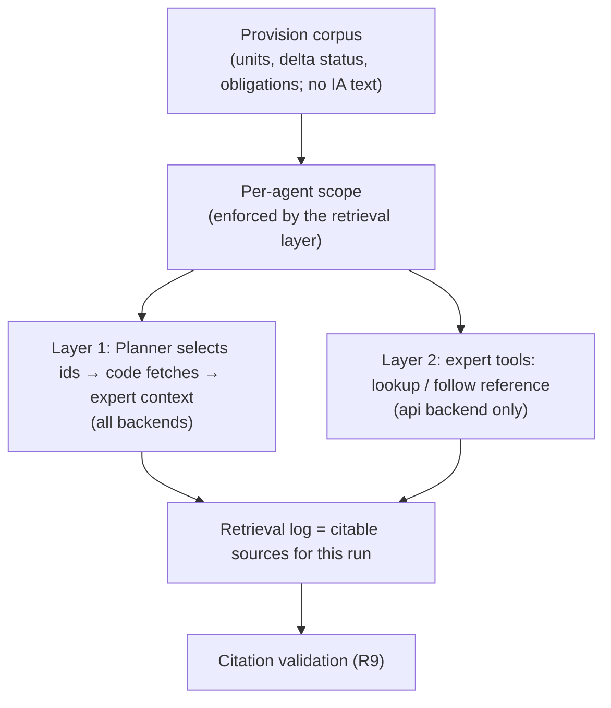

# Provision Retrieval and Per-Agent Data Scopes (v1)

## Problem Frame

v0 experts only see the 3 to 11 articles that a scenario selects in advance. v1 must analyse the whole
AI Act without putting the full text into context (origin R17). It must also follow cross-references,
for example Art 26 pointing to Art 72. The colleague's methodology adds a second idea: agents should
differ in **what data they can see**, not only in their prompt, and the multi-agent system should be
compared against a single-agent baseline that sees everything.

The colleague's data (integrated by `docs/plans/2026-10-02-001-feat-pipeline-data-import-plan.md`)
makes both ideas possible. It contains every provision of the proposal and the final act at unit
level, the proposal-to-final delta status of each unit, and 1,217 rule-based obligations.

This document defines one shared provision corpus with two ways in, built in this order:

- **Layer 1: deterministic retrieval.** The Planner chooses provisions, and code fetches them. This
  works on every backend.
- **Layer 2: expert tool calls.** Experts look up provisions and follow references themselves. This
  works on the api backend only.

Every agent sees the corpus through a declared scope.

---

## Actors

- A1. Impact Planner: reads a corpus index and chooses which provisions each expert should study.
- A2. Experts (Legal, Fiscal, Stakeholder, and the v1 additions): analyse retrieved provisions. On
  the api backend they may also retrieve provisions themselves.
- A3. Single-agent baseline: one agent with the union of all scopes and the same output schema.
- A4. Evaluation process: runs golden cases on both the multi-agent system and the baseline, and
  compares them.

---

## Key Flows

- F1. Layer 1 run (every backend)
  - **Trigger:** A run starts for a proposal or a regulatory change.
  - **Actors:** A1, A2
  - **Steps:** The Planner receives a compact corpus index: ids, headings, delta status and
    obligation counts, but no full text. It returns the provision ids to study for each expert. The
    system fetches each expert's texts, restricted to that expert's scope, and logs the retrieval.
    Experts produce findings, and citation validation checks them against the retrieval log.
  - **Outcome:** Findings cite only provisions that were actually retrieved for that expert.
  - **Failure path:** The Planner asks for an id outside the corpus or outside an expert's scope.
    The request is dropped and logged, and the run continues.
  - **Covered by:** R1, R4, R5, R7, R8, R11, R12

- F2. Layer 2 expert exploration (api backend)
  - **Trigger:** An expert reading its Layer 1 texts needs a referenced provision.
  - **Actors:** A2
  - **Steps:** The expert calls a lookup tool by id or follows a reference. The retrieval layer
    checks the expert's scope and call budget, returns the text, and logs the call.
  - **Outcome:** Retrieved texts join that expert's citable sources for the run.
  - **Failure path:** Out of scope, or budget exhausted: the tool returns a refusal and the expert
    continues with what it has. On the `claude_code` backend Layer 2 is off, and the run records
    that it ran on Layer 1 only.
  - **Covered by:** R9, R10, R11, R12

---

## Requirements

**Corpus**
- R1. A single provision corpus serves every agent. It holds all units of the proposal and the
  final act, the delta status of each final unit, and the rule-based obligations. It is built from
  the colleague's pinned data at build time, and read locally at runtime.
- R2. The corpus never contains impact-assessment text (origin R24). Memorandum sources keep
  today's stripping.
- R3. Existing v0 scenarios stay runnable as preset retrievals, so v0 results remain comparable.

**Per-agent scopes**
- R4. Every agent role has a declared data scope (which provisions, which fields, whether
  obligations and delta status are visible). The scope is part of the SystemVersion, like the
  agent composition.
- R5. Scopes are enforced by the retrieval layer, not by prompt instructions. A request outside
  scope returns nothing and is logged.
- R6. A single-agent baseline exists. It has the union of all scopes and the same output schema,
  and it runs on the same golden cases.

**Layer 1: deterministic retrieval**
- R7. The Planner chooses provisions from a compact index, never from full text. The index is small
  enough for one Planner call across the whole act.
- R8. Layer 1 works on every backend, including `claude_code`, with no tool calling.

**Layer 2: expert tool calls**
- R9. On the api backend, experts can look up a provision by id and follow references found in
  retrieved text, within a per-expert call budget set in the SystemVersion.
- R10. When Layer 2 is configured but the backend cannot call tools, the run falls back to Layer 1
  and records the fallback in run metadata and in the console.

**Citations and traceability**
- R11. An expert's citable sources for a run are exactly the provisions retrieved for it in that
  run (Layer 1 and Layer 2), plus the stripped memorandum. Citation validation (origin R9) checks
  quotes against this set.
- R12. Every retrieval is recorded: agent, layer, ids, refusal reason if any, and time. Retrievals
  are visible in the trace and as events in the run stream (origin R35).

**Evaluation**
- R13. Each evaluation compares the multi-agent system and the single-agent baseline on coverage,
  grounding, omissions and cost. The results are tagged so they can be compared side by side.

---

## Acceptance Examples

- AE1. **Covers R5, R12.** Given the Fiscal expert's scope excludes Annex III, when the Planner
  assigns `32024R1689:anxIII` to Fiscal, then Fiscal receives nothing for that id, and the
  retrieval log records a scope refusal.
- AE2. **Covers R11.** Given the Legal expert never retrieved Art 72, when one of its findings
  quotes Art 72, then citation validation fails and the finding becomes an open question, even
  though the quote is real legal text.
- AE3. **Covers R10.** Given a SystemVersion with Layer 2 enabled, when it runs on `claude_code`,
  then the run completes on Layer 1 and the dossier and console show "Layer 2 unavailable on this
  backend".
- AE4. **Covers R3.** Given the v0 scenario `eval_sme_impacts`, when it runs on the new retrieval
  path, then its experts receive the same four articles and memorandum sections as in v0.

---

## Success Criteria

- A run on the whole final act completes within the existing per-run latency and cost envelope. No
  agent's context ever holds the full act.
- Scope violations are impossible by construction and visible when attempted.
- The multi-agent versus single-agent comparison is reported on the evaluation page. Whichever way
  it comes out, the result tells us whether the data separation does real work.
- `ce-plan` can define the corpus index, the scope format and the tool contract without inventing
  product behaviour.

---

## Scope Boundaries

- **MCP is outside WOMM.** The user decided that an MCP server is not something WOMM itself can
  use now. If an external consumer appears later, the same corpus can be wrapped then.
- The colleague's municipal organization graph, CBS budgets and cost-location framing are not
  adopted.
- No embedding or semantic search in this round, unless planning shows the index cannot do the
  job (see Outstanding Questions).
- The Improvement Planner (origin R26) may later propose scope changes as config diffs, but that is
  not part of this work.

---

## Key Decisions

- **One corpus, scopes enforced in the data layer:** isolation then holds for both layers and for
  the baseline. Prompt-level "please don't look at X" would not count as real data separation.
- **Layer 1 before Layer 2:** Layer 1 delivers whole-act coverage and isolation on the backend we
  run today. Layer 2 needs an API key and tool calling, and it builds on the same corpus and log.
- **The retrieval log defines citable sources:** this keeps origin R9 deterministic, and it stops
  experts from quoting provisions they never saw, even when they know the law from training.
- **MCP is excluded** (user decision, 2026-10-02).

---

## Dependencies / Assumptions

- The data import plan (`docs/plans/2026-10-02-001-feat-pipeline-data-import-plan.md`) lands
  first.
- Whole-act rendering needs the rules that plan deferred: final-act `subparagraph` units with no
  `num`, and the 5 units with a gap marker.
- Layer 2 needs an OpenAI or Anthropic API key (pending from the user). Layer 1 does not.
- Unverified assumption: a compact index of the final act (113 articles, 13 annexes with headings,
  delta status and obligation counts) fits in one Planner call. Measure it during planning.

---

## Outstanding Questions

### Resolve Before Planning

(None)

### Deferred to Planning

- [Affects R4][Product default to confirm] The default scope per expert. Updated 2026-10-02:
  split by data form, borrowed from the colleague's method, instead of by topic.
  - Legal: full text plus full obligations.
  - Fiscal: obligation records only, no full text.
  - Stakeholder: the text of Art 1–3, Art 6 and Annex III, plus the actor fields of obligations.
  - Only the Planner sees delta status.
  - Only Legal sees the memorandum.

  When an obligation's actor is `unspecified`, Stakeholder also sees its verbatim span, until LLM
  actor completion lands. Each scope carries a stated hypothesis. See `docs/plans/2026-10-02-002-feat-scoped-provision-retrieval-plan.md`.
- [Affects R7][Technical] Index content and granularity: article level or paragraph level, and how
  delta status and obligation counts are summarised.
- [Affects R9][Technical] Reference following: use the colleague's `references` field on
  obligations, or parse references from text.
- [Affects R9][Technical] Default call budget per expert, and how budget exhaustion shows in the
  dossier.
- [Affects R13][Needs research] Whether the current 2 golden cases can show a multi-agent versus
  single-agent difference above run-to-run noise, or whether this waits for the 15–30 cases of
  origin R22.

---

## Next Steps

-> `/ce-plan` for the Layer 1 slice (corpus, scopes, Planner retrieval, single-agent baseline),
after the data import plan is implemented.
