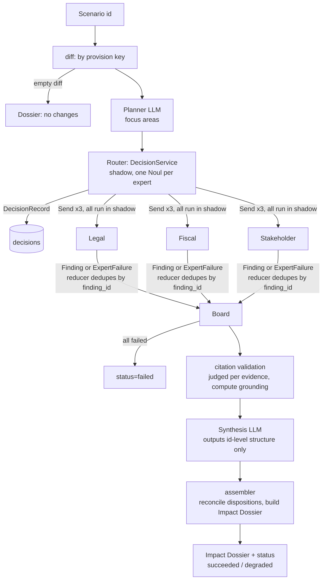

# feat: WOMM v0 end-to-end skeleton (RIA pipeline + evaluation baseline)

## Overview

Build WOMM's first runnable chain from an empty repo: AI Act fixture → provision-level diff → Impact Planner → Router (shadow) → 3 experts in parallel → Shared Impact Board → citation validation → Synthesis → Impact Dossier, and run the first evaluation baseline on LangSmith. The LLM backend is pluggable; during development it uses the local Claude Code subscription.

Delivery happens in two steps (see origin: docs/brainstorms/2026-09-28-womm-phased-requirements.md):

- **Friday 2026-10-02 (required)**: P1 local chain + P2 smoke evaluation baseline
- **v0.1 (next week)**: P3 Railway deployment, P4 Jev shadow, P5 Failure records + noise measurement, and the formal baseline on the api backend

---

## Problem Frame

WOMM must prove that the traceable chain "Regulatory Change → Provision → Finding → Evidence → Source" really runs end to end, and that there is a comparable evaluation baseline, to lay the foundation for v1 self-evolution. The colleague's structured AI Act data has not arrived yet, so v0 builds its own fixture and decouples via the data contract. v0 does no automatic improvement; it only leaves interfaces for v1 (SystemVersion, Failure records, DecisionRecord, run events).

---

## Requirements Trace

v0 covers the following requirements from the origin (v1's R17–R23, R25–R31, R33, R37 are out of scope for this plan; only interfaces are kept):

- R1 data contract + cross-version provision key; R2 two kinds of fixture scenarios; R3 deterministic diff by key; the "exclude sections that cite IA conclusions" part of R24 (v0 implements it at fixture build time; v1 extends it to holdout)
- R4 Impact Planner; R5 three experts + self-captured failures; R6 system fills IDs / provenance; R7 append-only Board; R8 Synthesis; R9 restricted evidence sources + verbatim citation matching
- R10 Jev Router shadow + timeout degradation
- R11 golden case (evaluation scenario); R12 metrics (omissions made numeric, grounding labeled as citation presence rate); R13 LangSmith experiments tagged by version; R14a SystemVersion; R14b Failure entries; R34 noise measurement
- R15 Railway deployment + async tasks; R16 full-chain tracing
- R32 pluggable LLM backend (`claude_code` isolated calls + `api`)
- R35 run event stream interface (the seam for the frontend; page implementation is planned separately)

**Origin actors:** A1 analyst/audience (submit and read), A2 colleague (the other side of the data contract), A3 LLM agents, A4 Jev, A5 evaluation process
**Origin flows:** F1 RIA run, F2 evaluation (v0 baseline part)
**Origin acceptance examples:** AE1 (covers R9), AE2 (covers R10)

---

## Scope Boundaries

- Not done: Jev publish/deliver/relate, Workforce/Evidence experts, Exa, Improvement Planner, MiniCheck, human review, pages 3–4 (same as the origin's v0 scope)
- Not done: resuming runs after interruption (on restart, v0 marks unfinished runs as failed; resuming belongs to v1's R29)
- Not done: run cancellation, deduplication of repeated submissions
- Not done: automatic golden case import (v1's R33); v0 golden cases are hand-written

### Deferred to Follow-Up Work

- Demo pages 1–2 (R36): planned separately after the user finishes the design per R36; this plan only provides the R35 event and query interfaces
- All of v1: a separate plan written after v0 is delivered

---

## Context & Research

### Relevant Code and Patterns

- The repo is empty (only `docs/brainstorms/`, `brainstorm/Plan.docx`, `.env`). There are no local patterns to follow; all conventions are set based on the external references below.
- Local environment: Python 3.14.6, uv 0.9.26, Docker 29.2.1, Railway CLI, Claude Code 2.1.283 (`claude -p` supports `--json-schema`, `--output-format json`, `--tools ""`, `--setting-sources`, `--strict-mcp-config`, `--system-prompt`, `--no-session-persistence`).
- `.env` already has LangSmith variables (`CC_LANGSMITH_API_KEY`, `CC_LANGSMITH_PROJECT`, `LANGSMITH_ENDPOINT`) used by Claude Code's own tracing plugin. The WOMM app uses separate `LANGSMITH_API_KEY` / `LANGSMITH_PROJECT` so traces do not mix into the same project.

### Institutional Learnings

- None (`docs/solutions/` does not exist).

### External References

- LangGraph 1.x (Context7 `/websites/langchain_oss_python_langgraph`): custom `StateGraph`, `Send` parallel branches, Annotated reducers, `context_schema` runtime context, `langgraph.json` can point to a graph factory function.
- LangSmith: `aevaluate(target, data, evaluators, summary_evaluators, max_concurrency, num_repetitions, metadata)`; `@traceable(run_type="llm", metadata={ls_provider, ls_model_name})` and set `usage_metadata` (with optional cost) on the run tree to record tokens and cost for subprocess calls.
- Cellar content negotiation (tested and working; the EUR-Lex web pages are blocked by a WAF, do not scrape them):
  - `publications.europa.eu/resource/celex/32024R1689`, `Accept: application/xhtml+xml`: final XHTML, with structural ids `art_N`, paragraphs `NNN.NNN`, chapters `cpt_*`, annexes `anx_*`
  - `52021PC0206`: from the 300 list, pick `DOC_1` (proposal + explanatory memorandum) and `DOC_3` (annexes). XHTML exported from Word; split articles by `Titrearticle`; no stable ids
  - SWD(2021)84 (`52021SC0084`): Part 1's 6.1.3 costs and administrative burden, 6.1.4 SME test, 6.2 public sector costs; Part 2's Annex 3
- Jev: `typesafe-sdk` (`TypeSafeClient`, `Choice` / `Score` / `Noul`); REST is `POST https://api.typesafe.ai/v1/systemone`; rate limit 1200 calls/minute; new sign-ups reportedly paused since 9/22 (unverified).
- Python compatibility: langgraph 1.2.12, langchain-core 1.6.5, langsmith 0.14.1, langgraph-checkpoint-postgres 3.1.2, psycopg-binary 3.3.6, pydantic 2.13.5, fastapi 0.141.1 all install on 3.14; pin 3.13 to reduce risk.
- Railway: the official LangGraph guide uses Railpack or a Dockerfile; about a 15-minute limit per request; `/health` required; redeploys kill in-flight runs.

---

## Key Technical Decisions

- **Python 3.13, managed by uv**: 3.14 installs, but langgraph has no 3.14 classifier; 3.13 is the most stable on Railway and for native dependencies. `requires-python = ">=3.13,<3.15"`.
- **SystemVersion is represented as YAML files in the repo, and version identity = content hash** (`system_versions/*.yaml`): config follows git and is immutable; changing a prompt yields a new hash. Code changes are not in the hash, so provenance, RunResult, and Failure records must also record the git sha, whether the working tree has uncommitted changes, and the claude CLI version. Models use full IDs, not aliases. When the working tree has uncommitted changes, `run_eval` refuses to apply a `baseline_kind` tag. No database is needed for Friday; v0.1 mirrors it into Postgres.
- **Friday does not depend on Postgres**: P1/P2 call the graph directly via the CLI and the eval script; run results are written as JSON files and go into LangSmith traces. Postgres (Docker locally / Railway online) is introduced from P3, storing runs, run_events, decision_records, failures. This removes one dependency from Friday's critical path.
- **v0 experts = single structured-output calls**, not `create_agent`: compatible with the `claude_code` backend (see origin Key Decisions). In v0, provision text goes directly into the prompt; experts get no retrieval tools.
- **The LLM backend interface is unified as "messages + Pydantic schema → validated object + usage"**:
  - `claude_code`: isolated `claude -p` subprocess
  - `api`: `init_chat_model(...).with_structured_output(schema)`
  - `fake`: for tests, replays from a script
  - Each role's backend, model, timeout, and retries are written in the SystemVersion
- **How `claude_code` is isolated**:
  - Cannot use `--bare`: tested, it disables OAuth, so the subscription stops working
  - Use `--tools ""` + `--strict-mcp-config` + restricted `--setting-sources` + `--system-prompt` (overrides the default prompt) + `--no-session-persistence` + a fresh temporary cwd per call (containing no golden data) instead
  - The subprocess uses an environment variable allowlist (PATH, HOME, locale, TMPDIR, and the variables OAuth needs), stripping `ANTHROPIC_API_KEY`, `LANGSMITH_*`, `CC_LANGSMITH_*`, `TRACE_TO_LANGSMITH`, to prevent silently switching to API billing and to prevent triggering Claude Code's own tracing
  - Whether this combination blocks the user's hooks and CLAUDE.md is tested by the U5 canary self-check; `--restricted` is evaluated alongside as a candidate flag
- **Unsupported findings are placed directly into open questions by the assembler**, marked "evidence unresolved". Synthesis has no authority over where they go, so AE1 is deterministic.
- **Synthesis only references ids and does not write back text**: Synthesis outputs how finding_ids / evidence_ids are organized (merges, disagreements, impact chains, open questions). The final Impact Dossier is built by a deterministic assembler from the ids, and it reconciles the disposition of every input finding. This way Synthesis cannot rewrite citations and cannot silently drop findings.
- **Citation validation runs before Synthesis**, judged per evidence item: failing evidence is removed; a finding counts as supported only if at least 1 passing evidence item remains, otherwise it goes to open questions marked "evidence unresolved" (AE1). The grounding metric (citation presence rate) is computed before Synthesis.
- **Citation normalization rules** (the same set on both sides):
  - NFKC + casefold
  - Curly quotes become straight quotes; all hyphen variants become `-`
  - Join hyphenated word breaks at line breaks
  - Collapse all whitespace into a single space, so matches across paragraphs are allowed
  - On `…` / `...`, split into segments; all must match in order, and each segment must have at least 4 words
  - After normalization, at least 6 words in total are required to pass
  - Match only within the IA-stripped text of the cited `source_id`
- **Run state machine**: `queued → running → succeeded | degraded | failed`.
  - `degraded`: at least one expert failed but at least one succeeded; or Synthesis failed, in which case the assembler lists all supported findings as-is as unmerged impacts and records the Synthesis error
  - The following cases are `failed`:
    - Planner failed
    - All experts failed (Synthesis is skipped)
    - At service startup, leftover `running` runs are marked `failed(orphaned)`
  - When the diff is empty, return a "no changes" Dossier directly without calling the LLM
- **Failure classification** `error_kind ∈ {auth, rate_limit, timeout, schema_invalid, process_error}`:
  - `auth`: a preflight check before each run / experiment; fail fast if it fails
  - `schema_invalid`: retry 2 times with the validation error included
  - `timeout`: force-kill the subprocess
  - The `claude_code` backend limits the number of concurrent subprocesses with a semaphore
  - In evaluation, `auth` / `timeout` count as infrastructure errors: the case is marked errored and excluded from aggregates; on `rate_limit`, stop the whole experiment and record no contaminated results
- **Evaluation: judge is isolated from experts**: the coverage / omissions judge is a separate role that can see the reference IA, but its prompt and temporary directory are fully separate from the experts'. When the judge fails, the metric is recorded as `null`, not 0; if any case is not scored, the experiment is marked `partial=true`.
- **Golden cases are stored in `evals/golden/`** (YAML) and synced to a LangSmith dataset: inputs hold the scenario id, reference_outputs hold the expected impacts. v0 has no Improvement Planner, so putting reference answers in LangSmith is acceptable. Experts never read data through LangSmith, and they run in a temporary cwd with no file access. v1's R23 moves holdout into our own database.
- **The v0 evaluation scenario uses a subset of provisions, not the whole proposal**:
  - Each golden case = a group of COM(2021)206 provisions corresponding to one subsection of SWD(2021)84, with "no prior version" as the diff input
  - This controls the token volume per call and matches R11's "manageable subsections"
  - Candidate cases: ① provider compliance costs and administrative burden (6.1.3, corresponding to high-risk requirements and provider obligations); ② SME impacts (6.1.4, corresponding to sandbox and SME measures, penalties); ③ optional public sector costs (6.2)
- **The Router's decision layer plugs into the DecisionService interface now**: P1 uses a stub, and DecisionRecords record `decider=stub`; P4 swaps in Jev (`decider=jev`). Jev uses "one Noul question per expert", because expert relevance is a multi-label judgment and Noul gives a probability directly.
- **API auth**: every endpoint except `/health` requires a bearer token (`WOMM_API_TOKEN`); without a token it returns 401. run_id is a UUID to prevent enumeration.
- **Background tasks: FastAPI in-process asyncio tasks + a Postgres runs table** (P3):
  - v0 scale does not need a separate worker and queue
  - Run events are written to the `run_events` table; this is the seam the R35 frontend will use
  - `GET /runs/{id}` returns status, per-node status, error_kind; the Dossier is returned only after the run ends

---

## Open Questions

### Resolved During Planning

- Whole proposal or provision subset for the evaluation scenario: provision subset, aligned to IA subsections (see Key Decisions).
- Jev with a single Choice question or one yes/no per expert: one Noul per expert (multi-label).
- Task queue with Postgres `SKIP LOCKED` or in-process: v0 uses in-process asyncio tasks, plus the runs table and reconciliation at startup.
- Judgment rule for multiple evidence items, citation normalization, run state machine, failure classification: all written into Key Decisions.
- Postgres for Friday or not: no, introduced from P3.
- OpenAI / Claude structured output: the `api` backend uses `with_structured_output` (native); `claude_code` uses `--json-schema`. Both validate again with Pydantic inside the backend.

### Deferred to Implementation

- Which values of `--setting-sources` / `--restricted` block user plugins, hooks, and CLAUDE.md while keeping subscription OAuth: tested by the U5 canary self-check, which also records the cold-start latency of each call. If they cannot be blocked, escalate in Risks (candidate options: switch to the Agent SDK's explicit parameters, or move to the api backend early).
- The exact field names for usage / cost in `claude -p --output-format json` output, and whether `--json-schema` accepts Pydantic-generated schemas with `$defs` / `$ref` and nullable required fields: determined during implementation against real output. If unsupported, flatten the schema before passing it.
- Which sections of the explanatory memorandum to exclude (besides "Results of impact assessments", also stakeholder consultation, proportionality, budgetary implications, etc.): U3 decides section by section while building the fixture and writes the exclusion list into the fixture metadata.
- The granularity of expected impacts in golden cases and the coverage judge's matching rubric: finalized in U10 when writing the first case. The official IA describes impacts by policy option and affected group; the judge matches semantically by "affected party + mechanism".
- Whether a Jev account can be obtained (sign-ups reportedly paused): if not, stay on the stub; this does not affect P1–P3.
- Dockerfile or Railpack for Railway: chosen during U11 implementation. Leaning toward a Dockerfile, to make the uv environment reproducible.

---

## Output Structure

    pyproject.toml
    uv.lock
    docker-compose.yml              # local Postgres (from P3)
    Dockerfile                      # Railway (P3)
    langgraph.json                  # local Studio, points to the graph factory
    system_versions/
      v0-baseline.yaml              # role → backend/model/prompt; content hash is the version identity
    prompts/
      planner.md  legal.md  fiscal.md  stakeholder.md  synthesis.md  judge_coverage.md
    data/fixtures/ai_act/
      proposal.json  final.json     # provisions structured per the R1 contract
      crosswalk.yaml                # provision key mapping table (proposal ↔ final)
      sources.json                  # source_id → IA-stripped text (provisions + memorandum)
      scenarios.yaml                # evaluation scenarios (provision subsets) and demo scenario
    evals/golden/
      case_01_provider_compliance_costs.yaml
      case_02_sme_impacts.yaml
    scripts/
      build_fixture.py              # fetch and parse from Cellar, generate data/fixtures
    src/womm/
      config.py
      models/        regulation.py findings.py dossier.py decisions.py system_version.py run.py
      data/          cellar.py parse_proposal.py parse_regulation.py fixtures.py
      diff.py
      citations.py
      llm/           base.py claude_code.py api.py fake.py
      decisions/     service.py stub.py jev.py
      graph/         state.py build.py planner.py router.py experts.py validate.py synthesis.py assemble.py
      eval/          golden.py evaluators.py run_eval.py
      api/           app.py jobs.py db.py migrations/
      cli.py
    tests/
      (test_*.py mirroring src/womm; fixtures/ holds small test data)

---

## High-Level Technical Design

> *This illustrates the intended approach and is directional guidance for review, not implementation specification. The implementing agent should treat it as context, not code to reproduce.*

LLM backend boundary: graph nodes depend only on the `llm/base.py` interface; the SystemVersion selects `claude_code` / `api` / `fake` for each role.

| Role | Friday default backend | Tools | Can see reference IA |
|---|---|---|---|
| Planner / experts / Synthesis | claude_code | none | no |
| Coverage / omissions judge | claude_code (api from v0.1) | none | yes (separate prompt and cwd) |

---

## Implementation Units

### Phase A — required for Friday (P1 + P2)

- U1. **Project scaffolding**

**Goal:** an installable, testable Python project skeleton with unified config loading.

**Requirements:** R16, R32 (config layer)

**Dependencies:** none

**Files:**
- Create: `pyproject.toml`, `src/womm/__init__.py`, `src/womm/config.py`, `langgraph.json`, `.env.example`, `.gitignore`
- Test: `tests/test_config.py`

**Approach:**
- Managed by uv, pin Python 3.13. Dependencies include langgraph, langchain-core, langchain (`init_chat_model`), langsmith, pydantic, fastapi, uvicorn, httpx, pyyaml, lxml (XHTML parsing), langchain-openai (api backend). Dev dependencies: pytest, pytest-asyncio, ruff, `langgraph-cli[inmem]` (local Studio)
- `config.py` reads from environment variables: `LANGSMITH_*` (separate from `CC_LANGSMITH_*`), the `WOMM_SYSTEM_VERSION` path, API keys (optional), `DATABASE_URL` (optional, from P3)
- `.gitignore` ignores `.env`, `runs/` (local run output)

**Test scenarios:**
- Happy path: when `WOMM_SYSTEM_VERSION` is set, the corresponding path is loaded
- Edge case: without `DATABASE_URL`, config still works (Friday path)
- Error path: when a required LangSmith variable is missing, a readable error is raised instead of a KeyError

**Verification:** the project installs its dependencies, tests pass, and the factory module that `langgraph.json` points to can be imported (the factory is implemented in U7).

---

- U2. **Domain models (Pydantic contracts)**

**Goal:** define all data structures shared across modules, including the data contract for the colleague.

**Requirements:** R1, R5, R6, R8, R10, R14a, R14b

**Dependencies:** U1

**Files:**
- Create: `src/womm/models/regulation.py`, `findings.py`, `dossier.py`, `decisions.py`, `system_version.py`, `run.py`
- Test: `tests/models/test_regulation.py`, `test_findings.py`, `test_system_version.py`

**Approach:**
- `regulation.py`: Regulation → Version (id, date, status, source) → Provision (`provision_key`, stable across versions and required, article, paragraph, text, source_id). This is the R1 delivery contract; also export a JSON Schema for the colleague.
- `findings.py`:
  - Two-layer model: `FindingDraft` is the LLM output, containing only provision_key, affected_actor, impact, mechanism, evidence[] (source_id + quote), and confidence; `ImpactFinding` is the version the system persists, additionally carrying finding_id, an evidence_id for each evidence item, and provenance (agent, system_version hash, prompt hash, backend, model, round)
  - IDs are generated deterministically: finding_id = hash(run_id, agent, draft index), evidence_id = hash(finding_id, evidence index)
  - `ExpertFailure` records agent, error_kind, message, attempts
  - All LLM-facing models set `extra="forbid"`, and optional fields are written as nullable required fields, for compatibility with OpenAI strict schema
- `dossier.py`:
  - `SynthesisPlan` is Synthesis's LLM output and contains only ids: impacts[] (referenced finding_ids, impact chain order, merge relations), disagreement_pairs, open_questions (finding_id + reason), discarded (finding_id + reason)
  - `ImpactDossier` is the final output, produced by the assembler: impacts, evidence, open questions, failed_experts, status, system_version
- `decisions.py`: `DecisionRecord` (decision_point, input summary, decision, probability (nullable), mode, decider=`jev|stub`, system_version, error).
- `system_version.py`:
  - Each role configures backend, model (full ID), prompt path, timeout, retry count
  - Plus an agents list and router_mode
  - `version_id` = hash of the canonicalized YAML content, plus hashes of the prompt file contents
- `run.py`: the `RunStatus` enum, and `RunResult` (status, dossier, board, decisions, raw metric inputs, latency and usage, code_identity: git sha, whether the working tree has uncommitted changes, claude CLI version).

**Test scenarios:**
- Happy path: a valid Provision passes validation, and the JSON Schema can be exported
- Error path: a Provision missing `provision_key` raises a validation error (required by R1)
- Error path: a `FindingDraft` with extra fields (e.g. a `finding_id` the LLM added on its own) is rejected (`extra="forbid"`, per R6)
- Edge case: a `FindingDraft` with an empty evidence list is still valid, and citation validation judges it unsupported instead of the model layer rejecting it directly, so the AE1 path can be reached
- Happy path: hashing the same SystemVersion file twice gives the same result; changing one character in a prompt file changes the hash
- Edge case: when only the key order in the YAML differs, the hash does not change

**Verification:** all models serialize and deserialize, and version hashes are stable.

---

- U3. **AI Act fixture build**

**Goal:** fetch and parse the proposal and final text from Cellar, and generate the fixture, cross-version mapping table, evidence sources, and scenario definitions.

**Requirements:** R1, R2, R9, R24 (v0 exclusion rules)

**Dependencies:** U2

**Files:**
- Create: `scripts/build_fixture.py`, `src/womm/data/cellar.py`, `src/womm/data/parse_proposal.py`, `src/womm/data/parse_regulation.py`, `src/womm/data/fixtures.py`
- Create (generated artifacts, committed to the repo): `data/fixtures/ai_act/proposal.json`, `final.json`, `crosswalk.yaml`, `sources.json`, `scenarios.yaml`
- Test: `tests/data/test_parse_regulation.py`, `tests/data/test_parse_proposal.py`, `tests/data/test_fixtures.py`, `tests/fixtures/` (small XHTML samples)

**Approach:**
- `cellar.py`: downloads by CELEX via content negotiation, caches locally (not in git), and is called only at build time; at runtime only the generated fixture is read.
- The final text is parsed by `art_N` and paragraph ids; the proposal is split by `Titrearticle` and paragraph class.
- `crosswalk.yaml` is maintained by hand: it covers only the provisions used in scenarios, mapped to stable provision keys (e.g. penalties: proposal Art.71 ↔ final Art.99).
- `sources.json`:
  - Each source_id maps to a piece of IA-stripped text, including the selected proposal provisions and the explanatory memorandum
  - Sections of the memorandum that cite IA conclusions are removed as whole sections, and the exclusion list is written into metadata
- `scenarios.yaml`:
  - Evaluation scenarios: each golden case maps to a group of proposal provisions, with an empty prior version
  - Demo scenario: a small number of corresponding "proposal → final" provisions
- The official IA text does **not** enter `data/fixtures/`; it appears only in `evals/golden/` in the form of expected impacts (U10).

**Execution note:** write parser tests first using small samples cut from real pages, then run the full build.

**Patterns to follow:** see Context & Research for Cellar URLs and Accept headers.

**Test scenarios:**
- Happy path: the final-text sample XHTML parses into article numbers, paragraph numbers, and text, with paragraph order preserved
- Happy path: the proposal sample is split into articles by `Titrearticle`, and numbered paragraphs (ManualNumPar1) are recognized as paragraphs
- Edge case: list items within an article (point (a)(b)) are merged into the text of their paragraph instead of being dropped
- Edge case: when the mapping table maps proposal Art.71 to final Art.99, both sides get the same provision key
- Error path: when a scenario references a provision not in the mapping table, the build fails immediately and names the provision
- Integration: no text in `sources.json` contains the heading of an excluded section (ensures the R9 / R24 exclusion actually takes effect)

**Verification:** the generated fixture passes the U2 contract validation, and every provision key referenced by a scenario can be found.

---

- U4. **Provision-level diff and scenario input**

**Goal:** a deterministic diff by provision key that turns a scenario into graph input.

**Requirements:** R2, R3

**Dependencies:** U2, U3

**Files:**
- Create: `src/womm/diff.py`
- Test: `tests/test_diff.py`

**Approach:**
- Input is two Versions (the prior version may be empty), matched by provision key, output as three categories: added / removed / modified. modified requires the text to still differ after whitespace normalization.
- Evaluation scenario: the prior version is empty, so everything is added.
- An empty diff is a valid result; the graph goes directly to the "no changes" branch.

**Test scenarios:**
- Happy path: when the prior version is empty, all provisions count as added
- Happy path: article number changed, key the same, text unchanged: the result is no change (verifies that renumbering is not treated as removal plus addition)
- Happy path: key the same, text changed: the result is modified, carrying both the old and new text
- Edge case: two identical versions give an empty diff
- Edge case: differences only in whitespace or line breaks do not count as modified

**Verification:** the demo scenario's diff shows the expected modified provisions, and the evaluation scenario's diff is all added.

---

- U5. **Pluggable LLM backend**

**Goal:** provide a unified structured call interface, implementing three backends: `claude_code` (isolated subscription CLI), `api`, and `fake`.

**Requirements:** R32, R16, R5 (failure classification)

**Dependencies:** U1, U2

**Files:**
- Create: `src/womm/llm/base.py`, `src/womm/llm/claude_code.py`, `src/womm/llm/api.py`, `src/womm/llm/fake.py`
- Test: `tests/llm/test_claude_code.py` (with a subprocess stub), `tests/llm/test_api.py`, `tests/llm/test_fake.py`, `tests/llm/test_claude_code_live.py` (marked `live`, not run by default)

**Approach:**
- `base.py`:
  - The interface is "system prompt + user content + Pydantic model + call options → validated object + usage (input/output tokens, cost, latency)"
  - A unified exception type carries `error_kind`
  - On schema validation failure, retry with the validation error included
- `claude_code.py`:
  - Each call creates a new temporary directory as cwd and deletes it after the call ends
  - CLI flags: `--print`, `--output-format json`, `--json-schema`, `--model`, `--system-prompt`, `--tools ""`, `--strict-mcp-config`, `--setting-sources` (restricted to the minimum), `--no-session-persistence`
  - Limit concurrency with a semaphore; on timeout, force-kill the subprocess
  - Classify failures into `error_kind` by exit code and output content
  - Wrap with `@traceable(run_type="llm")` and write the usage and cost from the CLI output into the run
- The subprocess only receives the environment variable allowlist (see Key Decisions); user content is passed via stdin, not argv
- Startup self-check (once per run / experiment):
  - `auth` preflight: send one tiny request
  - Isolation check (canary approach):
    - Make one call with `--output-format stream-json --verbose`, and check that the tool list, MCP servers, and loaded memory / CLAUDE.md files in the init event are all empty, and that the stream contains no hook events
    - Put a CLAUDE.md with a unique canary in the parent directory of the temporary cwd, ask the model to repeat verbatim all instructions it received other than the system prompt, and confirm the canary does not appear
    - Confirm no new traces appear in Claude Code's own tracing project
  - If the self-check fails, refuse to run (fail closed) and produce no baseline under the "isolated" label
- `api.py`: `init_chat_model` + `with_structured_output`, with provider and model from the SystemVersion; until the OpenAI key is available, this backend cannot be used unless configured.
- `fake.py`: replays preset outputs or exceptions by (role, call index), for graph tests and evaluation tests.

**Test scenarios:**
- Happy path (stub subprocess): the CLI returns valid JSON, a validated object is returned, and usage is filled in
- Error path: the CLI returns JSON that does not match the schema; retry with the error; after 3 consecutive failures, raise `schema_invalid`
- Error path: the subprocess is killed after a timeout, `timeout` is raised, and no process is left behind
- Error path: the CLI output indicates not logged in; raise `auth` and do not retry
- Error path: the CLI output indicates a rate limit was hit; raise `rate_limit`
- Edge case: when concurrent requests exceed the semaphore limit, they queue, and the number running at once does not exceed the limit
- Integration: check the flags actually passed to the subprocess; confirm they include `--tools ""`, `--strict-mcp-config`, `--no-session-persistence`, do not include `--bare`, and that cwd is a temporary directory
- Integration: the subprocess environment does not contain `ANTHROPIC_API_KEY`, `LANGSMITH_*`, `CC_LANGSMITH_*`, `TRACE_TO_LANGSMITH`, even if the parent process has them set
- Error path (stub): a memory file or tool appears in the init event; the self-check fails and the backend refuses to run
- Integration (live, triggered manually): the real CLI returns a valid small object; the canary self-check passes, and the `--setting-sources` / `--restricted` values actually used are recorded
- Happy path: `fake` returns in the preset order and raises a clear error when presets run out

**Verification:** all three backends pass the same interface tests; the live test on this machine passes the isolation self-check.

---

- U6. **Citation validation**

**Goal:** judge by deterministic rules whether each evidence item exists in its cited source, and compute the raw inputs for grounding.

**Requirements:** R9, R12 (grounding labeled as citation presence rate)

**Dependencies:** U2, U3

**Files:**
- Create: `src/womm/citations.py`
- Test: `tests/test_citations.py`

**Approach:**
- Normalization rules are in Key Decisions; both sides use the same function.
- Judged per evidence item: the `source_id` must exist; the finding's provision key must be in the current diff; the normalized quote must be a substring of the normalized source text, split into segments on ellipses and matched in order, and meet the minimum word count.
- Output the judgment for each evidence item (pass / fail + reason), and the supported status of each finding.

**Test scenarios:**
- Happy path: a verbatim quote of the original text passes
- Edge case: the quote uses curly quotes and the source uses straight quotes; passes
- Edge case: the source has a hyphenated word break at a line break ("obli-\ngations") and the quote says "obligations"; passes
- Edge case: the quote spans two paragraphs (with a line break in between); passes
- Edge case: the quote contains "…"; passes if both segments match in order; fails if the order is reversed
- Edge case: a quote built from 1–2 word fragments joined by ellipses ("the … provider … shall … system") fails even if it matches in order, with reason too_fragmented
- Edge case: a quote of only 3 words ("the Commission shall") fails because it is too short
- Error path: `source_id` does not exist; fails with reason unknown_source
- Error path: the quote exists in another source but not in the cited source; fails
- Covers AE1: when all evidence of a finding fails, it is judged unsupported; if at least one passes, it is judged supported and the failing ones are removed

**Verification:** all normalization cases pass; grounding equals passing evidence count divided by total evidence count.

---

- U7. **RIA graph (Planner → Router → experts → Board → validation → Synthesis → assembly)**

**Goal:** build the LangGraph from the SystemVersion, run F1 end to end, and cover all status branches.

**Requirements:** R4, R5, R6, R7, R8, R9, R10 (stub), R14a, R16, R32; F1; AE1, AE2

**Dependencies:** U2, U4, U5, U6; the DecisionService stub (write a minimal stub in this unit first; U8 completes it)

**Files:**
- Create: `src/womm/graph/state.py`, `build.py`, `planner.py`, `router.py`, `experts.py`, `validate.py`, `synthesis.py`, `assemble.py`
- Create: `src/womm/decisions/service.py`, `src/womm/decisions/stub.py`
- Create: `system_versions/v0-baseline.yaml`, `prompts/planner.md`, `legal.md`, `fiscal.md`, `stakeholder.md`, `synthesis.md`
- Create: `src/womm/cli.py` (`womm run <scenario>`: writes the Impact Dossier JSON to `runs/` and prints the LangSmith trace link)
- Test: `tests/graph/test_build.py`, `test_experts.py`, `test_synthesis_assemble.py`, `test_run_status.py`, `tests/graph/test_end_to_end_fake.py`

**Approach:**
- `build.py`: the factory function registers expert nodes from the SystemVersion's agents list; prompts, models, and router mode are injected at runtime via `context_schema`; `langgraph.json` points to this factory so the graph can be viewed locally in Studio.
- State:
  - The board has one slot per expert: the reducer keys by agent, and a new write from the same expert replaces its old write entirely, so node retries overwrite instead of appending
  - failures and decisions each have their own reducer
  - Also diff, focus, validation, synthesis_plan, status
- The Planner outputs focus areas (referencing provision keys). Keys not in the diff are filtered out; if the result is empty after filtering, experts get the full diff.
- Router: calls the DecisionService, asking "relevant or not" once per expert. In shadow mode, regardless of the result, it uses `Send` to dispatch to all experts, and DecisionRecords go into state (AE2).
- Expert node:
  - Put the text of the relevant provisions from the diff, the focus, and the list of citable sources into the prompt
  - Call the R32 backend to get `FindingDraft[]`; the node adds finding_id, evidence_id, provenance
  - Any exception is caught inside the node, turned into an `ExpertFailure`, and written to state, not raised upward
- Validation node: runs U6 on the board and records the raw grounding inputs.
- If all experts fail, skip Synthesis; status is failed.
- If Synthesis fails, the assembler lists all supported findings as-is as unmerged impacts; status is degraded, and the Synthesis error is recorded.
- Synthesis: input is supported findings (with ids) and the unsupported list; output is a `SynthesisPlan` containing only ids.
- Assembler (deterministic):
  - Check that every id in the `SynthesisPlan` exists and that it references only supported evidence
  - Unsupported findings are placed directly into open questions ("evidence unresolved") by the assembler, without looking at the `SynthesisPlan`; if the `SynthesisPlan` puts them into impacts or discarded, that is ignored
  - Every supported finding must have a disposition (kept / merged / open_question / discarded); those without one go into an "unprocessed" section
  - Produce the Impact Dossier and decide whether status is succeeded or degraded
- On an empty diff, short-circuit before the Planner and return no changes.

**Execution note:** write end-to-end tests with the `fake` backend first, covering all status branches, then connect the real backend.

**Technical design:** see the flowchart in High-Level Technical Design.

**Test scenarios:**
- Happy path (fake): all three experts return valid findings, final status=succeeded; every impact in the Impact Dossier traces via evidence_id to source_id and provision_key
- Covers AE2: the Router stub judges Fiscal not relevant (shadow mode); Fiscal still runs, and a DecisionRecord records decision=not_relevant, mode=shadow, decider=stub
- Covers AE1: all citations of a finding fail; it appears in open questions marked "evidence unresolved" and does not appear in impacts
- Error path: Fiscal raises timeout; status=degraded, and the Impact Dossier's failed_experts lists Fiscal and its error_kind
- Error path: all three experts fail; status=failed, and Synthesis is not called
- Error path: the Planner fails; status=failed
- Error path: Synthesis fails; status=degraded, the Impact Dossier contains all unmerged supported findings, and the Synthesis error is recorded
- Edge case: empty diff; returns a no changes Impact Dossier with 0 LLM calls
- Edge case: none of the keys returned by the Planner are in the diff; after filtering it is empty, and experts get the full diff
- Edge case: Synthesis references a non-existent finding_id; the assembler rejects that impact and records it; a finding not mentioned by Synthesis appears in the unprocessed section
- Edge case: an expert node runs twice and produces different findings (simulating a retry); the board keeps only the second result
- Covers AE1: the `SynthesisPlan` tries to put an unsupported finding into impacts; the assembler ignores this, and it still appears in open questions
- Happy path: when the SystemVersion's agents list names only two experts, the graph has only two expert nodes
- Integration (fake): the RunResult carries the system_version hash, and every LLM call's provenance points to this hash

**Verification:** `womm run` produces an Impact Dossier with the `claude_code` backend at least on the case_01 evaluation scenario; LangSmith has the full trace; the graph can also be opened in Studio. The demo scenario is a bonus; see the scope-cutting order in Phased Delivery.

---

- U10. **Evaluation baseline (smoke)**

**Goal:** write golden cases, sync them to a LangSmith dataset, implement evaluators, and run the first version-tagged experiment.

**Requirements:** R11, R12, R13, R14a; F2; Friday success criteria

**Dependencies:** U7

**Files:**
- Create: `evals/golden/case_01_provider_compliance_costs.yaml`, `evals/golden/case_02_sme_impacts.yaml`, `prompts/judge_coverage.md`
- Create: `src/womm/eval/golden.py`, `src/womm/eval/evaluators.py`, `src/womm/eval/run_eval.py`
- Test: `tests/eval/test_golden.py`, `tests/eval/test_evaluators.py`, `tests/eval/test_run_eval_fake.py`

**Approach:**
- Golden case fields: scenario_id, the corresponding IA subsection (citing the section number in SWD(2021)84), expected impacts (affected party, mechanism, impact, hand-written following the IA's wording; each must carry `provision_keys` stating which provisions in the scenario it comes from), and a list of important omissions. The fallback is to write only case_01 on Friday.
- `golden.py` syncs golden cases to a LangSmith dataset (inputs = scenario_id, reference_outputs = expected impacts).
- Evaluators:
  - coverage: the judge decides whether each expected impact is hit by some impact; score = hits divided by expected count
  - omissions: the same judge call judges each item in the important omissions list and gives a numeric score
  - grounding: read the citation presence rate directly from the RunResult; no judge needed
  - efficiency: latency, tokens, cost
- The judge is a separate role with its own prompt and temporary cwd. When the judge fails, the metric is recorded as null; when a case has an infrastructure error, it is marked errored and excluded from aggregates; when the experiment is incomplete, its metadata is marked `partial=true`.
- Experiment metadata includes the system_version hash, each role's backend and model, `baseline_kind=smoke` (when run on claude_code), and the git sha.
- `run_eval.py` calls `aevaluate` and supports a `num_repetitions` parameter, reserved for R34.

**Test scenarios:**
- Happy path: golden YAML passes schema validation and syncs to a dataset; repeated syncs are idempotent and do not create duplicate examples
- Happy path (fake judge): 2 of 3 expected impacts are hit, coverage = 0.667
- Edge case: the judge returns schema_invalid and exhausts retries; the metric is null, not 0
- Edge case: a case fails due to auth; it is marked errored, excluded from aggregates, and the experiment metadata is partial=true
- Error path: on rate_limit, the whole experiment stops and no aggregates are written
- Happy path: the grounding evaluator reads the precomputed presence rate from the RunResult and does not call an LLM
- Integration (fake): experiment metadata contains the system_version hash and each role's backend tag
- Error path: a golden case references a non-existent scenario_id; sync fails immediately
- Error path: an expected impact's `provision_keys` are not in the scenario's provision subset; sync fails immediately
- Error path: a request to apply a `baseline_kind` tag while the working tree has uncommitted changes is rejected

**Verification:** an experiment tagged with system_version and `baseline_kind=smoke` appears on LangSmith, covering at least case_01, with all four metrics visible: coverage, omissions, grounding, efficiency.

### Phase B — v0.1 (P3–P5)

- U8. **Jev DecisionService (P4)**

**Goal:** replace the Router stub with Jev, keeping the stub as a fallback.

**Requirements:** R10; AE2

**Dependencies:** U7

**Files:**
- Create: `src/womm/decisions/jev.py`
- Modify: `src/womm/decisions/service.py`, `system_versions/v0-baseline.yaml` (create a new version file with Jev, e.g. `v0.1-jev.yaml`, instead of changing the original file, to keep versions immutable)
- Test: `tests/decisions/test_jev.py`, `tests/decisions/test_service.py`

**Approach:**
- One Noul question per expert; the state holds the diff summary plus focus. Use `typesafe-sdk` or call REST directly.
- Set a short timeout (a few seconds); on timeout or error, record `decision=error`, an empty probability, and the error reason; the run continues.
- Keep the state sent to Jev within 32k tokens; if it exceeds that, truncate and record this in the DecisionRecord.
- Known issue: if the state contains URL-like text, it may be blocked by Cloudflare (403 HTML); classify this as process_error.

**Test scenarios:**
- Happy path (HTTP stub): 3 Noul questions return probabilities, producing 3 DecisionRecords with decider=jev
- Error path: Jev times out; the DecisionRecord records decision=error with an empty probability, and experts run as usual
- Error path: an HTML 403 is returned; classified as process_error, and the run continues
- Edge case: when the state exceeds the token limit, it is truncated and the DecisionRecord is marked truncated=true
- Happy path: when the SystemVersion selects stub, Jev is not called at all

**Verification:** with a Jev account, shadow decisions are written to DecisionRecords; without an account, the stub path is unaffected.

---

- U9. **Persistence (Postgres)**

**Goal:** store runs, events, decisions, failures, and versions for the API, the frontend, and v1.

**Requirements:** R14a (mirror), R14b, R15, R35

**Dependencies:** U2, U7

**Files:**
- Create: `docker-compose.yml`, `src/womm/api/db.py`, `src/womm/api/migrations/001_init.sql`
- Test: `tests/api/test_db.py` (needs Postgres, started with docker-compose; skipped when Postgres is not available)

**Approach:**
- Tables: `system_versions` (hash, raw YAML), `runs` (id, scenario, status, error_kind, system_version, timestamps, dossier JSON), `run_events` (run_id, seq, node, event, payload, timestamp), `decision_records`, `failures` (R14b: case, agent, category, system_version).
- Migrations are sequentially numbered SQL files, run idempotently at startup, without a migration framework.
- Run events are written by graph node callbacks. The Friday CLI path does not write to the database, so database writes must be optional.

**Test scenarios:**
- Happy path: write one run and its events, and read them back in seq order
- Edge case: re-running migrations is idempotent
- Integration: after a fake run finishes, the runs status and decision_records count match the RunResult
- Error path: when the database is unavailable, the CLI path still completes the run (writing only the JSON file)

**Verification:** one full run on local docker Postgres, with correct data in all tables.

---

- U11. **API, background tasks, and Railway deployment (P3)**

**Goal:** submit runs, poll status, and read events over HTTP; deploy to Railway.

**Requirements:** R15, R16, R35; F1's Trigger

**Dependencies:** U7, U9

**Files:**
- Create: `src/womm/api/app.py`, `src/womm/api/jobs.py`, `Dockerfile`
- Test: `tests/api/test_app.py`, `tests/api/test_jobs.py`

**Approach:**
- Endpoints:
  - `POST /runs`: body is scenario_id; returns run_id with status queued
  - `GET /runs/{id}`: returns status, per-node status, error_kind; includes the Impact Dossier when succeeded or degraded
  - `GET /runs/{id}/events`: paginated by seq; this is the R35 seam; SSE is added later during frontend planning
  - `GET /health`
- Auth: every endpoint except `/health` checks `Authorization: Bearer <WOMM_API_TOKEN>`; run_id is a UUID.
- Runs execute as in-process asyncio tasks, with a limit on concurrent runs; at service startup, leftover running runs are marked failed(orphaned).
- Online, only the `api` backend can be used, because there is no subscription on Railway. So deployment depends on an API key; without a key the service still starts, but submitting a run returns a clear error.
- The Dockerfile installs the locked dependencies with uv; on Railway, configure the Postgres plugin and `DATABASE_URL`.

**Test scenarios:**
- Happy path: after POST, polling shows status queued, running, succeeded in order, and GET returns the Impact Dossier (fake backend)
- Error path: scenario_id does not exist; returns 404
- Error path: no token or a wrong token; POST / GET / events all return 401; `/health` needs no token
- Edge case: run_id is a UUID; a guessed id returns 404 and leaks no other runs
- Error path: the SystemVersion requires the api backend but no key is configured; POST returns a readable error and does not create a run that is bound to fail
- Edge case: simulate a restart; leftover running runs are marked failed with error_kind=orphaned
- Edge case: a GET while the run is in progress returns only status and node progress, without the Impact Dossier
- Integration: the events endpoint returns node start and complete events in order, matching the run

**Verification:** `/health` on Railway is healthy; submit an evaluation scenario online and get an Impact Dossier (requires an API key).

---

- U12. **Formal baseline, noise measurement, and Failure records (P5)**

**Goal:** run the formal baseline on the api backend, measure noise with repeated runs, and record failing cases as Failure entries.

**Requirements:** R14b, R34, v0.1 success criteria

**Dependencies:** U9, U10, and an API key

**Files:**
- Modify: `src/womm/eval/run_eval.py`
- Create: `system_versions/v0.1-api.yaml`
- Test: `tests/eval/test_noise.py`, `tests/eval/test_failures.py`

**Approach:**
- Create a new version file for the api backend, with a version hash different from the claude_code smoke baseline, and experiment tag `baseline_kind=reference`.
- Run each case 3 times, compute the mean and spread of coverage, grounding, and omissions, and write them into the experiment summary and a local report.
- Failure entries: when coverage or omissions falls below a threshold, write to the failures table by case and agent. The threshold starts as a loose default and is tuned during v1 planning.

**Test scenarios:**
- Happy path (fake, given 3 different scores): the output mean and standard deviation are computed correctly
- Edge case: 1 of 3 repetitions has an infrastructure error; that repetition is excluded, and the report notes n=2
- Happy path: a case below the threshold generates a Failure entry carrying the system_version
- Integration: the formal baseline experiment and the smoke baseline experiment can be distinguished by baseline_kind on LangSmith

**Verification:** LangSmith has the reference baseline and noise data, and the failures table has entries, which serve as input to v1 planning.

---

## System-Wide Impact

- **Interaction graph:** graph nodes depend only on two interfaces, `llm/base.py` and `decisions/service.py`. The three entry points (CLI, evaluation, and API) share the `graph/build.py` factory; they differ only in whether they write to the database and whether they write events.
- **Error propagation:** failures inside experts become data in state (ExpertFailure) and are not raised upward. Planner and Synthesis failures determine the run status. The evaluation layer handles infrastructure errors and quality failures separately.
- **State lifecycle risks:** node retries could cause duplicate appends; handled by a reducer that dedupes by finding_id. Service restarts leave orphaned runs; handled by reconciliation at startup. The temporary directory of every CLI call must be cleaned up.
- **API surface parity:** the CLI (`womm run`) and `POST /runs` produce the same RunResult; evaluation calls the graph directly rather than going through HTTP, so the efficiency measured by evaluation does not include API overhead, which must be noted in the report.
- **Integration coverage:** end-to-end tests with the fake backend cover all status branches; live tests are triggered manually and cover the real CLI's isolation behavior.
- **Unchanged invariants:** once the R1 contract is sent to the colleague, it is treated as an external interface: fields can only be added, never removed.

---

## Risks & Dependencies

| Risk | Mitigation |
|---|---|
| `claude_code` isolation is incomplete: the user's hooks (ARS / ECC plugins) or CLAUDE.md get into the subprocess, contaminating metrics and slowing calls | Tested by the U5 self-check; if it fails, do not run under the "isolated" label; switch to the Agent SDK's explicit parameters, or move to the api backend early |
| Subscription rate limits: 3 experts in parallel, plus evaluation and repeated runs, will exhaust the quota | Limit concurrency with a semaphore; when evaluation hits rate_limit, stop the whole experiment and record no contaminated results; run R34 on the api backend |
| Company policy does not allow using a personal subscription for development | Confirm before P1 starts (see origin Dependencies); if not allowed, an API key must be obtained before P1 |
| The proposal's XHTML structure is irregular, and parsing takes longer than expected | The fixture covers only the provisions used in scenarios; if parsing stays unstable, allow manual fixes for this small set of provisions, marked in the JSON |
| Expected impacts in golden cases are written by policy option, which is hard to match against provision-level findings | The judge matches semantically by "affected party + mechanism"; on Friday, fall back to 1 case and get the rubric working first |
| The model has seen the AI Act and SWD(2021)84, so the smoke baseline is inflated | The smoke baseline is explicitly only for confirming the pipeline runs (accepted in the origin); formal comparisons are left to v1, using IAs published after the training cutoff |
| Jev sign-ups paused | Keep the stub path; P4 can slip |
| Railway redeploys kill in-flight runs | v0 accepts this and reconciles at startup, marking them orphaned; resuming is left to v1's R29 |

---

## Phased Delivery

### Friday (Phase A)
- U1 → U2 → U3 and U5 in parallel → U4, U6 → U7 → U10 (at least case_01)
- Critical path: U3 (fixture) and U5 (CLI isolation). Start these two first, because they have the most uncertainty
- Scope-cutting order (when time runs short, cut from the top down):
  1. Demo scenario: move `parse_regulation.py`, `final.json`, `crosswalk.yaml` to v0.1; this does not affect evaluation
  2. case_02; keep only case_01
  3. Studio visualization
- The floor that cannot be cut: the proposal fixture, case_01, and one smoke experiment tagged with system_version

### v0.1 (Phase B)
- U8 (when a Jev account is available), U9 → U11 → U12 (requires an API key)
- Frontend pages 1–2: planned separately after the user's design is done

---

## Documentation / Operational Notes

- `README.md`: how to run locally (subscription login, `womm run`, Studio), environment variables, and where the JSON Schema for the R1 data contract lives (to send to the colleague)
- LangSmith: the app uses a separate project, kept apart from Claude Code's own tracing (`CC_LANGSMITH_*`)

---

## Sources & References

- **Origin document:** [docs/brainstorms/2026-09-28-womm-phased-requirements.md](../brainstorms/2026-09-28-womm-phased-requirements.md)
- Vision: `brainstorm/Plan.docx`
- LangGraph docs (Context7 `/websites/langchain_oss_python_langgraph`), LangChain structured output (`/websites/langchain_oss_python_langchain`)
- LangSmith: https://docs.langchain.com/langsmith/evaluate-graph, https://docs.langchain.com/langsmith/cost-tracking
- Cellar / EUR-Lex: https://eur-lex.europa.eu/content/tools/Retrieval_machine-readable_formats.pdf
- TypeSafe Jev: https://docs.typesafe.ai/introduction/quickstart, https://pydantic.dev/docs/ai/models/typesafe/
- Railway LangGraph guide: https://docs.railway.com/guides/langgraph-agent-backend
