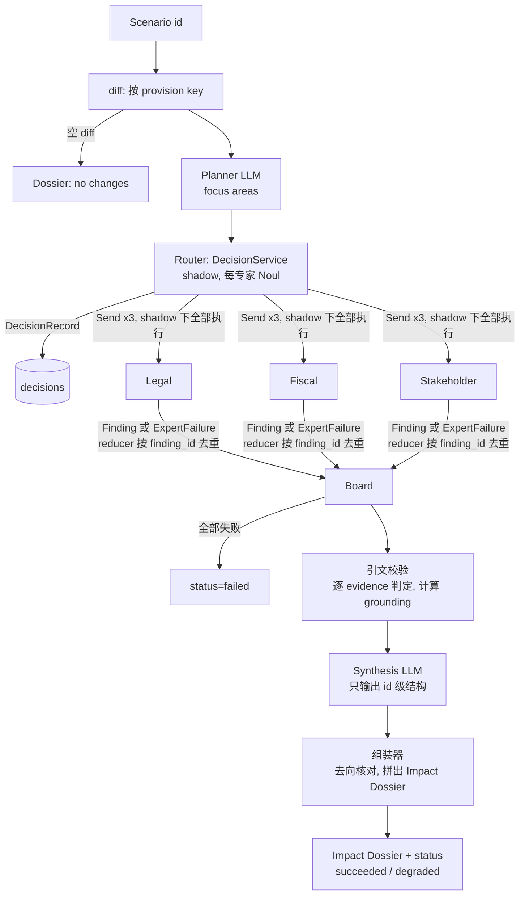

# feat: WOMM v0 端到端骨架（RIA 链路 + 评估基线）

## Overview

从空 repo 搭出 WOMM 的第一条可运行链路：AI Act fixture → provision 级 diff → Impact Planner → Router（shadow）→ 3 个专家并行 → Shared Impact Board → 引文校验 → Synthesis → Impact Dossier，并在 LangSmith 上跑出第一个评估基线。LLM 后端可插拔，开发期走本地 Claude Code 订阅。

交付分两步（see origin: docs/brainstorms/2026-09-28-womm-phased-requirements.md）：

- **周五 2026-10-02（必须）**：P1 本地链路 + P2 冒烟评估基线
- **v0.1（下周）**：P3 Railway 部署、P4 Jev shadow、P5 Failure 记录 + 噪声测量，以及 api 后端上的正式基线

---

## Problem Frame

WOMM 要证明 "Regulatory Change → Provision → Finding → Evidence → Source" 这条可追溯链路能真实跑通，并有一个能对比的评估基线，为 v1 的自进化打地基。同事负责的 AI Act 结构化数据还没到，所以 v0 自建 fixture，并用数据契约解耦。v0 不做任何自动改进，只为 v1 留好接口（SystemVersion、Failure 记录、DecisionRecord、运行事件）。

---

## Requirements Trace

v0 覆盖 origin 中的以下需求（v1 的 R17–R23、R25–R31、R33、R37 不在本计划内，只保留接口）：

- R1 数据契约 + 跨版本 provision key；R2 两类 fixture 场景；R3 按 key 的确定性 diff；R24 中"剔除引用 IA 结论的章节"这一条（v0 在 fixture 构建时实现，v1 再扩展到 holdout）
- R4 Impact Planner；R5 三个专家 + 自捕获失败；R6 系统填 ID / provenance；R7 只追加 Board；R8 Synthesis；R9 证据来源限定 + 引文原文匹配
- R10 Jev Router shadow + 超时降级
- R11 golden case（评估场景）；R12 指标（omissions 数值化，grounding 标注为引文存在率）；R13 LangSmith 实验按版本打标；R14a SystemVersion；R14b Failure 条目；R34 噪声测量
- R15 Railway 部署 + 异步任务；R16 全链路 tracing
- R32 可插拔 LLM 后端（`claude_code` 隔离调用 + `api`）
- R35 运行事件流接口（前端的接缝；页面实现另行规划）

**Origin actors:** A1 分析师/观众（提交与阅读）、A2 同事（数据契约的另一方）、A3 LLM agents、A4 Jev、A5 评估流程
**Origin flows:** F1 RIA 运行、F2 评估（v0 基线部分）
**Origin acceptance examples:** AE1（covers R9）、AE2（covers R10）

---

## Scope Boundaries

- 不做：Jev publish/deliver/relate、Workforce/Evidence 专家、Exa、Improvement Planner、MiniCheck、人工审核、页面 3–4（沿用 origin 的 v0 范围）
- 不做：运行中断后的续跑（v0 重启时把未完成的运行标为失败；续跑属于 v1 的 R29）
- 不做：取消运行、重复提交去重
- 不做：golden case 自动导入（v1 的 R33）；v0 的 golden case 手写

### Deferred to Follow-Up Work

- Demo 页面 1–2（R36）：等用户按 R36 出完设计后单独规划；本计划只提供 R35 的事件与查询接口
- v1 全部内容：在 v0 交付之后另写计划

---

## Context & Research

### Relevant Code and Patterns

- Repo 为空（只有 `docs/brainstorms/`、`brainstorm/Plan.docx`、`.env`），没有可沿用的本地模式，全部按下列外部参考建立约定。
- 本机环境：Python 3.14.6、uv 0.9.26、Docker 29.2.1、Railway CLI、Claude Code 2.1.283（`claude -p` 支持 `--json-schema`、`--output-format json`、`--tools ""`、`--setting-sources`、`--strict-mcp-config`、`--system-prompt`、`--no-session-persistence`）。
- `.env` 里已有 LangSmith 相关变量（`CC_LANGSMITH_API_KEY`、`CC_LANGSMITH_PROJECT`、`LANGSMITH_ENDPOINT`），用于 Claude Code 自身的 tracing 插件；WOMM 应用使用独立的 `LANGSMITH_API_KEY` / `LANGSMITH_PROJECT`，避免 trace 混进同一个 project。

### Institutional Learnings

- 无（`docs/solutions/` 不存在）。

### External References

- LangGraph 1.x（Context7 `/websites/langchain_oss_python_langgraph`）：自定义 `StateGraph`、`Send` 并行分支、Annotated reducer、`context_schema` 运行时上下文、`langgraph.json` 可指向图工厂函数。
- LangSmith：`aevaluate(target, data, evaluators, summary_evaluators, max_concurrency, num_repetitions, metadata)`；`@traceable(run_type="llm", metadata={ls_provider, ls_model_name})` 并在 run tree 上设置 `usage_metadata`（含可选 cost）来记录 subprocess 调用的 token 与成本。
- Cellar 内容协商（已实测可用，EUR-Lex 网页有 WAF 拦截，不要抓）：
  - `publications.europa.eu/resource/celex/32024R1689`，`Accept: application/xhtml+xml`：终版 XHTML，结构 id 为 `art_N`、段落 `NNN.NNN`、章节 `cpt_*`、附件 `anx_*`
  - `52021PC0206`：按 300 列表选 `DOC_1`（提案 + 解释备忘录）和 `DOC_3`（附件）。Word 转出的 XHTML，按 `Titrearticle` 切条款，没有稳定 id
  - SWD(2021)84（`52021SC0084`）：Part 1 的 6.1.3 成本与行政负担、6.1.4 SME test、6.2 公共部门成本；Part 2 的 Annex 3
- Jev：`typesafe-sdk`（`TypeSafeClient`，`Choice` / `Score` / `Noul`）；REST 为 `POST https://api.typesafe.ai/v1/systemone`；限流 1200 次/分钟；据报道 9/22 起暂停新注册（未核实）。
- Python 兼容性：langgraph 1.2.12、langchain-core 1.6.5、langsmith 0.14.1、langgraph-checkpoint-postgres 3.1.2、psycopg-binary 3.3.6、pydantic 2.13.5、fastapi 0.141.1 都能在 3.14 上装；为降低风险 pin 3.13。
- Railway：官方 LangGraph 指南使用 Railpack 或 Dockerfile；单个请求约 15 分钟上限；需要 `/health`；重新部署会杀掉正在跑的运行。

---

## Key Technical Decisions

- **Python 3.13，uv 管理**：3.14 能装，但 langgraph 没有 3.14 classifier；3.13 在 Railway 和原生依赖上最稳。`requires-python = ">=3.13,<3.15"`。
- **SystemVersion 用 repo 里的 YAML 文件表示，版本身份 = 内容哈希**（`system_versions/*.yaml`）：配置跟随 git，不可变，改了 prompt 就会得到新哈希。代码改动不在哈希里，所以 provenance、RunResult 和 Failure 记录还要同时写上 git sha、工作区是否有未提交改动、claude CLI 版本；模型用完整 ID，不用别名。工作区有未提交改动时，`run_eval` 拒绝打 `baseline_kind` 标签。周五不需要数据库；v0.1 把它镜像进 Postgres。
- **周五不依赖 Postgres**：P1/P2 通过 CLI 和评估脚本直接调用图，运行结果写成 JSON 文件并进入 LangSmith trace。Postgres（Docker 本地 / Railway 线上）从 P3 起引入，存 runs、run_events、decision_records、failures。这样周五的关键路径上少一个依赖。
- **v0 专家 = 单次结构化输出调用**，不用 `create_agent`：兼容 `claude_code` 后端（see origin Key Decisions）。v0 的条款文本直接放进 prompt，不给专家检索工具。
- **LLM 后端接口统一为"消息 + Pydantic schema → 校验后的对象 + usage"**：
  - `claude_code`：隔离的 `claude -p` 子进程
  - `api`：`init_chat_model(...).with_structured_output(schema)`
  - `fake`：测试用，按脚本回放
  - 每个角色的后端、模型、超时、重试写在 SystemVersion 里
- **`claude_code` 的隔离方式**：
  - 不能用 `--bare`：实测它会禁用 OAuth，订阅就用不了
  - 改用 `--tools ""` + `--strict-mcp-config` + 限制 `--setting-sources` + `--system-prompt`（覆盖默认 prompt）+ `--no-session-persistence` + 每次调用新建临时 cwd（里面没有 golden 数据）
  - 子进程使用环境变量白名单（PATH、HOME、locale、TMPDIR，以及 OAuth 所需的变量），剔除 `ANTHROPIC_API_KEY`、`LANGSMITH_*`、`CC_LANGSMITH_*`、`TRACE_TO_LANGSMITH`，防止悄悄切到 API 计费，也防止触发 Claude Code 自己的 tracing
  - 这套组合能否屏蔽用户的 hooks 和 CLAUDE.md，由 U5 的 canary 自检实测；`--restricted` 作为候选参数一起评估
- **unsupported finding 由组装器直接放进 open questions**，并标注 "evidence unresolved"，Synthesis 无权改动它们的去向，这样 AE1 是确定性的。
- **Synthesis 只引用 id，不回写原文**：Synthesis 输出的是 finding_id / evidence_id 的组织方式（合并、分歧、影响链、open question）。最终的 Impact Dossier 由确定性的组装器按 id 拼出来，并对每条输入 finding 做去向核对。这样 Synthesis 没法改写引文，也没法悄悄丢掉 finding。
- **引文校验放在 Synthesis 之前**，按单条 evidence 判定：不通过的 evidence 剔除；一条 finding 至少剩 1 条通过的 evidence 才算 supported，否则进入 open questions 并标 "evidence unresolved"（AE1）。grounding 指标（引文存在率）在 Synthesis 之前计算。
- **引文归一化规则**（两边用同一套）：
  - NFKC + casefold
  - 弯引号转直引号；各类连字符统一成 `-`
  - 合并换行处的断词连字符
  - 所有空白折叠成单个空格，因此允许跨段落匹配
  - 遇到 `…` / `...` 就切成几段，要求按顺序全部命中，并且每段至少 4 个词
  - 归一化后总共至少 6 个词才能算通过
  - 只在所引 `source_id` 的去 IA 文本里匹配
- **运行状态机**：`queued → running → succeeded | degraded | failed`。
  - `degraded`：至少一个专家失败但至少一个成功；或者 Synthesis 失败，此时组装器把全部 supported findings 原样列为未合并的 impacts，并记录 Synthesis 的错误
  - 以下情况为 `failed`：
    - Planner 失败
    - 全部专家失败（此时跳过 Synthesis）
    - 服务启动时，遗留的 `running` 运行标为 `failed(orphaned)`
  - diff 为空时直接返回 "no changes" 的 Dossier，不调用 LLM
- **失败分类** `error_kind ∈ {auth, rate_limit, timeout, schema_invalid, process_error}`：
  - `auth`：每次运行 / 实验开始前做一次预检，失败就快速失败
  - `schema_invalid`：带上校验错误重试 2 次
  - `timeout`：强制结束子进程
  - `claude_code` 后端用信号量限制并发子进程数
  - 评估里，`auth` / `timeout` 算基础设施错误：该 case 标为 errored，不计入汇总；遇到 `rate_limit` 就停掉整个实验，不记录受污染的结果
- **评估：judge 与专家隔离**：coverage / omissions judge 作为单独角色，能看到参考 IA，但它的 prompt 和临时目录与专家完全分开。judge 失败时指标记为 `null`，不是 0；只要有 case 没打上分，实验就标 `partial=true`。
- **golden case 存在 `evals/golden/`**（YAML），同时同步成 LangSmith dataset：inputs 放场景 id，reference_outputs 放期望影响。v0 没有 Improvement Planner，把参考答案放进 LangSmith 可以接受。专家从来不经过 LangSmith 读数据，而且跑在没有文件访问的临时 cwd 里。v1 的 R23 再把 holdout 迁进自有数据库。
- **v0 评估场景用条款子集，不用整份提案**：
  - 每个 golden case = 与 SWD(2021)84 某一子节对应的一组 COM(2021)206 条款，以"无先前版本"作为 diff 输入
  - 这样控制了每次调用的 token 量，也和 R11 的"可管理子节"一致
  - 候选 case：① 提供者合规成本与行政负担（6.1.3，对应高风险要求与提供者义务）；② SME 影响（6.1.4，对应 sandbox 与 SME 措施、罚则）；③ 可选的公共部门成本（6.2）
- **Router 的决策层现在就接入 DecisionService 接口**：P1 用 stub，DecisionRecord 记 `decider=stub`；P4 换成 Jev（`decider=jev`）。Jev 用"每个专家一个 Noul 问题"，因为专家相关性是多标签判断，Noul 直接给出概率。
- **API 鉴权**：除 `/health` 外，所有端点都要求 bearer token（`WOMM_API_TOKEN`），没有 token 返回 401；run_id 用 UUID，防止被枚举。
- **后台任务：FastAPI 进程内 asyncio 任务 + Postgres runs 表**（P3）：
  - v0 规模不需要单独的 worker 和队列
  - 运行事件写入 `run_events` 表，这就是 R35 前端要用的接缝
  - `GET /runs/{id}` 返回状态、各节点状态、error_kind；运行结束后才返回 Dossier

---

## Open Questions

### Resolved During Planning

- 评估场景用整份提案还是条款子集：用条款子集，按 IA 子节对齐（见 Key Decisions）。
- Jev 用单个 Choice 问题还是每个专家一个 yes/no：用每个专家一个 Noul（多标签）。
- 任务队列用 Postgres `SKIP LOCKED` 还是进程内：v0 用进程内 asyncio 任务，外加 runs 表和启动时的对账。
- 多个 evidence 的判定规则、引文归一化、运行状态机、失败分类：都已写进 Key Decisions。
- 周五要不要 Postgres：不要，从 P3 起引入。
- OpenAI / Claude 结构化输出：`api` 后端用 `with_structured_output`（原生），`claude_code` 用 `--json-schema`。两者都在后端内部用 Pydantic 再校验一遍。

### Deferred to Implementation

- `--setting-sources` / `--restricted` 取什么值才能在保留订阅 OAuth 的同时屏蔽用户插件、hooks 和 CLAUDE.md：由 U5 的 canary 自检实测，并记下每次调用的冷启动耗时。如果屏蔽不了，就在 Risks 里升级处理（候选方案是改用 Agent SDK 的显式参数，或者尽早切到 api 后端）。
- `claude -p --output-format json` 输出里 usage / cost 的确切字段名，以及 `--json-schema` 能否接受 Pydantic 生成的带 `$defs` / `$ref` 和可空必填字段的 schema：实现时对照真实输出确定。不支持的话，就把 schema 展平后再传。
- 解释备忘录要剔除哪些章节（除了 "Results of impact assessments" 之外，还有利益相关方咨询、比例性、预算影响等）：U3 构建 fixture 时逐节判断，并在 fixture 元数据里写明剔除清单。
- golden case 里期望影响的颗粒度和 coverage judge 的匹配 rubric：U10 写第一个 case 时定稿。官方 IA 按政策选项和受影响群体描述影响，judge 按"受影响方 + 作用机制"语义匹配。
- Jev 账号能不能拿到（据报道暂停注册）：拿不到就停在 stub，不影响 P1–P3。
- Railway 用 Dockerfile 还是 Railpack：U11 实现时选。倾向 Dockerfile，便于复现 uv 环境。

---

## Output Structure

    pyproject.toml
    uv.lock
    docker-compose.yml              # 本地 Postgres（P3 起）
    Dockerfile                      # Railway（P3）
    langgraph.json                  # 本地 Studio，指向图工厂
    system_versions/
      v0-baseline.yaml              # 角色 → 后端/模型/prompt；内容哈希即版本身份
    prompts/
      planner.md  legal.md  fiscal.md  stakeholder.md  synthesis.md  judge_coverage.md
    data/fixtures/ai_act/
      proposal.json  final.json     # 按 R1 契约结构化的条款
      crosswalk.yaml                # provision key 对照表（提案 ↔ 终版）
      sources.json                  # source_id → 去 IA 文本（条款 + 备忘录）
      scenarios.yaml                # 评估场景（条款子集）与 demo 场景
    evals/golden/
      case_01_provider_compliance_costs.yaml
      case_02_sme_impacts.yaml
    scripts/
      build_fixture.py              # 从 Cellar 拉取并解析，生成 data/fixtures
    src/womm/
      config.py
      models/        regulation.py findings.py dossier.py decisions.py system_version.py run.py
      data/          cellar.py parse_proposal.py parse_regulation.py fixtures.py
      diff.py
      citations.py
      llm/           base.py claude_code.py api.py fake.py
      decisions/     service.py stub.py jev.py
      graph/         state.py build.py planner.py router.py experts.py validate.py synthesis.py assemble.py
      eval/          golden.py evaluators.py run_eval.py
      api/           app.py jobs.py db.py migrations/
      cli.py
    tests/
      (与 src/womm 对应的 test_*.py；fixtures/ 放小型测试数据)

---

## High-Level Technical Design

> *This illustrates the intended approach and is directional guidance for review, not implementation specification. The implementing agent should treat it as context, not code to reproduce.*

LLM 后端的边界：graph 节点只依赖 `llm/base.py` 的接口，由 SystemVersion 为每个角色选择 `claude_code` / `api` / `fake`。

| 角色 | Friday 默认后端 | 有无工具 | 能否看到参考 IA |
|---|---|---|---|
| Planner / 专家 / Synthesis | claude_code | 无 | 否 |
| Coverage / omissions judge | claude_code（v0.1 起 api） | 无 | 是（单独的 prompt 与 cwd） |

---

## Implementation Units

### Phase A — 周五必须（P1 + P2）

- U1. **工程脚手架**

**Goal:** 可安装、可测试的 Python 项目骨架，统一配置加载。

**Requirements:** R16，R32（配置层）

**Dependencies:** 无

**Files:**
- Create: `pyproject.toml`, `src/womm/__init__.py`, `src/womm/config.py`, `langgraph.json`, `.env.example`, `.gitignore`
- Test: `tests/test_config.py`

**Approach:**
- uv 管理，pin Python 3.13；依赖包括 langgraph、langchain-core、langchain（`init_chat_model`）、langsmith、pydantic、fastapi、uvicorn、httpx、pyyaml、lxml（解析 XHTML）、langchain-openai（api 后端）；开发依赖 pytest、pytest-asyncio、ruff、`langgraph-cli[inmem]`（本地 Studio）
- `config.py` 从环境变量读取：`LANGSMITH_*`（与 `CC_LANGSMITH_*` 分开）、`WOMM_SYSTEM_VERSION` 路径、各 API key（可选）、`DATABASE_URL`（可选，P3 起）
- `.gitignore` 忽略 `.env`、`runs/`（本地运行输出）

**Test scenarios:**
- Happy path：设置了 `WOMM_SYSTEM_VERSION` 时，加载出对应路径
- Edge case：没有 `DATABASE_URL` 时配置仍然可用（周五路径）
- Error path：必需的 LangSmith 变量缺失时报出可读的错误，而不是 KeyError

**Verification:** 项目能装好依赖，测试跑通，`langgraph.json` 指向的工厂模块可以导入（工厂在 U7 实现）。

---

- U2. **领域模型（Pydantic 契约）**

**Goal:** 定义所有跨模块共享的数据结构，包括给同事的数据契约。

**Requirements:** R1, R5, R6, R8, R10, R14a, R14b

**Dependencies:** U1

**Files:**
- Create: `src/womm/models/regulation.py`, `findings.py`, `dossier.py`, `decisions.py`, `system_version.py`, `run.py`
- Test: `tests/models/test_regulation.py`, `test_findings.py`, `test_system_version.py`

**Approach:**
- `regulation.py`：Regulation → Version（id、date、status、source）→ Provision（`provision_key` 跨版本稳定且必填、article、paragraph、text、source_id）。这就是 R1 的交付契约，另外导出一份 JSON Schema 给同事。
- `findings.py`：
  - 两层模型：`FindingDraft` 是 LLM 输出，只含 provision_key、affected_actor、impact、mechanism、evidence[]（source_id + quote）和 confidence；`ImpactFinding` 是系统落库的版本，额外带 finding_id、每条 evidence 的 evidence_id、provenance（agent、system_version 哈希、prompt 哈希、backend、model、round）
  - ID 确定性生成：finding_id = hash(run_id, agent, draft 序号)，evidence_id = hash(finding_id, evidence 序号)
  - `ExpertFailure` 记 agent、error_kind、message、attempts
  - 所有面向 LLM 的模型都设 `extra="forbid"`，可选字段写成可空的必填字段，以兼容 OpenAI strict schema
- `dossier.py`：
  - `SynthesisPlan` 是 Synthesis 的 LLM 输出，只包含 id：impacts[]（引用的 finding_ids、影响链顺序、合并关系）、disagreement_pairs、open_questions（finding_id + reason）、discarded（finding_id + reason）
  - `ImpactDossier` 是最终输出，由组装器生成：impacts、evidence、open questions、failed_experts、status、system_version
- `decisions.py`：`DecisionRecord`（decision_point、input 摘要、decision、probability 可为空、mode、decider=`jev|stub`、system_version、error）。
- `system_version.py`：
  - 每个角色配置 backend、model（完整 ID）、prompt 路径、超时、重试次数
  - 另有 agents 列表和 router_mode
  - `version_id` = 规范化 YAML 内容的哈希，再加上 prompt 文件内容的哈希
- `run.py`：`RunStatus` 枚举，以及 `RunResult`（status、dossier、board、decisions、指标原料、耗时和 usage、code_identity：git sha、工作区是否有未提交改动、claude CLI 版本）。

**Test scenarios:**
- Happy path：一个合法的 Provision 能通过校验，JSON Schema 能导出
- Error path：Provision 缺少 `provision_key` 时报校验错误（R1 规定必填）
- Error path：`FindingDraft` 带了多余字段（比如 LLM 自己加的 `finding_id`）时被拒（`extra="forbid"`，对应 R6）
- Edge case：evidence 为空列表时 `FindingDraft` 仍然合法，交给引文校验去判为 unsupported，而不是在模型层直接拒绝，保证能走到 AE1 的路径
- Happy path：同一份 SystemVersion 文件算两次哈希结果相同；prompt 文件改动一个字符后哈希改变
- Edge case：YAML 里只是 key 顺序不同，哈希不变

**Verification:** 所有模型可以序列化和反序列化，版本哈希稳定。

---

- U3. **AI Act fixture 构建**

**Goal:** 从 Cellar 拉取并解析提案和终版，生成 fixture、跨版本对照表、证据来源和场景定义。

**Requirements:** R1, R2, R9, R24（v0 的剔除规则）

**Dependencies:** U2

**Files:**
- Create: `scripts/build_fixture.py`, `src/womm/data/cellar.py`, `src/womm/data/parse_proposal.py`, `src/womm/data/parse_regulation.py`, `src/womm/data/fixtures.py`
- Create（生成物，提交进 repo）: `data/fixtures/ai_act/proposal.json`, `final.json`, `crosswalk.yaml`, `sources.json`, `scenarios.yaml`
- Test: `tests/data/test_parse_regulation.py`, `tests/data/test_parse_proposal.py`, `tests/data/test_fixtures.py`, `tests/fixtures/`（小段 XHTML 样本）

**Approach:**
- `cellar.py`：按 CELEX 做内容协商下载，缓存到本地（不进 git），只在构建时调用；运行时只读生成好的 fixture。
- 终版按 `art_N` 和段落 id 解析；提案按 `Titrearticle` 和段落 class 切分。
- `crosswalk.yaml` 手工维护：只覆盖 scenarios 里用到的条款，对应到稳定的 provision key（例如罚则：提案 Art.71 ↔ 终版 Art.99）。
- `sources.json`：
  - 每个 source_id 对应一段去 IA 的文本，包括选中的提案条款和解释备忘录
  - 备忘录中引用 IA 结论的章节整节剔除，剔除清单写进元数据
- `scenarios.yaml`：
  - 评估场景：每个 golden case 对应一组提案条款，前一版本为空
  - demo 场景：少量"提案 → 终版"对应条款
- 官方 IA 文本**不**进入 `data/fixtures/`，只在 `evals/golden/` 以期望影响的形式出现（U10）。

**Execution note:** 解析器先用从真实页面截取的小样本写测试，再跑完整构建。

**Patterns to follow:** Cellar 的 URL 与 Accept 头见 Context & Research。

**Test scenarios:**
- Happy path：终版样本 XHTML 能解析出条号、段落号和文本，段落顺序保持不变
- Happy path：提案样本按 `Titrearticle` 切出条款，编号型段落（ManualNumPar1）被识别为段落
- Edge case：条款里的列表项（point (a)(b)）被并进所在段落的文本，而不是丢掉
- Edge case：对照表里提案 Art.71 对应终版 Art.99 时，两边得到同一个 provision key
- Error path：scenario 引用了对照表里没有的条款时，构建直接失败并指出是哪一条
- Integration：`sources.json` 的任何文本里都不包含被剔除章节的标题（保证 R9 / R24 的剔除确实生效）

**Verification:** 生成的 fixture 能通过 U2 的契约校验，scenario 引用的每个 provision key 都能找到。

---

- U4. **Provision 级 diff 与场景输入**

**Goal:** 按 provision key 做确定性 diff，把场景转换成图的输入。

**Requirements:** R2, R3

**Dependencies:** U2, U3

**Files:**
- Create: `src/womm/diff.py`
- Test: `tests/test_diff.py`

**Approach:**
- 输入两个 Version（前一版本可以为空），按 provision key 匹配，输出 added / removed / modified 三类。modified 要求归一化空白之后文本仍有差异。
- 评估场景：前一版本为空，所以全部是 added。
- 空 diff 是合法结果，由图直接走 "no changes" 分支。

**Test scenarios:**
- Happy path：前一版本为空时，所有条款都算 added
- Happy path：条号变了、key 相同、文本不变，结果是没有变化（验证重新编号不会被当成删除加新增）
- Happy path：key 相同、文本变了，结果是 modified，并同时带出新旧文本
- Edge case：两个版本完全相同，得到空 diff
- Edge case：只有空白或换行不同，不算 modified

**Verification:** demo 场景的 diff 里能看到预期的 modified 条款，评估场景的 diff 全部是 added。

---

- U5. **可插拔 LLM 后端**

**Goal:** 提供统一的结构化调用接口，实现 `claude_code`（隔离的订阅 CLI）、`api` 和 `fake` 三种后端。

**Requirements:** R32, R16, R5（失败分类）

**Dependencies:** U1, U2

**Files:**
- Create: `src/womm/llm/base.py`, `src/womm/llm/claude_code.py`, `src/womm/llm/api.py`, `src/womm/llm/fake.py`
- Test: `tests/llm/test_claude_code.py`（用子进程桩）, `tests/llm/test_api.py`, `tests/llm/test_fake.py`, `tests/llm/test_claude_code_live.py`（标记为 `live`，默认不跑）

**Approach:**
- `base.py`：
  - 接口是"system prompt + user 内容 + Pydantic 模型 + 调用选项 → 校验后的对象 + usage（输入/输出 token、成本、耗时）"
  - 统一的异常类型带上 `error_kind`
  - schema 校验失败时，带着校验错误重试
- `claude_code.py`：
  - 每次调用新建临时目录作为 cwd，调用结束后删掉
  - CLI 参数：`--print`、`--output-format json`、`--json-schema`、`--model`、`--system-prompt`、`--tools ""`、`--strict-mcp-config`、`--setting-sources`（限制到最少）、`--no-session-persistence`
  - 用信号量限制并发；超时就强制结束子进程
  - 按退出码和输出内容把失败归类到 `error_kind`
  - 以 `@traceable(run_type="llm")` 包装，并把 CLI 输出里的 usage 和 cost 写进 run
- 子进程只拿到环境变量白名单（见 Key Decisions）；用户内容通过 stdin 传入，不放在 argv 里
- 启动自检（每次运行 / 实验做一次）：
  - `auth` 预检：发一条极小的请求
  - 隔离验证（canary 方式）：
    - 用 `--output-format stream-json --verbose` 发起一次调用，检查 init 事件里的工具列表、MCP 服务器、已加载的 memory / CLAUDE.md 文件都为空，并且流里没有 hook 事件
    - 在临时 cwd 的上层目录放一个带唯一 canary 的 CLAUDE.md，要求模型逐字复述 system prompt 以外收到的全部指令，确认 canary 没有出现
    - 确认 Claude Code 自己的 tracing project 里没有新增 trace
  - 自检不通过就拒绝运行（fail closed），不以"隔离"名义产出任何基线
- `api.py`：`init_chat_model` + `with_structured_output`，provider 和 model 来自 SystemVersion；OpenAI key 到位之前，不配置这个后端就用不上。
- `fake.py`：按 (角色, 调用序号) 回放预设的输出或异常，供图测试和评估测试使用。

**Test scenarios:**
- Happy path（桩子进程）：CLI 返回合法 JSON，得到校验后的对象，usage 被填上
- Error path：CLI 返回的 JSON 不符合 schema，带着错误重试；连续失败 3 次后抛出 `schema_invalid`
- Error path：子进程超时后被结束，抛出 `timeout`，没有残留进程
- Error path：CLI 输出表示未登录，抛出 `auth`，并且不重试
- Error path：CLI 输出表示触发限流，抛出 `rate_limit`
- Edge case：并发请求数超过信号量上限时排队执行，同时运行的数量不超过上限
- Integration：检查实际传给子进程的参数，确认包含 `--tools ""`、`--strict-mcp-config`、`--no-session-persistence`，不包含 `--bare`，且 cwd 为临时目录
- Integration：子进程的环境变量里不包含 `ANTHROPIC_API_KEY`、`LANGSMITH_*`、`CC_LANGSMITH_*`、`TRACE_TO_LANGSMITH`，即使父进程里设置了这些变量
- Error path（桩）：init 事件里出现了 memory 文件或工具，自检失败，后端拒绝运行
- Integration（live，手动触发）：真实 CLI 能返回一个合法的小对象；canary 自检通过，并记录实测所用的 `--setting-sources` / `--restricted` 取值
- Happy path：`fake` 按预设顺序返回，预设用完时报出清楚的错误

**Verification:** 三种后端都能通过同一套接口测试；在本机跑 live 测试能通过隔离自检。

---

- U6. **引文校验**

**Goal:** 按确定性规则判断每条 evidence 是否在所引来源里存在，并算出 grounding 原料。

**Requirements:** R9, R12（grounding 标为引文存在率）

**Dependencies:** U2, U3

**Files:**
- Create: `src/womm/citations.py`
- Test: `tests/test_citations.py`

**Approach:**
- 归一化规则见 Key Decisions，两边使用同一个函数。
- 按单条 evidence 判定：`source_id` 必须存在；finding 的 provision key 必须在当前 diff 里；归一化后的 quote 必须是归一化来源文本的子串，遇到省略号就分段按顺序匹配，并且满足最少词数。
- 输出每条 evidence 的判定结果（通过 / 不通过 + 原因），以及每条 finding 的 supported 状态。

**Test scenarios:**
- Happy path：原文一字不差地引用，判为通过
- Edge case：quote 用弯引号、来源用直引号，判为通过
- Edge case：来源在换行处有断词连字符（"obli-\ngations"），quote 写成 "obligations"，判为通过
- Edge case：quote 跨越两个段落（中间有换行），判为通过
- Edge case：quote 中带 "…"，前后两段都按顺序命中则通过；顺序颠倒则不通过
- Edge case：quote 由 1–2 个词的碎片加省略号拼成（"the … provider … shall … system"），即使按顺序命中也判为不通过，原因为 too_fragmented
- Edge case：quote 只有 3 个词（"the Commission shall"），因为太短判为不通过
- Error path：`source_id` 不存在，判为不通过，原因为 unknown_source
- Error path：quote 在另一个来源里存在、但不在所引来源里，判为不通过
- Covers AE1：finding 的全部 evidence 都不通过时判为 unsupported；只要有一条通过，就判为 supported，并剔除不通过的那几条

**Verification:** 所有归一化用例都通过；grounding 等于通过的 evidence 数除以 evidence 总数。

---

- U7. **RIA 图（Planner → Router → 专家 → Board → 校验 → Synthesis → 组装）**

**Goal:** 由 SystemVersion 构建 LangGraph，跑通 F1，覆盖全部状态分支。

**Requirements:** R4, R5, R6, R7, R8, R9, R10（stub）, R14a, R16, R32；F1；AE1, AE2

**Dependencies:** U2, U4, U5, U6；DecisionService 的 stub（本单元内先写一个最小 stub，U8 再完善）

**Files:**
- Create: `src/womm/graph/state.py`, `build.py`, `planner.py`, `router.py`, `experts.py`, `validate.py`, `synthesis.py`, `assemble.py`
- Create: `src/womm/decisions/service.py`, `src/womm/decisions/stub.py`
- Create: `system_versions/v0-baseline.yaml`, `prompts/planner.md`, `legal.md`, `fiscal.md`, `stakeholder.md`, `synthesis.md`
- Create: `src/womm/cli.py`（`womm run <scenario>`：输出 Impact Dossier JSON 到 `runs/`，并打印 LangSmith trace 链接）
- Test: `tests/graph/test_build.py`, `test_experts.py`, `test_synthesis_assemble.py`, `test_run_status.py`, `tests/graph/test_end_to_end_fake.py`

**Approach:**
- `build.py`：工厂函数按 SystemVersion 的 agents 列表注册专家节点；prompt、模型、router 模式通过 `context_schema` 在运行时注入；`langgraph.json` 指向这个工厂，本地可以用 Studio 看图。
- 状态：
  - board 按专家分槽：reducer 以 agent 为 key，同一专家的新写入整体替换旧写入，所以节点重试会覆盖而不是追加
  - failures、decisions 各自有 reducer
  - 另有 diff、focus、validation、synthesis_plan、status
- Planner 输出 focus areas（引用 provision key）。diff 里没有的 key 会被过滤掉；如果过滤后为空，专家就拿完整 diff。
- Router：调用 DecisionService，每个专家问一次"是否相关"。shadow 模式下无论结果如何都用 `Send` 发给全部专家，DecisionRecord 进入状态（AE2）。
- 专家节点：
  - 把 diff 中相关条款的文本、focus 和可引用来源的清单一起放进 prompt
  - 调用 R32 后端得到 `FindingDraft[]`，节点补上 finding_id、evidence_id、provenance
  - 任何异常都在节点内部捕获，转成 `ExpertFailure` 写进状态，不向上抛
- 校验节点：对 board 调用 U6，并记录 grounding 原料。
- 如果全部专家失败，就跳过 Synthesis，status 为 failed。
- 如果 Synthesis 失败，组装器把全部 supported findings 原样列为未合并的 impacts，status 为 degraded，并记录 Synthesis 的错误。
- Synthesis：输入是 supported findings（带 id）和 unsupported 列表，输出 `SynthesisPlan`，只含 id。
- 组装器（确定性）：
  - 检查 `SynthesisPlan` 里的每个 id 都存在，并且只引用 supported 的 evidence
  - unsupported findings 由组装器直接放进 open questions（"evidence unresolved"），不看 `SynthesisPlan`；`SynthesisPlan` 里如果把它们放进 impacts 或 discarded，一律忽略
  - 每条 supported finding 都要有去向（kept / merged / open_question / discarded）；没有去向的放进 "unprocessed" 区
  - 生成 Impact Dossier，并确定 status 是 succeeded 还是 degraded
- 空 diff 时在进入 Planner 之前就短路，返回 no changes。

**Execution note:** 先用 `fake` 后端写端到端测试，覆盖所有状态分支，然后再接真实后端。

**Technical design:** 见 High-Level Technical Design 中的流程图。

**Test scenarios:**
- Happy path（fake）：三个专家都返回合法 findings，最终 status=succeeded；Impact Dossier 中每条 impact 都能沿 evidence_id 追溯到 source_id 和 provision_key
- Covers AE2：Router 的 stub 判 Fiscal 不相关（shadow 模式），Fiscal 仍然执行，并有 DecisionRecord 记录 decision=not_relevant、mode=shadow、decider=stub
- Covers AE1：某条 finding 的引文全部不通过，它出现在 open questions，并标注 "evidence unresolved"，不出现在 impacts 里
- Error path：Fiscal 抛出 timeout，status=degraded，Impact Dossier 的 failed_experts 列出 Fiscal 及其 error_kind
- Error path：三个专家全部失败，status=failed，Synthesis 没有被调用
- Error path：Planner 失败，status=failed
- Error path：Synthesis 失败，status=degraded，Impact Dossier 里是全部未合并的 supported findings，并记录 Synthesis 的错误
- Edge case：空 diff，返回 no changes 的 Impact Dossier，LLM 调用次数为 0
- Edge case：Planner 返回的 key 都不在 diff 里，过滤后为空，专家拿到完整 diff
- Edge case：Synthesis 引用了一个不存在的 finding_id，组装器拒绝该 impact 并记录；一条 finding 没被 Synthesis 提到，它出现在 unprocessed 区
- Edge case：某个专家节点运行两次，产出不同的 findings（模拟重试），board 里只保留第二次的结果
- Covers AE1：`SynthesisPlan` 试图把一条 unsupported finding 放进 impacts，组装器忽略这一步，它仍然出现在 open questions
- Happy path：SystemVersion 的 agents 列表只列两个专家时，图里只有两个专家节点
- Integration（fake）：RunResult 带有 system_version 哈希，每个 LLM 调用的 provenance 都指向这个哈希

**Verification:** `womm run` 至少在 case_01 的评估场景上能用 `claude_code` 后端产出 Impact Dossier；LangSmith 里有完整 trace；图也能在 Studio 里打开。demo 场景是加分项，见 Phased Delivery 的砍范围顺序。

---

- U10. **评估基线（冒烟）**

**Goal:** 写出 golden case，同步成 LangSmith dataset，实现评估器，并跑出第一个带版本标签的实验。

**Requirements:** R11, R12, R13, R14a；F2；周五成功标准

**Dependencies:** U7

**Files:**
- Create: `evals/golden/case_01_provider_compliance_costs.yaml`, `evals/golden/case_02_sme_impacts.yaml`, `prompts/judge_coverage.md`
- Create: `src/womm/eval/golden.py`, `src/womm/eval/evaluators.py`, `src/womm/eval/run_eval.py`
- Test: `tests/eval/test_golden.py`, `tests/eval/test_evaluators.py`, `tests/eval/test_run_eval_fake.py`

**Approach:**
- golden case 的字段：scenario_id、对应的 IA 子节（引用 SWD(2021)84 的章节号）、期望影响（受影响方、机制、影响，按 IA 的表述手写，每条必须带 `provision_keys`，说明它来自场景里的哪些条款）、重要遗漏清单。降级方案是周五只写 case_01。
- `golden.py` 负责把 golden case 同步成 LangSmith dataset（inputs = scenario_id，reference_outputs = 期望影响）。
- 评估器：
  - coverage：judge 判断每条期望影响是否被某条 impact 命中，得分为命中数除以期望数
  - omissions：同一个 judge 调用对重要遗漏清单逐条判断，给出数值分
  - grounding：直接读取 RunResult 里的引文存在率，不需要 judge
  - efficiency：耗时、token、成本
- judge 是独立角色，使用自己的 prompt 和临时 cwd。judge 失败时指标记为 null；case 出现基础设施错误时标为 errored，不计入汇总；实验不完整时 metadata 标上 `partial=true`。
- 实验 metadata 包括 system_version 哈希、每个角色的 backend 和 model、`baseline_kind=smoke`（在 claude_code 上跑时）、git sha。
- `run_eval.py` 调用 `aevaluate`，支持 `num_repetitions` 参数，为 R34 预留。

**Test scenarios:**
- Happy path：golden YAML 能通过 schema 校验并同步成 dataset，重复同步时幂等，不会重复创建 example
- Happy path（fake judge）：3 条期望影响命中 2 条，coverage = 0.667
- Edge case：judge 返回 schema_invalid 并用完重试，该指标为 null，不是 0
- Edge case：一个 case 因为 auth 失败，被标为 errored，从汇总中剔除，实验 metadata 为 partial=true
- Error path：遇到 rate_limit，整个实验停止，并且不写入汇总
- Happy path：grounding 评估器读取 RunResult 里预先算好的存在率，不调用 LLM
- Integration（fake）：实验 metadata 里包含 system_version 哈希和各角色的后端标签
- Error path：golden case 引用了不存在的 scenario_id，同步时直接失败
- Error path：某条期望影响的 `provision_keys` 不在场景的条款子集里，同步时直接失败
- Error path：工作区有未提交改动时要求打 `baseline_kind` 标签，被拒绝

**Verification:** LangSmith 上出现一个带 system_version 标签、`baseline_kind=smoke` 的实验，至少覆盖 case_01，coverage、omissions、grounding、efficiency 四项指标都能看到。

### Phase B — v0.1（P3–P5）

- U8. **Jev DecisionService（P4）**

**Goal:** 把 Router 的 stub 换成 Jev，保留 stub 作为降级。

**Requirements:** R10；AE2

**Dependencies:** U7

**Files:**
- Create: `src/womm/decisions/jev.py`
- Modify: `src/womm/decisions/service.py`, `system_versions/v0-baseline.yaml`（新建一份带 Jev 的版本文件，比如 `v0.1-jev.yaml`，不改原文件，以保持版本不可变）
- Test: `tests/decisions/test_jev.py`, `tests/decisions/test_service.py`

**Approach:**
- 每个专家一个 Noul 问题，state 放 diff 摘要加 focus。用 `typesafe-sdk` 或直接调 REST。
- 设短超时（几秒）；超时或出错时记 `decision=error`、probability 为空、附错误原因，运行继续。
- 送进 Jev 的 state 在控制在 32k token 以内；超过就截断，并在 DecisionRecord 里记下。
- 已知问题：state 里如果带 URL 类文本，可能被 Cloudflare 拦截（403 HTML），要归类为 process_error。

**Test scenarios:**
- Happy path（HTTP 桩）：3 个 Noul 返回概率，生成 3 条 DecisionRecord，decider=jev
- Error path：Jev 超时，DecisionRecord 记 decision=error、probability 为空，专家照常执行
- Error path：返回 HTML 403，归类为 process_error，运行继续
- Edge case：state 超过 token 上限时被截断，DecisionRecord 标 truncated=true
- Happy path：SystemVersion 选择 stub 时完全不调用 Jev

**Verification:** 有 Jev 账号时 shadow 决策能写入 DecisionRecord；没有账号时 stub 路径不受影响。

---

- U9. **持久化（Postgres）**

**Goal:** 存储运行、事件、决策、失败和版本，供 API、前端和 v1 使用。

**Requirements:** R14a（镜像）, R14b, R15, R35

**Dependencies:** U2, U7

**Files:**
- Create: `docker-compose.yml`, `src/womm/api/db.py`, `src/womm/api/migrations/001_init.sql`
- Test: `tests/api/test_db.py`（需要 Postgres，用 docker-compose 起；没有 Postgres 时跳过）

**Approach:**
- 表：`system_versions`（哈希、YAML 原文）、`runs`（id、scenario、status、error_kind、system_version、时间、dossier JSON）、`run_events`（run_id、seq、node、event、payload、时间）、`decision_records`、`failures`（R14b：case、agent、类别、system_version）。
- 迁移用顺序编号的 SQL 文件，启动时幂等执行，不引入迁移框架。
- 运行事件由图的节点回调写入。周五的 CLI 路径不写数据库，所以数据库写入要可选。

**Test scenarios:**
- Happy path：写入一次运行及其事件，按 seq 顺序读回
- Edge case：迁移重复执行幂等
- Integration：fake 运行跑完后，runs 的状态和 decision_records 条数都与 RunResult 一致
- Error path：数据库不可用时，CLI 路径仍然能完成运行（只写 JSON 文件）

**Verification:** 本地 docker Postgres 上完整跑一次，所有表都有正确的数据。

---

- U11. **API、后台任务与 Railway 部署（P3）**

**Goal:** 通过 HTTP 提交运行、轮询状态、读取事件；部署到 Railway。

**Requirements:** R15, R16, R35；F1 的 Trigger

**Dependencies:** U7, U9

**Files:**
- Create: `src/womm/api/app.py`, `src/womm/api/jobs.py`, `Dockerfile`
- Test: `tests/api/test_app.py`, `tests/api/test_jobs.py`

**Approach:**
- 端点：
  - `POST /runs`：body 为 scenario_id，返回 run_id，状态为 queued
  - `GET /runs/{id}`：返回状态、各节点状态、error_kind；succeeded 或 degraded 时附带 Impact Dossier
  - `GET /runs/{id}/events`：按 seq 分页返回，这是 R35 的接缝，SSE 留给前端规划时再加
  - `GET /health`
- 鉴权：除 `/health` 外都校验 `Authorization: Bearer <WOMM_API_TOKEN>`；run_id 用 UUID。
- 用进程内 asyncio 任务执行运行，并限制同时进行的运行数；服务启动时把遗留的 running 运行标为 failed(orphaned)。
- 线上只能用 `api` 后端，因为 Railway 上没有订阅。所以部署依赖 API key，没有 key 时服务照样启动，但提交运行会返回清楚的错误。
- Dockerfile 用 uv 安装锁定的依赖；Railway 上配置 Postgres 插件和 `DATABASE_URL`。

**Test scenarios:**
- Happy path：POST 提交后轮询，状态依次为 queued、running、succeeded，GET 带回 Impact Dossier（fake 后端）
- Error path：scenario_id 不存在，返回 404
- Error path：没有 token 或 token 错误，POST / GET / events 都返回 401；`/health` 不需要 token
- Edge case：run_id 是 UUID，猜测的 id 返回 404，不会泄露其他运行
- Error path：SystemVersion 要求 api 后端但没有配置 key，POST 返回可读的错误，不会创建一个注定失败的运行
- Edge case：模拟重启，遗留的 running 运行被标为 failed，error_kind=orphaned
- Edge case：运行进行中请求 GET，只返回状态和节点进度，不含 Impact Dossier
- Integration：events 端点按顺序返回节点开始和完成事件，与运行过程对应

**Verification:** Railway 上的 `/health` 正常；在线上提交一个评估场景，能拿到 Impact Dossier（需要 API key）。

---

- U12. **正式基线、噪声测量与 Failure 记录（P5）**

**Goal:** 在 api 后端上跑出正式基线，重复运行测量噪声，并把未通过的 case 记为 Failure 条目。

**Requirements:** R14b, R34, v0.1 成功标准

**Dependencies:** U9, U10，以及 API key

**Files:**
- Modify: `src/womm/eval/run_eval.py`
- Create: `system_versions/v0.1-api.yaml`
- Test: `tests/eval/test_noise.py`, `tests/eval/test_failures.py`

**Approach:**
- 新建一份 api 后端的版本文件，与 claude_code 冒烟基线的版本哈希不同，实验标签 `baseline_kind=reference`。
- 对每个 case 重复运行 3 次，计算 coverage、grounding、omissions 各自的均值和离散度，写进实验的 summary 和一份本地报告。
- Failure 条目：coverage 或 omissions 低于某个阈值时，按 case 和 agent 写进 failures 表。阈值先设成宽松的默认值，v1 规划时再调。

**Test scenarios:**
- Happy path（fake，给定 3 次不同分数）：输出的均值和标准差计算正确
- Edge case：3 次重复中有 1 次出现基础设施错误，这次被剔除，报告里注明 n=2
- Happy path：低于阈值的 case 生成 Failure 条目，带上 system_version
- Integration：正式基线实验和冒烟基线实验在 LangSmith 上能按 baseline_kind 区分

**Verification:** LangSmith 上有 reference 基线和噪声数据，failures 表里有条目，可以作为 v1 规划的输入。

---

## System-Wide Impact

- **Interaction graph：** 图节点只依赖 `llm/base.py` 和 `decisions/service.py` 两个接口。CLI、评估和 API 三个入口共用 `graph/build.py` 的工厂，差别只在于是否写数据库、写不写事件。
- **Error propagation：** 专家内部的失败转成状态里的数据（ExpertFailure），不向上抛。Planner 和 Synthesis 的失败决定运行的 status。评估层把基础设施错误和质量失败分开处理。
- **State lifecycle risks：** 节点重试可能导致重复追加，用按 finding_id 去重的 reducer 处理。服务重启会留下孤儿运行，靠启动时对账。每次 CLI 调用的临时目录必须清理。
- **API surface parity：** CLI（`womm run`）和 `POST /runs` 产出同一种 RunResult；评估直接调用图，而不是走 HTTP，所以评估测到的 efficiency 不包含 API 开销，要在报告里注明。
- **Integration coverage：** fake 后端的端到端测试覆盖所有状态分支；live 测试手动触发，覆盖真实 CLI 的隔离行为。
- **Unchanged invariants：** R1 契约一经发给同事就视为对外接口，只能加字段，不能删字段。

---

## Risks & Dependencies

| 风险 | 缓解 |
|---|---|
| `claude_code` 隔离不彻底：用户的 hooks（ARS / ECC 插件）或 CLAUDE.md 进入子进程，既污染指标又拖慢调用 | U5 自检实测；不通过就不以"隔离"名义运行，改用 Agent SDK 的显式参数，或者尽早切到 api 后端 |
| 订阅限流：3 个专家并行，再加上评估和重复运行，会打满额度 | 信号量限制并发；评估遇到 rate_limit 时停下整个实验，不记录受污染的结果；R34 放在 api 后端上跑 |
| 公司政策不允许用个人订阅开发 | P1 开工前确认（见 origin Dependencies）；如果不允许，P1 前就要拿到 API key |
| 提案的 XHTML 结构不规则，解析耗时超出预期 | fixture 只覆盖场景用到的条款；解析实在不稳时，允许对这一小批条款做手工修正并在 JSON 里标注 |
| golden case 的期望影响按政策选项写，和条款级 finding 匹配困难 | judge 按"受影响方 + 机制"语义匹配；周五降级为 1 个 case，先把 rubric 跑通 |
| 模型见过 AI Act 和 SWD(2021)84，冒烟基线偏高 | 冒烟基线明确只用来确认管线能跑通（origin 已接受）；正式比较留给 v1 用训练截止之后的 IA |
| Jev 注册暂停 | 保留 stub 路径，P4 可以顺延 |
| Railway 重新部署会杀掉正在跑的运行 | v0 接受这一点，启动时对账标为 orphaned；续跑留给 v1 的 R29 |

---

## Phased Delivery

### 周五（Phase A）
- U1 → U2 → U3 与 U5 并行 → U4、U6 → U7 → U10（至少 case_01）
- 关键路径：U3（fixture）和 U5（CLI 隔离）。这两个先动手，因为它们的不确定性最大
- 砍范围顺序（时间不够时从上往下砍）：
  1. demo 场景：`parse_regulation.py`、`final.json`、`crosswalk.yaml` 移到 v0.1，不影响评估
  2. case_02，只保留 case_01
  3. Studio 可视化
- 不能砍的底线：提案 fixture、case_01、一个带 system_version 标签的冒烟实验

### v0.1（Phase B）
- U8（有 Jev 账号时）、U9 → U11 → U12（需要 API key）
- 前端页面 1–2：等用户的设计完成后另行规划

---

## Documentation / Operational Notes

- `README.md`：本地运行方法（订阅登录、`womm run`、Studio）、环境变量、R1 数据契约的 JSON Schema 在哪里（发给同事）
- LangSmith：应用使用独立的 project，和 Claude Code 自身的 tracing（`CC_LANGSMITH_*`）分开

---

## Sources & References

- **Origin document:** [docs/brainstorms/2026-09-28-womm-phased-requirements.md](../brainstorms/2026-09-28-womm-phased-requirements.md)
- Vision: `brainstorm/Plan.docx`
- LangGraph docs（Context7 `/websites/langchain_oss_python_langgraph`）、LangChain structured output（`/websites/langchain_oss_python_langchain`）
- LangSmith：https://docs.langchain.com/langsmith/evaluate-graph、https://docs.langchain.com/langsmith/cost-tracking
- Cellar / EUR-Lex：https://eur-lex.europa.eu/content/tools/Retrieval_machine-readable_formats.pdf
- TypeSafe Jev：https://docs.typesafe.ai/introduction/quickstart、https://pydantic.dev/docs/ai/models/typesafe/
- Railway LangGraph guide：https://docs.railway.com/guides/langgraph-agent-backend
