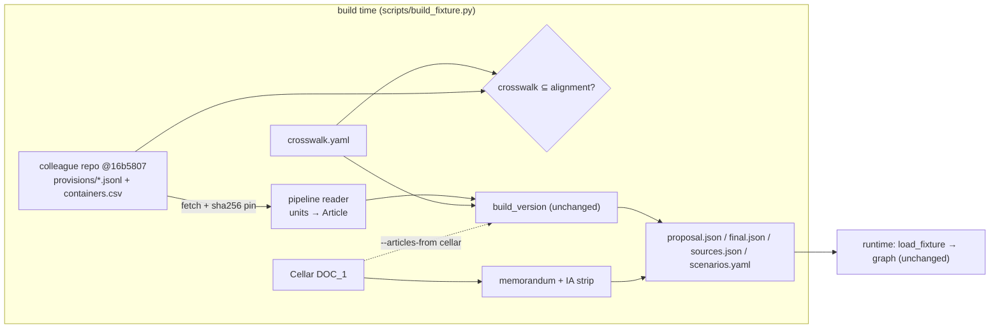

# feat: Build the AI Act fixture from the colleague's data pipeline

## Overview

The colleague delivered the structured EU AI Act data in a public repository,
[calderonsamuel/course-cs-project-fall-2026-data](https://github.com/calderonsamuel/course-cs-project-fall-2026-data).
The deliverable includes the methodology and the data itself. This plan swaps the source of article
texts in `scripts/build_fixture.py`. Today the texts come from our own Cellar HTML parse. After this
change they come from the colleague's provision units, pinned to commit `16b5807927be1ade3802db7c59c26f7ca338ebf2`.
The colleague's proposal-to-final alignment table also becomes a build-time check on our
hand-maintained `crosswalk.yaml`.

The committed fixture format, the scenarios, the golden cases and all agent code stay unchanged.
This is the R1 promise from the origin document: "once the colleague's data arrives, only the data
source needs replacing".

The integration is deliberately minimal. We use their data and adopt the parts of their methodology
that fit WOMM. The rest is listed under Scope Boundaries with a reason for each item.

---

## Problem Frame

WOMM v0 runs on a fixture we built ourselves from Cellar (see origin: R1, R2). The colleague's data
is now ready, but it is shaped differently from our data contract:

- Their texts are split into units keyed `<CELEX>:<path>`, e.g. `32024R1689:art26.par9`, held in
  JSONL files.
- Our contract has one `Provision` per article, keyed by a semantic `provision_key`. Scenarios and
  golden cases depend on those keys.

They also ship a lot we do not consume yet: unit-level alignment, 1,217 rule-based obligations, and
an organization graph of three Dutch municipalities.

We compared their texts against our Cellar parse for the 19 article texts in today's fixture:

- 16 of the 19 are identical after `womm.citations.normalize`.
- Proposal Art 9 and Art 43 differ for a structural reason. When a paragraph has its own text both
  before and after its points, their parser writes a ` […] ` marker in the parent text and appends
  the points after all of that text. The `full_text` order then no longer matches the law. The
  marker sits in the own `text` of 3 proposal units (art5.par2, art9.par4, art43.par1) and 2 final
  units (art22.par3, anxXI.sec1.pt_2). It spreads to 11 and 7 units when ancestors' `full_text` is
  counted. Our committed fixture already has the correct order, because it comes from our Cellar
  parse.
- Final Art 99 writes "35000000" where our XHTML parse has "35 000 000". The Formex source itself
  has no separator, so this is faithful to the source and harmless. Experts quote the text they
  are shown.
- Our 15 hand-crosswalk pairs all agree with their container alignment
  (`52021PC0206__32024R1689_containers.csv`, 86 article pairs).

---

## Requirements Trace

- R1. The colleague's data enters only as a data source. No change to agent code, graph, models or
  prompts (see origin: R1, and the v1 success criterion "integrating the colleague's data needs no
  change to the agent layer").
- R2. Scenario and golden-case semantics are preserved. Same scenario ids, same provision keys, same
  memorandum sources (see origin: R2, R11).
- R9 / R24. Citable sources stay limited to the provisions plus the IA-stripped explanatory
  memorandum. The memorandum still comes from Cellar, because the colleague's data has none.
- R3. The provision-level diff keeps matching by provision key. For the demo scenario it must
  produce the same added, removed and modified sets as before.
- Pinning and reproducibility: the upstream data is pinned by commit and sha256, matching the
  existing `downloads.json` behaviour.

**Origin flows:** F1 (RIA run) and F2 (evaluation) consume the rebuilt fixture unchanged.

---

## Scope Boundaries

- No runtime dependency on the colleague's repository, on R, or on network access. Only the
  generated fixture is committed and read at runtime.
- No change to `src/womm/models/regulation.py` (the R1 contract), `src/womm/graph/`, prompts, the
  API or the web console.
- We do not adopt their research framing: municipal implementation cost, VNG/PBLQ validation, and
  agents split by data access. The user confirmed that both sides share the same plan, so WOMM's
  plan stays as it is.
- We do not import the organization graph, CBS budgets or the algorithm register. WOMM has no
  consumer for them.
- We do not vendor their raw downloads (40 MB) or their R scripts into this public repository.

### Deferred to Follow-Up Work

These parts of their methodology are worth adopting later. Each one has a v1 home:

- Whole-act coverage with on-demand retrieval (origin R17): generate provision keys for all 113
  final articles and 85 proposal articles from their alignment, instead of only the scenario
  articles. Belongs to the v1 retrieval work.
- Per-unit `delta_status` (added / modified / split_merge after the proposal): a strong
  Planner-focus signal. Their figures: 387 of 975 duties sit in text added after the proposal.
  Belongs to the v1 Planner and diff work.
- Rule-based obligations (`obligations/32024R1689.jsonl`) as structured evidence for the Legal
  expert. Belongs to the v1 Evidence/Legal expert work (origin R18).
- Their validator style (every documented field checked, references resolved, a report written)
  as a model for extending `validate_fixture`.
- Point-level source ids (`…art26.par9`) for finer citations. This would change source ids that
  findings cite, so it waits for a planned re-baseline.

---

## Context & Research

### Relevant Code and Patterns

- `scripts/build_fixture.py`: the single build entry point. `VersionSpec`, `build_version` (uses
  only `Article.number`, `.title`, `.text`), `memorandum_sources`, `check_downloads`
  (sha256 pinning into `data/fixtures/ai_act/downloads.json`), `write_fixture`.
- `src/womm/data/cellar.py`: build-time HTTPS fetch with a local `.cache/` cache. This is the
  pattern for fetching pinned upstream files.
- `src/womm/data/parse_regulation.py`: `parse_articles` returns `list[Article]`. This is the shape
  the new reader mirrors.
- `src/womm/data/parse_proposal.py`: the `Article` / `Paragraph` dataclasses that the new reader
  should return, so `build_version` stays unchanged.
- `src/womm/data/fixtures.py`: `load_crosswalk`, `Crosswalk.article_for`, `validate_fixture`.
- `src/womm/citations.py`: `normalize`, the shared function used for the fidelity comparison.
- `tests/test_build_fixture_script.py`: loads the script as a module. New script-level tests
  follow it.
- The golden cases (`evals/golden/*.yaml`) do not reference source ids or article texts.
  `check_against_fixture` (`src/womm/eval/golden.py`) only requires their provision keys to be in
  the scenario.
- `tests/data/test_fixtures.py` pins the committed fixture. It is the main regression net and must
  pass unmodified. It checks:
  - only scenario provisions are present, and each evaluation scenario is under 40k characters;
  - the Art 9 layout: `"\n\n4. The risk management measures"`, with "In eliminating or reducing
    risks…" between paragraphs 4 and 5 (this is exactly the ` […] ` ordering bug);
  - the memorandum strip list, and that no source contains "impact assessment";
  - the source order for `eval_sme_impacts`, and the demo 71→99 mapping.
- Verbatim copies of fixture text live outside `data/fixtures/` and must stay in sync. They all
  quote unchanged articles (53, 54, 55, 62, 71), so the expected Art 99 change does not touch
  them. Re-check them anyway.
  - `tests/graph/conftest.py` (Q55, Q71)
  - `src/womm/api/e2e.py` with `docs/ui/sample_run.json`
  - `web/src/test/sources_sme.json`
  - `web/e2e/detail.spec.ts`
- Runtime and CI never build the fixture: Dockerfile `COPY data`, and `.github/workflows/ci.yml`
  runs ruff, pytest and the web e2e only. The proposal articles and the memorandum both come from
  Cellar DOC_1 today, so DOC_1 is still downloaded, but only `parse_memorandum` is needed from it
  in pipeline mode.

### Institutional Learnings

- `docs/solutions/` has nothing on fixture building or citation normalization. Capture what this
  plan teaches with `/ce-compound` after it lands.
- `docs/solutions/evaluation/single-run-scores-are-noise.md`: identical runs move coverage by about
  0.1. Even the single changed article (Art 99) must not be judged from one eval run.
- v0 plan U3 (`docs/plans/2026-09-28-001-feat-womm-v0-skeleton-plan.md`): build-time/runtime split,
  sha256 pinning, IA text never in `data/fixtures/`, parser tests on small real samples first.

### External References

- Upstream data: `data/processed/provisions/{52021PC0206,32024R1689}.jsonl` and
  `data/processed/alignment/52021PC0206__32024R1689_containers.csv` at commit `16b5807…`.
  The field definitions are in their `docs/schemas/02-provisions.md` and `03-alignment.md`.
- The ` […] ` gap convention is documented in their `scripts/parse_provisions.R` (around line 26):
  own text that sits between two pieces of child text gets the marker.

---

## Key Technical Decisions

- **Consume their outputs, not their pipeline.** Fetch the three processed files (two provision JSONL files and the containers CSV) over HTTPS from
  `raw.githubusercontent.com` at the pinned commit, cache them under `.cache/`, and pin each sha256
  in `downloads.json`. *Why:* this mirrors the Cellar path, needs no R, and keeps a 40 MB unlicensed
  tree out of our public repository.
- **Rebuild article text from the unit tree instead of using `full_text`.** Walk an article's
  children in `seq` order. Wherever a parent's own text has a ` […] ` gap, insert the rendered
  children there. Points get their `(a)` label. Paragraphs are joined like `Article.text` today.
  *Why:* `full_text` reorders text around points (Art 9(4), Art 43(1) and 16 other units). Wrong
  order hurts the LLM's reading and breaks verbatim quotes that span a point.
- **The hand crosswalk stays authoritative for keys; their alignment checks it.** The build fails
  if any crosswalk pair (proposal article, final article) is missing from their containers table.
  *Why:* scenarios and golden cases are keyed by our semantic keys. Their table independently
  confirms the renumbering, and all 15 pairs agree today.
- **The memorandum still comes from Cellar DOC_1.** The final act's Cellar download is no longer
  needed. *Why:* their data has no memorandum, and R9/R24 stripping is ours.
- **Keep the Cellar article parse as a selectable fallback** (`--articles-from cellar|pipeline`,
  default `pipeline`). The build prints a per-article fidelity report with three outcomes:
  byte-identical, identical only after `normalize` (layout drift), or the first differing context. *Why:* this gives a one-command regression check whenever
  the pin moves, and an immediate escape hatch.

---

## Open Questions

### Resolved During Planning

- Do golden cases depend on article text or source ids? No. They reference scenarios and IA
  sections only, so the cases need no change.
- Does their alignment disagree with our renumbering anywhere? No. All 15 pairs match, including
  53→57, 54→59, 55→62 and 71→99.
- Is the "35000000" difference a defect? No. The Formex source has no separator.
- Licence: their repository has no LICENSE file. We publish only EU legislative text derived from
  it, which EUR-Lex allows to be reused. We do not redistribute their code or files. Still mention
  this to the colleague.

### Deferred to Implementation

- Whether the gap rule holds for all 5 units that carry the marker in their own `text`. Match only
  the space-delimited ` […] ` in `text`: proposal rct89 contains a literal "on […]" that is real
  source text. Final-act `subparagraph` units with `num: null` (e.g. final Art 9) also need a
  rendering rule before whole-act coverage (R17).
- Whether to keep `parse_regulation.py` once the final act no longer needs a Cellar download. It
  stays while the `cellar` fallback exists, so the decision can wait.

---

## High-Level Technical Design

> *This illustrates the intended approach and is directional guidance for review, not implementation specification. The implementing agent should treat it as context, not code to reproduce.*

---

## Implementation Units

- U1. **Pipeline provision reader**

**Goal:** Turn the colleague's provision units for one CELEX into the `Article` objects that
`build_version` already consumes, with the law's text order restored.

**Requirements:** R1, R2, R9

**Dependencies:** None

**Files:**
- Create: `src/womm/data/parse_units.py`
- Create: `tests/data/test_parse_units.py`
- Create: `tests/data/samples/units_sample.jsonl` (small real excerpt: proposal Art 9, Art 43, Art 16, and one plain article)

**Approach:**
- Read JSONL lines into lightweight records. Index them by `parent_id`. Select `type == "article"`
  units, and use `label` as the article number and `heading` as the title.
- Rendering rules. These must reproduce the committed Cellar layout byte for byte:
  - Each numbered paragraph child becomes one `Paragraph`. `Paragraph.number` comes from the unit
    `label` ("1"), not `num` ("1."), because `Article.text` adds the dot. Paragraphs are joined
    with `\n\n` through `Article.text`.
  - An article with its own `text`, or with point children directly (proposal and final Art 16:
    "Providers of high-risk AI systems shall:" then (a)–(l)), becomes a single unnumbered
    `Paragraph`: the intro text, then its points.
  - Points and subparagraphs attach to their parent's text with a single `\n`. Points are prefixed
    with `num`, e.g. `\n(a) identification…`. Nested points recurse the same way.
  - Where the parent's own `text` contains the space-delimited ` […] `, split there and insert the
    rendered children at the gap. Without a marker, children follow the parent text.
- Reject input that would silently corrupt text: a duplicate `unit_id`, a `parent_id` that does not
  resolve, a malformed JSONL line, or a missing CSV column. Raise `FixtureError` naming the file.

**Execution note:** Write the tests first against the real sample lines, following the v0 parser
practice.

**Patterns to follow:** `src/womm/data/parse_regulation.py` (`parse_articles` returns `list[Article]`),
`src/womm/data/parse_proposal.py` dataclasses.

**Test scenarios:**
- Happy path: a plain article (no points, no marker). The rendered text, normalized, equals the
  unit's `full_text`, normalized.
- Happy path: proposal Art 9 sample. The points (a)–(c) of paragraph 4 appear before "In
  eliminating or reducing risks…", and the text contains no `[…]`.
- Happy path: proposal Art 43 sample. Byte-identical to the committed fixture text for Art 43.
- Happy path: proposal Art 16 sample (article-level intro with direct points (a)–(j)).
  Byte-identical to the committed fixture text: one block, no `\n\n`, each point on its own line.
- Edge case: a paragraph whose own text is empty and that has only points renders its points with
  no stray separator.
- Edge case: an article heading containing a stray backtick (`Subject matter\``) is passed through
  as the colleague wrote it. Record this as a known upstream quirk; it is not repaired here.
- Error path: two lines with the same `unit_id` raise `FixtureError` naming the id.
- Error path: a child whose `parent_id` is not in the file raises `FixtureError`.

**Verification:**
- For all 19 fixture articles, the rendered text is byte-identical to the committed fixture text.
  The only exception is final Art 99 ("35000000" digit grouping), which must still be equal after
  `normalize`. Normalized comparison alone is not enough, because it hides join and label
  regressions.

---

- U2. **Pinned fetch of the colleague's files and the alignment check**

**Goal:** Fetch the pinned upstream files reproducibly and check the hand crosswalk against their
container alignment.

**Requirements:** R1, R2, R3, pinning

**Dependencies:** U1

**Files:**
- Modify: `src/womm/data/parse_units.py` (container-alignment reader and crosswalk check)
- Modify: `src/womm/data/cellar.py` only if `fetch` needs a non-Cellar URL accepted, generalized minimally
- Test: `tests/data/test_parse_units.py`

**Approach:**
- Hold one constant for the pinned commit and build raw URLs for the two provision files and the
  containers CSV. Fetch them with the existing cached `fetch`, and pin them through
  `check_downloads`, so a moved upstream fails loudly unless `--accept-upstream-changes` is given.
- Re-raise fetch failures (`CellarError`, `httpx.HTTPError`) as `FixtureError` naming the URL, so
  `main` exits cleanly instead of printing a traceback.
- Read the containers CSV into (old article, new article) pairs. For every crosswalk entry that has
  both versions, require the pair `art<old>`/`art<new>` to be present. Otherwise raise
  `FixtureError` naming the provision key and both article numbers.

**Patterns to follow:** `check_downloads` and `fetch` in `scripts/build_fixture.py` and
`src/womm/data/cellar.py`. Keep HTTPS-only, and extend `test_fixture_urls_use_https` to the new
URLs.

**Test scenarios:**
- Happy path: the current `crosswalk.yaml` against a containers sample containing the 15 pairs
  passes.
- Error path: a crosswalk that maps proposal 71 to final 98 fails with a message naming
  `ai_act/penalties/penalties`, 71 and 98.
- Edge case: a crosswalk entry present in only one version (added or deleted article) is skipped,
  not failed.
- Happy path: every new upstream URL is HTTPS and contains the full pinned commit hash.
- Error path: a non-200 upstream response, and a malformed JSONL line, each end as `FixtureError`
  naming the URL or file.

**Verification:**
- The build fails on a tampered or moved upstream file, and on a crosswalk pair that disagrees with
  the alignment.

---

- U3. **Switch `build_fixture.py` to the pipeline source and rebuild the fixture**

**Goal:** Make the colleague's data the default article source, keep Cellar as a fallback, print
a fidelity report, and commit the rebuilt fixture.

**Requirements:** R1, R2, R3, R9, R24

**Dependencies:** U1, U2

**Files:**
- Modify: `scripts/build_fixture.py`
- Modify (regenerated): `data/fixtures/ai_act/proposal.json`, `final.json`, `sources.json`, `downloads.json`
- Test: `tests/test_build_fixture_script.py`

**Approach:**
- Add `--articles-from {pipeline,cellar}`, defaulting to `pipeline`. Pipeline mode reads articles
  through U1, runs the U2 crosswalk check, and fetches Cellar only for DOC_1 (the memorandum).
  Cellar mode keeps today's behaviour.
- After building, print one line per scenario article: identical, or the first differing normalized
  context against the other source. Only compute this when both sources are already cached;
  otherwise print a note. Do not fail on differences, because the report is informational.
- Leave `scenarios.yaml`, `crosswalk.yaml` and the memorandum sources byte-identical. Expect
  `final.json` / `sources.json` to change only in final Art 99 (digit grouping). `proposal.json`
  must not change. Any diff in Art 9 or Art 43 is a gap-filling bug.
- Update the module docstring: where the texts come from, the pinned commit, and that runtime
  never reads the upstream.

**Patterns to follow:** existing `main()` structure and `write_fixture`.

**Test scenarios:**
- Integration: pipeline mode, with `build_fixture.fetch` monkeypatched to serve local files.
  Skipped when `.cache/` lacks the pinned bodies, so CI does not need them. CI coverage comes from
  the U1/U2 unit tests on small committed samples and from the unmodified
  `tests/data/test_fixtures.py`. The pipeline-mode build
  produces a fixture that passes `load_fixture`. It must have the same scenario ids, the same
  provision keys per version, and the same memorandum source ids as the committed fixture.
- Integration: `diff_versions` on `demo_penalties_amended` gives the same change kinds per key
  before and after the rebuild. Covers R3.
- Happy path: `--articles-from cellar` still builds the previous fixture.
- Error path: an unknown `--articles-from` value is rejected by argparse.

**Verification:**
- `tests/data/test_fixtures.py` passes without edits. This includes the Art 9 layout assertions.
- `git diff` of `data/fixtures/ai_act/` touches only final Art 99's text and `downloads.json`. Apart from that, the colleague's files never land in `data/fixtures/`, because
  agents may only see what they can cite.
- The verbatim copies listed under Context & Research still occur in the rebuilt sources.
- The full test suite passes, and the API e2e runs on the fake backend unchanged.

---

- U4. **Record the integration and the upstream issues**

**Goal:** Make the data provenance discoverable, and hand the colleague a short list of upstream
issues.

**Requirements:** R1

**Dependencies:** U3

**Files:**
- Modify: `README.md` (data section: source, pin, how to move the pin)
- Create: `docs/status/2026-10-02-data-integration.md`

**Approach:**
- The status note covers: what was integrated, the fidelity results, what was deferred and why
  (the Scope Boundaries list), and the upstream issues to raise with the colleague: the `full_text`
  reordering around ` […] `, the stray backtick in the Art 1 heading, the missing LICENSE, and the
  missing `project-plan.md` referenced in their docs.

**Test expectation:** none -- documentation only.

**Verification:**
- A teammate can find which commit of the colleague's data the fixture was built from without
  reading code.

---

## System-Wide Impact

- **Interaction graph:** Only the build script and the new reader change. `load_fixture` callers
  (CLI, API jobs, eval runner, UI contract export) read the same file shapes.
- **Error propagation:** Every upstream problem surfaces as `FixtureError` at build time, which
  `main` already turns into a non-zero exit. Runtime cannot fail on upstream data.
- **State lifecycle risks:** Moving the pin later rewrites fixture texts. `downloads.json` makes
  this explicit, and `--accept-upstream-changes` is required.
- **Unchanged invariants:** the R1 contract models, provision keys, scenario ids, source ids,
  memorandum stripping, golden cases, the agent graph and prompts.
- **Evaluation comparability:** One article text changes (final Art 99, digit grouping only). Existing eval results stay comparable
  only loosely. Per the single-run-noise learning, any before/after comparison pools at least 6 runs
  per case. This is not required to land the change.

---

## Risks & Dependencies

| Risk | Mitigation |
|------|------------|
| The gap-filling rule mis-orders other marked units outside the scenario articles | U1 verification covers the 19 fixture articles. The deferred item checks all 18 marked units before whole-act coverage (R17). |
| The colleague force-pushes or rewrites history and the pinned commit disappears | The cache keeps a local copy, and the committed fixture is unaffected. Ask the colleague to tag the delivered commit. |
| raw.githubusercontent.com rate limits or is unavailable during a rebuild | Build-time only. The cache avoids refetching, and `--articles-from cellar` remains. |
| No licence on the upstream repository | Publish only EU legislative text, which is reusable. Ask the colleague to add a licence. |

---

## Sources & References

- **Origin document:** [docs/brainstorms/2026-09-28-womm-phased-requirements.md](../brainstorms/2026-09-28-womm-phased-requirements.md)
- Prior plan: [docs/plans/2026-09-28-001-feat-womm-v0-skeleton-plan.md](2026-09-28-001-feat-womm-v0-skeleton-plan.md) (U3 fixture)
- Related code: `scripts/build_fixture.py`, `src/womm/data/fixtures.py`, `src/womm/data/cellar.py`, `src/womm/citations.py`
- Upstream: https://github.com/calderonsamuel/course-cs-project-fall-2026-data at `16b5807927be1ade3802db7c59c26f7ca338ebf2`
