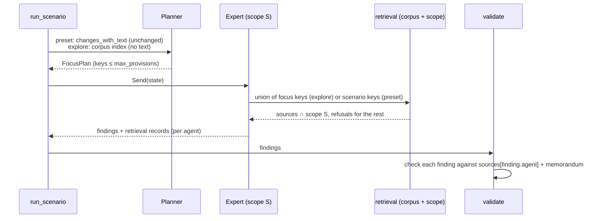

# feat: Scoped provision retrieval (Layer 1) and data-scope experiment

> **Revision 2026-10-03.** This revision follows a second review against new facts (colleague import merged; EU Digital Omnibus, Regulation (EU) 2026/1744, in force since 27 July 2026, amending 42 AI Act articles and moving Article 113 dates). Where a section below conflicts with this block, this block wins.
>
> **User decisions:**
> - **Law version per mode.**
>   - Evaluation stays on COM(2021) 206, which matches SWD(2021) 84.
>   - Explore/demo runs use **Reg (EU) 2024/1689 as adopted**, explicitly labelled "pre-Omnibus" in the scenario name, the version metadata and the dossier header.
>   - Every article that 2026/1744 amends carries a "superseded in part by Regulation (EU) 2026/1744" marker. The marker comes from a pinned list of the 42 amended articles.
>   - The 2026 consolidated text becomes a third version in **Stage D**. That stage ports the consolidated parser built in the private demo track, uses string article numbers in keys such as `ai_act/art/4a`, and has no obligation records.
>   - The corpus key scheme must accept that third version without re-keying.
> - **Data scopes are a side experiment, not the v1 base.**
>   - U6 compares **scoped vs unscoped only**, on AI Act cases only, on the **api backend**, with a pre-registered rule: if scoped coverage is more than one noise band below unscoped, revise the default scopes; otherwise keep them.
>   - The self-evolution base (R27/R28) is an **unscoped** version.
>   - The single-agent arm (v1.0-single, origin R6) is deferred until the 15–30 golden cases exist.
> - **Sequencing.** Golden-case building (parent R22/R33) starts now, in parallel with U1–U4. Stage A (obligation enrichment, adversarial reviewer) moves to **v1.1**.
>
> **Fixes adopted from the review:**
> - **No stale dates reach an agent (P0).**
>   - The corpus build never emits a colleague `applies_from` as a current date. It drops `applies_from` for Chapter III Sections 1–3 (Articles 6–27, except Article 6(5)), for Articles 102–110, and for any article 2026/1744 amends.
>   - Every remaining date is rendered as "as adopted (2024)".
>   - Article 113's own records are left out of obligation views.
>   - These rules are the same per-paragraph rules proven in the private demo.
>   - U1 test: no rendered obligation source for Articles 6–27 contains a 2026-08-02 date.
>   - U2 test: the `actors` and `full` views carry the label.
> - **Prompt budget.**
>   - The v1 SystemVersions set `max_provisions` to about 8 for text-all experts. This is sized from the measured baseline of about 40k characters, which takes about 6 minutes on `claude_code`.
>   - Expert timeouts are raised to match.
>   - U3 asserts that every expert prompt in the fake explore run stays under 60k characters.
> - **Whole-proposal explore evaluation.**
>   - Add an explore scenario "no prior version → COM(2021) 206, whole proposal", kind `evaluation`.
>   - It is scored with the existing golden cases, next to the presets.
>   - Report Planner key recall against the golden cases' provisions. This is the real test of R17.

## Overview

This plan lets WOMM analyse the whole AI Act without putting it into any agent's context:

- a committed **provision corpus** built from the colleague's data;
- a **per-agent data scope** declared in the SystemVersion and enforced by the retrieval code;
- **Planner-driven deterministic retrieval**: the Planner reads a compact index, chooses provision
  keys, and code fetches each expert's texts within its scope;
- a **retrieval log** that defines each expert's citable sources;
- a **single-agent baseline** SystemVersion with a comparison report.

Layer 2 (expert tool calls) and MCP are out of scope (see origin: Scope Boundaries, Key Decisions).

---

## Problem Frame

Today every expert receives the same `state["sources"]`: the 3 to 11 articles that a scenario
lists, plus the memorandum (`src/womm/graph/build.py` `run_scenario`, `src/womm/graph/experts.py`
`expert_user_content`). The Planner and the Router both read provision **texts**
(`render.changes_with_text`, `router.router_state`).

That cannot scale. The final act's articles and annexes total about 330k characters, about 85k
tokens, measured on the colleague's data. A compact index of the same 126 units (number, heading,
delta status, obligation counts) is about 11k characters. That fits one Planner call, which
resolves the origin's unverified assumption.

The colleague's methodology also asks that agents differ by the data they can see, and that the
system be compared with a single agent that sees everything (see origin: Problem Frame, R4–R6,
R13).

---

## Requirements Trace

- R1. One corpus holds all units of both versions, the delta status and the obligations. It is
  built at build time from pinned data and read locally at runtime. → U1, U2
- R2. The corpus never contains IA text, and the memorandum keeps today's stripping. → U1
- R3. v0 scenarios stay runnable as preset retrievals. v0 results stay comparable. → U2, U4
  (AE4)
- R4. Each role has a declared data scope in the SystemVersion. → U2
- R5. Scopes are enforced by the retrieval layer. Out-of-scope requests return nothing and are
  logged. → U2, U4 (AE1)
- R6. A single-agent baseline has the union scope and the same output schema. → U5
- R7. The Planner chooses provisions from a compact index, never from full text. → U3
- R8. Layer 1 works on every backend, including `claude_code`. → U3, U4
- R11. An expert's citable sources are exactly its retrieved provisions plus the stripped
  memorandum. → U4 (AE2)
- R12. Every retrieval is recorded (agent, layer, key, status, UTC time) and visible in the trace
  and run stream. → U2, U4. Console display is deferred.
- R13. Multi-agent versus single-agent comparison on coverage, grounding, omissions and cost. → U6

R9 and R10 (Layer 2) are not covered by this plan. AE3 is deferred with Layer 2.

**Origin actors:** A1 Planner, A2 Experts, A3 Single-agent baseline, A4 Evaluation
**Origin flows:** F1 (Layer 1 run). F2 is out of scope.
**Origin acceptance examples:** AE1 (R5, R12), AE2 (R11), AE4 (R3). AE3 is deferred.

---

## Scope Boundaries

- No expert tool calling and no MCP (see origin).
- No embedding or semantic search. The index is enough at 11k characters.
- No change to the R1 data contract models in `src/womm/models/regulation.py` (`Provision`,
  `RegulationVersion`, `Regulation`). `Scenario` gains one optional mode (U3).
- No new golden cases. The comparison runs on the existing two cases, with honest noise reporting.

### Deferred to Follow-Up Work

- Console view of retrievals and scope refusals (origin R12 UI part, R36). The API and RunResult
  carry the data from U4. The web console comes in a follow-up.
- Explore-mode scenarios in the console's scenario picker and `/scenarios/{id}/sources`. This
  plan only covers CLI and API runs.
- Layer 2 tool calls, AE3 and the fallback (origin R9, R10).
- Improvement Planner proposing scope diffs (origin Scope Boundaries).
- Every part of the colleague's method that is not in this plan is staged in
  `docs/brainstorms/2026-10-02-next-stage-cost-and-methodology-requirements.md`:
  - Stage A: LLM obligation enrichment (this removes the Stakeholder span fallback) and the
    adversarial reviewer.
  - Stage B: EU-level cost estimation.
  - Stage C: the municipal organization case, covering system classification, applicability, cost
    location, and VNG/PBLQ validation.
  - Stage D: the validator report, point-level ids, Digital Omnibus dates, and per-act config.

---

## Context & Research

### Relevant Code and Patterns

- `src/womm/graph/build.py`: `run_scenario` computes `diff` and one shared `sources` dict, and
  builds the graph from the SystemVersion. The topology must not change, because the web console
  hard-codes nodes in `web/src/model/pipeline.ts`.
- `src/womm/graph/planner.py`: `FocusPlan` / `FocusArea.provision_keys`, and `restrict_to(diff
  keys)`.
- `src/womm/graph/router.py`: `router_state` reads the first 300 characters of every change. That
  must switch to the index in explore mode.
- `src/womm/graph/experts.py`: `expert_user_content` renders the shared sources. This is where
  per-expert retrieval goes.
- `src/womm/graph/synthesis.py` `validate_node` calls `validate_findings(findings,
  state["sources"], diff_keys)`. `src/womm/citations.py` checks `ev.source_id in sources`. This
  becomes a per-agent lookup.
- `src/womm/graph/state.py`: `merge_slots` and `operator.add` reducers are the patterns for the new
  per-agent and log fields.
- `src/womm/graph/events.py` `_payload`: summaries only, never texts. The retrieval counts go
  here.
- `src/womm/models/system_version.py`: `version_id` hashes `spec.model_dump(mode="json")`. Adding
  any field with a default changes every existing version id (see Key Technical Decisions).
- `system_versions/PROMOTIONS.md` and `v0.3-candidate.yaml`: the current default and its lineage.
- The data import plan's `src/womm/data/parse_units.py` (unit tree to `Article`) and the pinned
  fetch in `scripts/build_fixture.py`.

### Institutional Learnings

- `docs/solutions/evaluation/single-run-scores-are-noise.md`: identical runs move coverage by about
  0.1. Pool at least 6 runs per case before claiming a difference. This governs U6.
- `docs/solutions/llm-backends/claude-cli-subscription-isolation.md`: the `claude_code` backend runs
  with no tools or MCP. That is why Layer 1 must be code-side retrieval.

### External References

- No external research. Every pattern needed already exists locally (graph state reducers,
  content-addressed SystemVersions, pinned build-time data).

---

## Key Technical Decisions

- **Corpus is separate from the fixture.** `data/corpus/ai_act/` holds whole-act versions plus an
  index. `data/fixtures/ai_act/` keeps serving preset scenarios unchanged. *Why:* R3 comparability,
  and the citable set stays controlled by retrieval instead of by "everything in the folder".
- **Provision keys:** crosswalk keys are reused for the 15 scenario articles. Other aligned
  articles and annexes get generated keys from the colleague's container alignment, for example
  `ai_act/art/26` named by final numbering, shared with the aligned proposal article.
  Proposal-only units get `ai_act/proposal/art/<n>`. *Why:* golden cases keep working, and
  renumbered provisions still diff as `modified`, not added plus removed.
- **Scopes split by data form, not by topic.** Borrowed from the colleague's method, where cost
  location works only from structured obligation records. `DataScope` has three fields:
  - `text`: `all`, or an explicit list of provision keys whose full text is visible;
  - `obligations`: `none`, `actors` (addressee, actors, condition, applies_from only), or `full`;
  - `sees_delta`: whether change kinds are visible;
  - `sees_memorandum`: whether the stripped explanatory memorandum is in context. The memorandum
    discusses the whole act, so leaving it in every prompt would undo the separation.

  The `actors` view has one fallback. The colleague's rule-based extraction leaves the primary
  actor `unspecified` for 430 of 975 final duties and 243 of 506 proposal duties (passive
  sentences). For those records only, the view also includes the verbatim span, so the reader can
  infer the actor. This weakens the separation for those records, and the Stakeholder hypothesis
  states it. Later work replaces this fallback with LLM actor completion (see Deferred to Follow-Up
  Work).

  A scope also has a mandatory `hypothesis` string that states what the separation is meant to
  test. *Why:*
  - Topic prefixes cannot be expressed: most keys are numeric, like `ai_act/art/26`.
  - Topic subsets starve experts in preset scenarios. For example, Stakeholder would get none of
    Art 8–17 or 43.
  - A data-form split gives every expert something for every key and tests a stated hypothesis.
- **Scope fields stay out of the hash when absent.** `version_id` hashing keeps
  `model_dump(mode="json")`, and removes only the new keys (`scope` on experts, the Planner's
  `explore_prompt`, `retrieval`) when their value is None. Do not use a global `exclude_unset`
  or `exclude_defaults`: existing defaults such as `timeout_s` are already in today's hashes, and
  `derive_system_version` marks every field as set. *Why:* PROMOTIONS lineage and LangSmith tags
  key on version ids. An unscoped expert means "everything", which is the v0 behaviour.
- **Obligation views are citable sources.** A key granted only at the obligation level yields a
  source of kind `obligations`. Its text is the verbatim obligation spans of that provision, plus
  the visible structured fields. Its source id is `<version_id>/obligations/<n>`. *Why:* R11 needs
  every expert's evidence to be quotable, and spans are verbatim legal text.
- **Preset mode reads the fixture; explore mode reads the corpus.** Preset scenarios resolve text
  against today's fixture sources, so v0 texts stay byte-stable. Obligation views always come from
  the corpus, which holds obligations for both versions. `state["sources"]` is filled at run start:
  the scenario's fixture sources (preset), or the corpus restricted to the diff keys (explore).
  Experts only write their per-agent granted ids through a `merge_slots` field, so parallel
  experts never write the same key.
- **Retrieval happens inside the expert node, not in a new graph node.** The expert resolves the
  Planner's selected keys through its own scope, logs the result and builds its prompt. *Why:* it
  keeps the graph topology the console hard-codes, and it runs per expert in parallel for free.
- **The Planner keeps its output schema and gets a second, optional prompt.** A `PlannerConfig`
  (a `RoleConfig` subtype) adds `explore_prompt`, used only in explore mode, so preset runs keep
  the v0.3 Planner prompt. The Planner has no scope: it always sees the full index, including
  delta. In explore mode it picks keys from the index, capped by a SystemVersion
  `max_provisions`. Per-expert routing comes from scope filtering of the union.
  *Why:* the scope does the separation, and `FocusPlan` and its prompt contract barely change. A
  key the Planner wants studied but an expert cannot see becomes a logged scope refusal (AE1).
- **Validation is per agent, on both source and provision.** A finding is supported only if its
  `provision_key` is among its agent's granted keys (new reason `provision_out_of_scope`), and its
  quote matches a source retrieved for that agent, or the memorandum. *Why:* this is R11 and AE2.
  It also closes the memorandum channel: the memorandum stays citable for granted provisions, but
  it cannot carry a finding about a provision the agent may not see.
- **Expert prompts are filtered too, not only the sources block.** For scoped experts:
  - `changes_index` and the focus areas list only granted keys;
  - the `[added]` / `[modified]` tags are dropped unless `sees_delta` is set;
  - focus-area rationales are omitted, because the Planner wrote them with full delta visibility.

  Unscoped experts keep today's rendering byte for byte. The shared
  `state["sources"]` remains as the union, for dossier display.
- **Delta status is visible only where the scope allows it.** It appears in the Planner's index by
  default, and in an expert's context only when `sees_delta` is set. *Why:* this follows the
  colleague's "reviewer with the delta" separation (see origin: Outstanding Questions, proposed
  defaults).

---

## Open Questions

### Resolved During Planning

- Does the whole-act index fit one Planner call? Yes. It is about 11k characters for 126 final
  units, measured.
- Default scopes (origin's "product default to confirm"). These are proposed by data form, borrowed
  from the colleague's method, and still need user confirmation. They are config, so changing them
  needs no code.

  | Expert | `text` | `obligations` | `sees_delta` | `sees_memorandum` | Hypothesis |
  |---|---|---|---|---|---|
  | Legal | all | full | no | yes | Legal interpretation needs the full text and the legislator's explanation |
  | Fiscal | none | full | no | no | Cost claims stay traceable to specific obligation records |
  | Stakeholder | Art 1–3, Art 6, Annex III (both versions, explicit key list) | actors (with span fallback when the actor is unspecified) | no | no | Who is affected is judged without being steered by what the duties are. This is weakened for unspecified-actor records until actor completion lands |

  Only the Planner sees delta.
- Scenario mode: a separate `mode: preset | explore` field, defaulting to `preset`. This avoids
  extending `kind`, because an explore scenario could later also be an evaluation scenario.
- Index granularity: article and annex level, with obligation counts by primary actor and the delta
  status of the article. Paragraph level waits for evidence that article level is too coarse.
- Whether two golden cases can show a multi- versus single-agent difference: probably not above
  noise. U6 reports the pooled difference together with its noise band, and says so. The real
  answer waits for origin R22.

### Deferred to Implementation

- The rendering rules for final-act `subparagraph` units with `num: null`, and for annex sections.
  Settle them against real units when building the corpus.
- Whether explore-mode Router input needs the index or only the focus areas. Measure prompt size
  first.

---

## High-Level Technical Design

> *This illustrates the intended approach and is directional guidance for review, not implementation specification. The implementing agent should treat it as context, not code to reproduce.*

| Mode | Planner input | Expert receives | Old SVs (no scope) |
|---|---|---|---|
| Preset (v0 scenarios) | changes with text, as today | scenario keys ∩ scope | all scenario keys, same as v0 (AE4) |
| Explore (whole act) | corpus index | Planner keys ∩ scope | Planner keys |

---

## Implementation Units

- U1. **Build the provision corpus**

**Goal:** A committed whole-act corpus and index, built from the pinned colleague data.

**Requirements:** R1, R2

**Dependencies:** The data import plan (`docs/plans/2026-10-02-001-feat-pipeline-data-import-plan.md`), U1–U3 of that plan.

**Files:**
- Create: `scripts/build_corpus.py`
- Create (generated): `data/corpus/ai_act/proposal.json`, `data/corpus/ai_act/final.json`, `data/corpus/ai_act/index.json`, `data/corpus/ai_act/downloads.json`
- Modify: `src/womm/data/parse_units.py` (subparagraph and annex rendering, `Article` for annexes)
- Test: `tests/test_build_corpus_script.py`, `tests/data/test_parse_units.py`

**Approach:**
- Reuse the pinned fetch and `parse_units` from the import plan. Also pin both obligations files
  (final 1,217 records, proposal 585). Preset evaluation scenarios run on the proposal, so they need
  the proposal's obligations.
- Versions are `Regulation`-shaped files covering every article and annex. Keys follow the Key
  Technical Decisions rule. Source ids follow `<version_id>/art_<n>` and `<version_id>/annex_<n>`.
- `index.json` has one row per final and proposal unit: key, version, number, heading, delta
  kind, obligation counts by primary actor, and character length. It never contains text.
- No memorandum and no IA material in the corpus. The memorandum stays in the fixture sources
  (R2).

**Patterns to follow:** `scripts/build_fixture.py` (`check_downloads`, `write_fixture`, `main`
structure).

**Test scenarios:**
- Happy path: the crosswalk articles carry their semantic keys in both versions (for example
  `ai_act/penalties/penalties` is final 99 and proposal 71).
- Happy path: an aligned non-scenario article shares one generated key across versions (final 26
  with its proposal counterpart from the containers table).
- Edge case: a final article with no proposal counterpart gets a key that appears only in
  `final.json`, and its index delta kind is `added`.
- Edge case: a final-act subparagraph with `num: null` renders as a separate line, not
  concatenated mid-sentence.
- Error path: two units resolve to one key within a version, and the build fails naming both.
- Integration: every `index.json` key resolves to a provision in its version, and no index row has
  a text field.

**Verification:**
- The corpus covers 113 final articles plus 13 annexes, and 85 proposal articles plus its annexes.
  The index is under 15k characters per version.

---

- U2. **Corpus loader, data scopes and the retrieval function**

**Goal:** Load the corpus at runtime and resolve a key list through a scope into sources plus
retrieval records.

**Requirements:** R1, R3, R4, R5

**Dependencies:** U1

**Files:**
- Create: `src/womm/data/corpus.py`
- Create: `src/womm/retrieval.py`
- Modify: `src/womm/models/system_version.py` (`DataScope`, an optional `scope` on `ExpertConfig`, `PlannerConfig` with an optional `explore_prompt`, optional `retrieval: {max_provisions}`, and hash canonicalisation that drops only those new keys when None)
- Modify: `src/womm/models/regulation.py` (`Source.kind` gains `obligations`)
- Test: `tests/data/test_corpus.py`, `tests/test_retrieval.py`, `tests/models/test_system_version_scope.py`

**Approach:**
- `retrieve(scope, keys, before_version, after_version, text_store, corpus)` returns both
  versions' sources for each granted key, in `Fixture.scenario_sources` order, and one record per
  requested key.
  - Text sources come from `text_store`: the fixture in preset mode, the corpus in explore mode.
  - Obligation-view sources come from the corpus.
  - Each record has: agent, layer (`1`), key, status (`granted_text`, `granted_obligations`,
    `out_of_scope`, `unknown_key`), and a UTC timestamp.
- The default scopes are committed as concrete key lists in `system_versions/v1.0-scoped.yaml`. A
  test prints each scope's resolved keys, so gaps are reviewable.
- An absent scope means everything. This is the v0 behaviour.

**Patterns to follow:** `src/womm/data/fixtures.py` (frozen dataclass, `FixtureError` style),
`StrictModel`.

**Test scenarios:**
- Happy path: the Legal default scope with keys [Art 26, Art 99] grants both texts, before and
  after for a modified key.
- Covers AE1. The Stakeholder scope with key Art 99 returns an obligations-view source with actor
  fields only (no action text) and a `granted_obligations` record. The Fiscal scope with
  `ai_act/annex/III` (no obligations) returns no source and an `out_of_scope` record.
- Edge case: an empty key list returns no sources and no records.
- Error path: an unknown key gives an `unknown_key` record, not an exception.
- Edge case: `obligations: actors` omits action and span text, `full` includes them, and `none`
  yields no obligations source.
- Edge case: under `actors`, a record whose primary actor is `unspecified` includes its verbatim
  span, and a record with a named actor does not.
- Edge case: `sees_memorandum: false` gives no memorandum sources, and an unscoped expert still
  gets all three.
- Error path: a scope without a `hypothesis` fails SystemVersion validation.
- Integration: loading each existing file in `system_versions/` gives the same `version_id` as
  before this change, and so does a `derive_system_version` backend override of v0.3-candidate.
  Pin the current ids in the test.

**Verification:**
- Existing SystemVersion ids are unchanged, and the scope filter is the only path from corpus to
  expert context.

---

- U3. **Explore-mode scenarios and the Planner index input**

**Goal:** Run the whole act, with the Planner reading the index and choosing keys.

**Requirements:** R7, R8

**Dependencies:** U2

**Files:**
- Modify: `src/womm/models/regulation.py` (`Scenario.mode: preset | explore`, and explore scenarios have no `provision_keys`)
- Modify: `src/womm/api/app.py` (hide explore scenarios from `GET /scenarios`, return 404 on `/scenarios/{id}/sources` for them, and keep `POST /runs` accepting them)
- Modify: `src/womm/data/fixtures.py` (`validate_fixture` rules for explore)
- Modify: `scripts/build_fixture.py` (one explore scenario: proposal → final, whole act)
- Modify: `src/womm/graph/render.py` (`corpus_index` rendering)
- Modify: `src/womm/graph/planner.py` (explore input, cap at `max_provisions`, `restrict_to` on corpus keys)
- Modify: `src/womm/graph/router.py` (`router_state` uses the index summary and focus in explore mode)
- Modify: `src/womm/graph/build.py` (`run_scenario` loads the corpus for explore, with the diff over full versions)
- Modify: `prompts/planner.md` only as a new versioned copy, `prompts/v1/planner_explore.md`, so v0 prompt hashes stay
- Test: `tests/graph/test_planner_explore.py`, `tests/data/test_fixtures.py`

**Approach:**
- The diff for explore runs over full versions, and its keys bound the Planner's choice. The
  Planner prompt receives the index rows for changed keys only. In a proposal → final run, that is
  almost everything.
- Over-long Planner output is truncated to `max_provisions` in the Planner's own order, and the
  truncation is recorded.
- An explore-mode FocusPlan that has no keys left after `restrict_to` becomes a Planner
  `fatal_error`, the same path as a Planner failure. Experts never run on the memorandum alone
  while being told "analyse all changes".
- The Planner uses `explore_prompt` in explore mode and `prompt` in preset mode.

**Test scenarios:**
- Happy path: on the fake backend, an explore run sends Planner input that contains no
  provision text (assert that no `full` text of Art 26 appears) and stays under 20k characters.
- Edge case: the Planner returns 40 keys with `max_provisions=20`, and 20 are kept and the
  truncation is noted.
- Error path: the Planner returns a key that is not in the diff, and it is dropped by `restrict_to`
  (existing behaviour, now on corpus keys).
- Error path: an explore Planner output with zero valid keys ends the run as failed, with a planner
  error.
- Integration: `GET /scenarios` does not list the explore scenario, and `POST /runs` for it
  succeeds on the fake backend.
- Integration: preset scenarios still send `changes_with_text` to the Planner, byte-identical to
  today's prompt for the same scenario.

**Verification:**
- `womm run` on the explore scenario completes on the fake backend, and every agent's input
  stays bounded.

---

- U4. **Per-expert retrieval, retrieval log and per-agent validation**

**Goal:** Each expert receives only its scoped sources. Retrievals are logged, and citations are
validated against the retrieving agent's sources.

**Requirements:** R3, R5, R8, R11, R12

**Dependencies:** U2, U3

**Files:**
- Modify: `src/womm/graph/state.py` (`retrieved: per-agent source ids`, `retrievals: list` with `operator.add`)
- Modify: `src/womm/graph/experts.py` (resolve keys through the scope, build the prompt from the expert's own sources plus the memorandum)
- Modify: `src/womm/citations.py` and `src/womm/graph/synthesis.py` (`validate_findings` takes per-agent sources)
- Modify: `src/womm/graph/events.py` (`_payload`: retrieval counts per agent, granted and refused)
- Modify: `src/womm/models/run.py` (`RunResult.retrievals`)
- Modify: `src/womm/api/e2e.py` only if its stub must read the per-expert source list
- Test: `tests/graph/test_scoped_retrieval.py`, `tests/test_citations.py`, `tests/graph/test_end_to_end_fake.py`

**Approach:**
- Preset mode: the requested keys are the scenario keys. Explore mode: the union of focus-area
  keys. In both modes the scope filters per expert.
- Memorandum sources are added for unscoped experts (v0 behaviour) and for scopes with
  `sees_memorandum`. They are not logged as retrievals.
- Scoped experts get filtered `changes_index` and focus rendering (Key Technical Decisions).
  Unscoped experts are byte-identical to today.
- Retrieval records and granted ids are returned on all three expert return paths: success,
  `LLMError` and unexpected exception. A failed expert's refusals stay in the log.
- `RunResult.retrievals` is a flat list of records, ordered by agent, then request order.
- A finding whose quote cites a source outside its agent's retrieved set gets the existing
  `unknown_source` reason, so it becomes an open question.

**Execution note:** Start with a failing end-to-end fake-backend test for AE2 before changing
validation.

**Test scenarios:**
- Covers AE4. With v0.3-candidate (no scopes) on `eval_sme_impacts`, every expert receives source
  ids art_53, 54, 55 and 71 plus all three memorandum sources (context, legal_basis,
  other_elements), in the current order, the same as v0. The expert prompt is
  byte-identical to today's.
- Covers AE2. Legal never retrieved Art 72, and its finding quotes Art 72 verbatim, so the finding
  lands in `unsupported` with `unknown_source`.
- Covers AE1. Under v1.0-scoped, Fiscal's prompt contains no article text, only obligations-view
  sources. `retrievals` holds Fiscal's records.
- Leak check: a v1.0-scoped Fiscal prompt in explore mode contains no `[added]` / `[modified]` /
  `[removed]` tags, no out-of-scope provision key, and no focus-area rationale.
- Memorandum channel: Fiscal files a finding on an Annex III key with a verbatim memorandum quote.
  The finding becomes unsupported with `provision_out_of_scope`.
- Edge case: an expert whose scope excludes every requested key runs with the memorandum only, and
  its records show all refusals.
- Integration: the event payload for an expert node carries `{granted: n, refused: m}` and no
  texts.
- Integration: the existing e2e, console API and fake end-to-end tests pass unchanged on v0
  SystemVersions.

**Verification:**
- No path lets an expert see or cite a provision outside its scope, and v0 behaviour is
  byte-stable.

---

- U5. **Scoped and single-agent SystemVersions**

**Goal:** Ship the scoped multi-agent version and the single-agent baseline as config.

**Requirements:** R4, R6

**Dependencies:** U2, U4

**Files:**
- Create: `system_versions/v1.0-scoped.yaml`, `system_versions/v1.0-unscoped.yaml`, `system_versions/v1.0-single.yaml`
- Create: `prompts/v1/generalist.md` (the three v0.3 checklists merged, same `FindingBatch` output)
- Modify: `system_versions/PROMOTIONS.md` (record both as candidates, not promoted)
- Test: `tests/test_baseline_version.py`

**Approach:**
- v1.0-scoped: v0.3-candidate prompts plus the default scopes, `explore_prompt` and
  `max_provisions`.
- v1.0-unscoped: v1.0-scoped with every scope removed. It is the control arm that isolates the
  effect of data separation.
- v1.0-single: one expert, `generalist`, with no scope, and the same Planner, synthesis and judge
  as v1.0-scoped. The topology and the expert prompt differ, which is why the unscoped arm is
  needed.

**Test scenarios:**
- Happy path: both files load, and their version ids differ from each other and from v0.3.
- Happy path: v1.0-single has exactly one expert with no scope, and its Planner, synthesis and
  judge roles equal v1.0-scoped's.
- Happy path: v1.0-unscoped equals v1.0-scoped except that it has no `scope` keys.
- Integration: v1.0-single produces a dossier with the same schema as v1.0-scoped on the fake
  backend.

**Verification:**
- Switching between the two is a `--sv` flag, with no code path specific to either.

---

- U6. **Multi-agent versus single-agent comparison report**

**Goal:** Report coverage, grounding, omissions and cost for two SystemVersions over pooled runs,
with a noise band.

**Requirements:** R13

**Dependencies:** U5

**Files:**
- Create: `scripts/compare_versions.py`
- Test: `tests/test_compare_versions_script.py`

**Approach:**
- Read saved eval reports under `runs/` for the three version ids. Report three contrasts:
  - scoped vs unscoped: the data-separation effect;
  - unscoped vs single: the topology and prompt effect;
  - scoped vs single: the overall effect.

  Pool the runs per case and print the mean and spread for each metric, plus cost and latency.
- All three arms must run with the router in `shadow` (or `off`) mode, so every expert runs and
  only the scopes decide what each one sees. The script refuses to compare runs whose router mode
  is `active`, or differs between arms.
- State in the output that golden-case results measure preset-mode scoping only. Separately,
  summarise one explore run per version: per-expert granted and refused counts, the number of
  provisions chosen, and the dossier impact count. These are unscored and are not used for any
  verdict. Flag any difference smaller than the
  observed spread as "within noise". Require at least 6 runs per case before printing a verdict.

**Patterns to follow:** `src/womm/eval/run_eval.py` `write_report` (the report format it reads),
script conventions in `scripts/build_fixture.py`.

**Test scenarios:**
- Happy path: three synthetic report sets give one verdict per metric for each of the three
  contrasts.
- Edge case: fewer than 6 runs for a case gives "insufficient runs" and no verdict for that case.
- Edge case: overlapping spreads give "within noise".
- Error path: an unknown version id gives a clear message listing the versions found.
- Error path: runs with an `active` router, or with mixed router modes across arms, are refused
  with a message naming them.

**Verification:**
- The user can run eval for both versions and get one table that states honestly whether the data
  separation made a measurable difference.

---

## System-Wide Impact

- **Interaction graph:** Planner, Router, expert nodes and validation change, but only behind
  explore mode or declared scopes. Graph topology, the API routes and the web console are
  unchanged.
- **Error propagation:** Scope refusals and unknown keys are data (records), not exceptions. A
  missing corpus file at runtime is a startup `FixtureError`, the same as a missing fixture.
- **State lifecycle risks:** `retrievals` uses an append reducer. A retried expert node may append
  twice, so records carry the agent and attempt. Use `merge_slots` per agent if duplicates matter.
- **Unchanged invariants:** existing SystemVersion ids, v0 prompt bytes, preset scenario inputs,
  golden cases, RunResult fields (only additions), and the R1 contract models.
- **Deployment:** `data/corpus/` is copied by the existing Dockerfile `COPY data` step. Image size
  grows by about 1–2 MB.

---

## Risks & Dependencies

| Risk | Mitigation |
|------|------------|
| A hash canonicalisation change silently alters old version ids | The U2 test pins every current id |
| Unspecified actors (44–48% of duties) make the Stakeholder view thin | Span fallback now. LLM actor completion follows. U6 reports per-expert granted counts |
| Default scopes starve an expert (for example Fiscal sees too little), which hurts coverage | Scopes are config. U6 shows the effect. Start from the proposed defaults and confirm them with the user |
| The explore run's expert context still grows with `max_provisions` | The cap is in the SystemVersion. U3 asserts bounded input. Tune it after the first real run |
| Two golden cases cannot show a real multi- versus single-agent difference | U6 reports "within noise" honestly. The real test waits for origin R22 |
| The import plan slips | U1 depends on it. Nothing else here can start first |

---

## Sources & References

- **Origin document:** [docs/brainstorms/2026-10-02-provision-retrieval-requirements.md](../brainstorms/2026-10-02-provision-retrieval-requirements.md)
- Prerequisite plan: [docs/plans/2026-10-02-001-feat-pipeline-data-import-plan.md](2026-10-02-001-feat-pipeline-data-import-plan.md)
- Parent requirements: [docs/brainstorms/2026-09-28-womm-phased-requirements.md](../brainstorms/2026-09-28-womm-phased-requirements.md) (R9, R17, R24, R35, R36)
- Colleague methodology: their `docs/project-status.md` section 5, at commit `16b5807`
