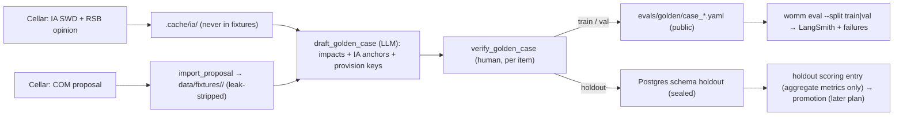

# feat: Golden-case expansion with multi-regulation import and a sealed holdout

> **Revision 2026-10-04 (after review and user decisions).** Where this block conflicts with a section below, this block wins.
>
> **User decisions**
> - **Size and split:** about 21 cases, about 10 train / 3 val / **8 holdout**. The holdout comes from **at least 5 proposals**. Split per proposal.
> - **Annotators:** 2–3 classmates at 3–5 hours each, so about 6–15 annotator-hours in total.
> - **Drafting model:** Claude (no second vendor). Recall bias is countered by the classmates' "add missing" task. Every item records `provenance: llm_drafted | human_added` and the drafting model id.
>
> **Annotation design: humans only where an LLM cannot be trusted** (user decision 2026-10-04: "only the most necessary places get a human; everything else can be an LLM judge")
>
> | Step | Who | Where |
> |---|---|---|
> | Draft the impacts, each with an IA anchor, a category, a derivability pre-check and provision keys | LLM (Claude) | drafting tool |
> | Recall pass: list "possibly missing" candidates from the IA impacts section and annex, each anchored | LLM, second pass | drafting tool |
> | **LLM judge verification:** each item and candidate is checked against its IA anchor in context, then marked `agree` (auto-accepted), `disagree` or `uncertain`, with a reason | LLM judge, an independent prompt and call | drafting tool |
> | **Human check, train/val:** only the `disagree` and `uncertain` items, plus a **random 20% audit** of the auto-accepted items | classmates | GitHub PR |
> | **Escalation:** if a proposal's audit error rate is over 10%, every item of that proposal goes to human review | classmates | same PR |
> | **Holdout: full human verification** of every item | 1–2 classmates who do not edit prompts or routing | private: encrypted draft, local `verify_golden_case.py` |
>
> - Expected human effort is about 5–8 minutes per train/val case and 15–20 minutes per holdout case, roughly 3–4 hours in total.
> - Provenance per item is one of `llm_judged`, `human_verified`, `human_edited` or `human_confirmed_candidate`. Audit results and the judge's agreement rate with humans are reported as evidence of golden-set quality.
> - The draft-check CI test requires every `disagree`/`uncertain` item and every audited item to have a human decision and reviewer. Auto-accepted, un-audited items need none.
> - Target granularity is 5–10 impacts per case, at the actor × mechanism level. The guide (`docs/eval/golden-review-guide.md`) has worked examples from the two existing AI Act cases.
> - A tracking sheet (`evals/annotation-assignments.md`, with names and case ids only, no holdout ids) assigns cases and records minutes spent.
> - **Go/no-go after the 2-proposal pilot:** if measured minutes per case × remaining cases exceeds the available hours, cut train cases first and keep the holdout at 8.
>
> **Review fixes adopted**
> - **Holdout never traced or written to disk.**
>   - Holdout drafting, verification and scoring run inside `langsmith.tracing_context(enabled=False)`, the pattern in `src/womm/backends.py`.
>   - Scoring never uses `evaluate_cases`' `womm:eval_case` wrapper, never writes `runs/`, and never calls `write_report` or `record_langsmith_experiment`.
>   - Tests patch the LangSmith client and assert zero posted runs and no files written.
> - **Separate holdout database.**
>   - `HOLDOUT_DATABASE_URL` points to a database the deployed API is never given. Its own migrations are run only by the holdout scripts, never by `Database.migrate()`.
>   - Holdout scenario definitions, IA and RSB ids, and the split live there too. Public fixtures and `evals/candidates.yaml` list holdout proposals only as imported fixtures, with no `evaluation` scenario, no `ia_reference` and no split. `holdout.compare` injects the scenarios at scoring time.
> - **Interface for R28:**
>   - `holdout.compare(candidate, baseline, repetitions)` returns per-metric mean deltas, paired bootstrap CIs clustered by proposal, and pooled noise, but never per-case values or ids.
>   - Results go only to an audit table in the holdout DB. The R27 archive excludes holdout metrics.
>   - A minimum-detectable-delta report runs after the pilot noise run. If the delta exceeds the improvement R30 expects, record "v1 uses R28 weak-threshold mode" before the self-evolution plan starts.
> - **Category-stratified split.** Every category with at least 3 train instances must also appear in the holdout. Category counts per split are recorded in the holdout DB.
> - **Contamination.**
>   - The cutoff is not a fixed date. It is looked up from the published training cutoffs of every model id in the evaluated SystemVersion (experts, synthesis, judge) at selection time.
>   - Each holdout case records whether its IA postdates that cutoff. If fewer than half do, the demo says so.
> - **Parser hardening comes before the pilot.** The current `parse_proposal` returns **0 articles, silently,** on the Data Act (52022PC0068). The Data Act uses:
>   - `Titrearticleb`, `Titrearticle0`, `Titrearticlef` and `Titrearticlefa` variants;
>   - `ChapterTitle` (it must end an article);
>   - title spans split mid-word;
>   - '•.' memorandum numbering.
>
>   The import fails, naming the CELEX, on zero articles, gaps or duplicates. A Data Act characterization sample is added before hardening. IA documents use `li Heading1/2/3`, so U3 gets its own heading parser.
> - **Draft destinations by split.** Train/val drafts are written to `evals/golden/drafts/` for PR review. Holdout drafts are written only to `.cache/drafts/`, which is gitignored and encrypted for sharing.
> - **CI.** `.github/workflows/ci.yml` triggers on `ready_for_review` too. The draft-PR exemption flag comes from `github.event.pull_request.draft`. Pushes to `main` always run the strict check.
> - **`--formal` flag.** Only `womm eval --formal` (the R34 noise run) refuses non-api backends. `--baseline` on `claude_code` keeps its `smoke` tag.
> - **Keys.** Imported proposals use plan 002's shape: `<regulation_id>/proposal/art/<n>`.
> - **Annexes.** Annexes are not imported in v1. The guide rejects impacts that rest only on annex content, and U8 records per proposal whether its key obligations sit in annexes.

## Overview

This plan grows WOMM's evaluation set from 2 AI Act cases to about 20 cases drawn from several EU proposals. Each proposal is paired with its official impact assessment (IA). The cases are split into train, val and holdout. Holdout reference answers never enter the public repository, LangSmith, or anything the Improvement Planner can read.

Four capabilities make this possible:

1. Regulation-independent fixtures, one per proposal.
2. An automatic importer for other COM proposals (origin R33).
3. An LLM-assisted drafting tool for reference answers, with **mandatory human verification** of every expected impact. This was a user decision on 2026-10-04.
4. A sealed holdout store.

This is on the critical path of the v1 self-evolution demo (origin R30), so it starts now, in parallel with plan 002 U1–U4. That sequencing was decided on 2026-10-03.

---

## Problem Frame

R28 promotion needs a holdout large enough to beat run-to-run noise. Two cases cannot do that: identical runs already move coverage by about 0.1 (`docs/solutions/evaluation/single-run-scores-are-noise.md`). The AI Act has only one IA, so further cases must come from other proposals (origin R33). The current code assumes one regulation everywhere:

- `load_fixture()` defaults to `data/fixtures/ai_act`.
- `scripts/build_fixture.py` hard-codes the AI Act.
- `MEMORANDUM_STRIP` contains three English headings that must match exactly.
- `GoldenCase` has no regulation and no split field.
- `sync_dataset` uploads full cases to LangSmith, which would leak the holdout (R23/AE3).

---

## Requirements Trace

- R22. About 20 golden cases (range 15–30) from COM proposal + official IA pairs. RSB opinions are used, where available, as the source for important omissions. → U3, U4, U5, U8
- R23. Train/val/holdout split. Holdout answers live only in our own database and are readable only by the promotion path. → U1, U6, U7
- R24. Strip IA-restating memorandum sections from every imported proposal. Prefer IAs published after the model's training cutoff for the holdout. → U2, U8
- R33. Other EU proposals are imported automatically under the R1 contract, with input "no prior version → proposal". This plan is the owner. → U2
- R34 / R28 inputs. The split and the case count let the noise run and the promotion threshold be set. Running them on the api backend needs an API key (see Dependencies). → U7
- AE3. The Improvement Planner sees only train/val failure summaries, never holdout cases or answers. → U6

---

## Scope Boundaries

- No Improvement Planner, no promotion logic and no Failure Memory aggregation. Those belong to the self-evolution plan. This plan provides the data, the split, the sealed store and a holdout scoring entry point that returns only aggregate metrics.
- No multi-version support for non-AI-Act proposals: proposal only (origin Scope Boundaries).
- The console keeps showing the AI Act fixture. Other regulations are evaluation-only in v1.
- No obligation data for other proposals, so data scopes (plan 002) stay AI-Act-only.

### Deferred to Follow-Up Work

- **Formal R34 noise run and the R28 threshold numbers.** They need the api backend and key. This plan adds the command, and the run happens once a key exists.
- **More than about 20 cases.** The tooling scales, but human verification time is the limit.

---

## Context & Research

### Relevant Code and Patterns

- `src/womm/eval/golden.py`: `GoldenCase`, `ExpectedImpact`, `Omission` (all `StrictModel`), `load_all_golden()` (globs `evals/golden/case_*.yaml`) and `check_against_fixture` (requires an `evaluation` scenario containing every provision key).
- `src/womm/eval/run_eval.py`:
  - `evaluate_cases` runs cases × repetitions one after another;
  - `sync_dataset` upserts full cases into LangSmith dataset `womm-golden-v0` (**a holdout leak path**);
  - `persist_failures` writes the `failures` table, whose schema comment already says "train/val only".
- `src/womm/eval/evaluators.py`: the judge sees expected impacts' actor, mechanism and impact only; `noise()` gives per-case statistics.
- `src/womm/data/fixtures.py`: `load_fixture(directory)` already takes a directory. `VERSION_FILES` is `proposal.json` and `final.json`, so a proposal-only fixture already fits.
- `src/womm/data/parse_proposal.py`:
  - built for Word-derived XHTML classes (`Titrearticle`, `ManualHeading1-4`, `ManualNumPar1`);
  - the article regex is `Article\s+(\d+[a-z]?)`;
  - tested only on COM(2021) 206.
- `scripts/build_fixture.py`:
  - `strip_sections` raises when a listed heading is missing, so it fails closed;
  - `check_downloads` pins sha256;
  - `fetch` and `fetch_upstream` handle Cellar.
- `src/womm/api/migrations/001–003.sql`: single DB user, no roles, and no golden or holdout tables. Migrations run under an advisory lock.
- `.dockerignore` excludes `evals/`, so the deployed API never sees golden files.
- `src/womm/citations.py`: `match_quote` can verify that a drafted IA anchor quote exists in the IA text (U4).

### Verified facts (2026-10-04)

- Cellar returns XHTML for `52022PC0068` (Data Act proposal) and `52022SC0034` (Data Act IA).
- Multi-part IAs (`52022SC0282`, `52020SC0348`, `52021SC0084`) answer HTTP 300 with a listing. The importer must resolve `DOC_n` items, as the v0 fixture already does for COM(2021) 206.
- Several 2025–2026 candidates return 404 under the CELEX resource. Their identifiers must be confirmed through SPARQL before use.

### Institutional Learnings

- `docs/solutions/evaluation/single-run-scores-are-noise.md`: pool at least 6 runs per case; judge omission scores move in steps of 0.25–0.33.

### External References

- Candidate list (to verify in U8): DSA, DMA, DGA, Data Act, CRA, EHDS, eIDAS 2, political advertising, Chips Act, Interoperable Europe Act, PLD, AILD, ESPR, SMEI, Gigabit Infrastructure Act, digital euro, PSR/PSD3, FIDA, GPSR, Machinery, Batteries, NZIA, Platform Work. For the holdout, 2025–2026 proposals with IAs, for example the EU Space Act COM(2025)335. Omnibus proposals without a full IA are excluded.

---

## Key Technical Decisions

- **One fixture directory per regulation, with a registry.**
  - Layout: `data/fixtures/<regulation_id>/`. The existing `ai_act` directory stays as it is.
  - `GoldenCase` gains `fixture` (default `ai_act`) and `split` (`train` | `val` | `holdout`, default `train`), so the two existing cases stay valid.
  - The eval runner loads each case's own fixture.
  - *Why:* `load_fixture(dir)` already supports this, and runtime callers (API, console) keep the AI Act default.
- **Generic proposal importer.**
  - `scripts/import_proposal.py <COM CELEX>` resolves Cellar `DOC_n`, parses articles with a hardened `parse_proposal`, and generates keys `<regulation_id>/art_<n>`.
  - It builds sources: the articles plus memorandum sections.
  - Per-proposal settings live in `data/fixtures/<id>/import.yaml`: CELEX, the strip patterns used, and the scenario article sets.
  - *Why:* R33 asks for automatic import, and per-proposal YAML keeps the exceptions reviewable.
- **Memorandum leak stripping by topic patterns, failing closed.**
  - Section headings are matched case-insensitively against topic patterns: results of ex-post evaluations / stakeholder consultations / impact assessment; proportionality; budgetary implications. Each removed section is recorded.
  - A **leak guard** then rejects the fixture if kept memorandum text still contains IA-conclusion markers ("impact assessment", "preferred option", "Regulatory Scrutiny Board", "SWD(") outside allow-listed citations.
  - *Why:* headings vary between proposals, and v0's exact-heading match would either raise or, if loosened naively, leak.
- **Splits are per proposal, never per case.** All cases of one proposal share a split, so holdout answers cannot be inferred from train cases about the same text. The holdout prefers IAs published after June 2025. Each case records its IA publication date and the system version's model ids, so the cutoff claim can be checked.
- **Drafting = LLM proposal + human verification, recorded per impact.**
  - `scripts/draft_golden_case.py` fetches the IA (and the RSB opinion where it can be found), cut to the impacts sections: "impacts of the policy options" or "preferred option", plus the who-is-affected and costs annexes.
  - A drafting role, configured like any WOMM backend role, proposes `expected_impacts` and `important_omissions`. Each item carries an **IA anchor quote**, checked with `match_quote` against the IA text, and provision keys validated against the imported fixture.
  - *Why:* the user decision (2026-10-04), and every reference answer stays traceable to the IA.
- **Train/val cases are reviewed by teammates in GitHub pull requests** (user decision, 2026-10-04).
  - Draft cases are committed to `evals/golden/drafts/` on a review branch. Every item carries its IA anchor, the IA section and a link to the IA page, plus `review: {decision: pending, reviewer: null, note: null}`.
  - Teammates set each decision (`verified`, `edited` or `rejected`) with GitHub suggestions, or comment, and approve the PR.
  - A pytest check, run by CI on every PR, blocks publishing until every item is decided, has a GitHub username as reviewer, and every edit keeps a valid schema and provision keys.
  - After merge, `scripts/publish_golden_cases.py` turns fully decided drafts into `evals/golden/case_*.yaml` and removes the drafts.
  - A short rubric, `docs/eval/golden-review-guide.md`, keeps reviewers consistent. It says what counts as matching the IA (actor, mechanism, impact; no changed numbers) and when to reject.
  - Two or three cases get a second reviewer, and their agreement is reported.
  - Drafts live in a subfolder the eval loader never globs, so an unreviewed draft is never scored.
  - **The holdout is never in a PR.** Holdout drafts are verified only locally by the user, or one named person, with `scripts/verify_golden_case.py`, and go straight to the sealed store.
- **The IA never becomes agent input.** IA and RSB texts are cached under `.cache/ia/` (gitignored) and never written to `data/fixtures/`. A test asserts that no fixture source contains text overlapping its own IA beyond a short n-gram threshold.
- **Sealed holdout.**
  - Holdout cases are never written to the repository. After verification they are imported into a Postgres schema `holdout` (migration 004), and the plaintext draft is deleted.
  - Access goes only through `womm.eval.holdout`, which exposes a single scoring entry point returning aggregate metrics per system version.
  - `load_all_golden`, `sync_dataset` and `persist_failures` reject holdout cases.
  - Where Postgres roles are available, the app role gets no `SELECT` on the schema, and the promotion job uses a separate role. Otherwise isolation is code-level, with tests.
  - *Why:* R23 and AE3 in a public repository.
- **Eval runner by split.** `womm eval --split train|val` selects cases. Holdout is never selectable from the CLI; it runs only through the holdout entry point. Reports and LangSmith experiments are tagged with the split.

---

## Open Questions

### Resolved During Planning

- **Who writes the reference answers?** An LLM drafts them and a human verifies each one (user, 2026-10-04).
- **Who owns R33?** This plan.
- **How many cases?** Target about 20: about 12 train, 4 val and 4 holdout, with 1–3 cases per proposal and about 10–12 proposals.

### Deferred to Implementation

- **Exact CELEX ids for every candidate, especially 2025–2026.** Confirm via SPARQL in U8.
- **How far `parse_proposal` needs hardening.** Read it off the first 5 imports (U2).
- **Which IA sections each case covers.** Decided per proposal while drafting, recorded in `ia_reference`.
- **Whether Railway's Postgres plan allows a second role.** If not, document code-level isolation.

---

## High-Level Technical Design

> *This illustrates the intended approach and is directional guidance for review, not implementation specification. The implementing agent should treat it as context, not code to reproduce.*

---

## Implementation Units

- U1. **Multi-fixture golden cases and splits**

**Goal:** Golden cases name their fixture and split, and evaluation loads the right fixture per case.

**Requirements:** R22, R23

**Dependencies:** none

**Files:**
- Modify: `src/womm/eval/golden.py`, `src/womm/eval/run_eval.py`, `src/womm/cli.py`
- Test: `tests/eval/test_golden.py`, `tests/eval/test_run_eval_fake.py`

**Approach:**
- `GoldenCase.fixture` (default `ai_act`) and `split` (default `train`). The fixture is resolved to `data/fixtures/<fixture>`.
- `check_against_fixture` checks the case's own fixture. The CLI gets `--split`. Holdout is rejected by the YAML loader.

**Test scenarios:**
- Happy path: the existing two cases load unchanged with `fixture=ai_act` and `split=train`.
- Happy path: a case with `fixture: data_act` is checked against that fixture and runs on the fake backend.
- Error path: a YAML case with `split: holdout` is refused by `load_all_golden`, with a message pointing to the holdout importer.
- Error path: an unknown fixture name fails, naming it.
- Edge case: `--split val` selects only val cases, and an empty selection exits with code 2.

**Verification:** the existing eval tests pass, and a two-fixture fake run reports per case.

---

- U2. **Generic proposal importer with leak-guarded memorandum**

**Goal:** Import any COM proposal into a fixture directory automatically (R33), with the memorandum IA-stripped (R24).

**Requirements:** R33, R24

**Dependencies:** U1

**Files:**
- Create: `scripts/import_proposal.py`, `src/womm/data/memorandum.py`, `data/fixtures/<reg>/import.yaml` (per proposal)
- Modify: `src/womm/data/parse_proposal.py` (hardening found on real samples), `src/womm/data/cellar.py` (`DOC_n` resolution from a 300 listing)
- Test: `tests/data/test_memorandum.py`, `tests/test_import_proposal_script.py`, `tests/fixtures/<new proposal samples>.xhtml`

**Approach:**
- Resolve the main document from the 300 listing: the item with the explanatory memorandum and the articles.
- Parse the articles and generate keys. Topic-pattern stripping is recorded in sources, as `stripped_sections` does today.
- The leak guard fails closed. Pin every download.
- One generated `evaluation` scenario per case article set, defined in `import.yaml`.

**Execution note:** Characterization first. Before changing `parse_proposal`, lock in today's COM(2021) 206 output byte for byte.

**Patterns to follow:** `scripts/build_fixture.py` (`check_downloads`, `memorandum_sources`, `write_fixture`), `src/womm/data/fixtures.py` validation.

**Test scenarios:**
- Happy path: the Data Act sample imports to a fixture that `load_fixture` accepts, and the article count matches the document.
- Happy path: the AI Act import through the new path produces the same memorandum strip list as v0.
- Edge case: a memorandum whose heading reads "Results of ex-post evaluations, stakeholder consultations and impact assessments" in a different case or numbering is still stripped.
- Error path: kept text containing "preferred option" fails the build, naming the section.
- Error path: a 300 listing with no recognisable main document fails, naming the CELEX.
- Integration: the importer's AI Act fixture equals the committed `data/fixtures/ai_act` sources for the memorandum.

**Verification:** at least 5 different proposals import cleanly, and the leak guard has caught no false negatives on hand inspection.

---

- U3. **IA and RSB fetcher (never agent-visible)**

**Goal:** Cache each proposal's IA parts and RSB opinion locally, cut to the impact-relevant sections.

**Requirements:** R22, R24

**Dependencies:** U2 (`DOC_n` resolution)

**Files:**
- Create: `src/womm/eval/ia_sources.py`
- Test: `tests/eval/test_ia_sources.py`

**Approach:**
- Store under `.cache/ia/<reg>/` (gitignored). Extract the "impacts of the policy options" or "preferred option" section, the "who is affected" annex and the costs tables as text.
- Find the RSB opinion through the work's related documents where possible. Otherwise record "none found".
- A guard asserts that `.cache/ia` paths are never written under `data/fixtures`.

**Test scenarios:**
- Happy path: the Data Act IA sample yields its impacts section and annex text.
- Edge case: a multi-part IA (HTTP 300) resolves both parts.
- Error path: no impacts section found gives a clear error that lists the headings it did see.
- Integration: for every fixture, an n-gram overlap test between fixture sources and the cached IA stays under the threshold.

**Verification:** IA text exists only in `.cache/ia`, and the overlap test passes for the AI Act and the Data Act.

---

- U4. **Golden-case drafting tool (LLM, anchored)**

**Goal:** Draft expected impacts and omissions with traceable IA anchors and valid provision keys.

**Requirements:** R22

**Dependencies:** U2, U3

**Files:**
- Create: `scripts/draft_golden_case.py`, `prompts/tools/draft_golden_case.md`, `src/womm/eval/drafting.py`
- Test: `tests/eval/test_drafting.py`

**Approach:**
- A structured-output model holds the draft impacts. Each impact has actor, mechanism, impact, provision keys, `ia_section`, and an `ia_anchor` quote.
- Anchors are checked with `match_quote` against the cached IA, and provision keys against the fixture. Failing items are flagged, not dropped.
- Train/val drafts go to `evals/golden/drafts/` with pending reviews. Holdout drafts go only to `.cache/drafts/` (gitignored), never to `evals/`.
- The draft also contains an LLM recall pass: `possibly_missing` candidates, each with an IA anchor, which reviewers accept or decline. It also has an LLM-proposed category and a derivability pre-check per item, which reviewers confirm in the same pass.
- The drafting role uses a backend from config, isolated like the `claude_code` experts.

**Test scenarios:**
- Happy path (fake backend): a scripted draft writes a draft file whose anchors all verify.
- Edge case: an impact whose anchor is not in the IA is marked `anchor_not_found`.
- Error path: an unknown provision key is marked, and the draft still writes.
- Edge case: omissions from the RSB opinion carry `source: rsb`, and from the IA itself `source: ia`.

**Verification:** a real draft for the Data Act exists, with every item anchored or flagged.

---

- U5. **Human verification and publishing (PR review for train/val, local for holdout)**

**Goal:** Teammates verify train/val drafts through GitHub PRs, and the user verifies holdout drafts locally. Only fully decided cases are published.

**Requirements:** R22, R23

**Dependencies:** U4

**Files:**
- Create: `scripts/verify_golden_case.py` (holdout, local), `scripts/publish_golden_cases.py`, `docs/eval/golden-review-guide.md`, `.github/pull_request_template.md` (review checklist section for golden-case PRs)
- Modify: `src/womm/eval/golden.py` (draft schema with per-item `review`; loader ignores `drafts/`)
- Test: `tests/test_verify_golden_case_script.py`, `tests/eval/test_golden_drafts.py`

**Approach:**
- **Train/val:**
  - The drafting tool writes YAML drafts into `evals/golden/drafts/` with pending reviews.
  - The PR is reviewed by teammates following the guide.
  - `tests/eval/test_golden_drafts.py` fails while any item is pending or lacks a reviewer, so the PR cannot merge undecided. A draft with all items pending is allowed only on a branch whose PR is still marked draft, which CI checks through an env flag.
  - After merge, the publish script writes the cases, records reviewers and dates in `notes`, and deletes the drafts.
  - A case with fewer than 3 kept impacts is not published.
- **Holdout:**
  - The interactive local script shows each item with its IA anchor in context: verify, edit or reject, with a note.
  - Every item must be decided. It never runs non-interactively without an explicit reviewer and a decisions file.
  - The output goes straight to U6's importer, never to the repo.

**Test scenarios:**
- Happy path: all items verified gives a valid `GoldenCase` YAML that loads and passes `check_against_fixture`.
- Happy path (PR flow): a draft with every item decided and a reviewer set passes the draft check, and publish writes `case_*.yaml` and removes the draft.
- Error path (PR flow): one pending item, or a decided item without a reviewer, fails the draft check with the case and item ids.
- Edge case: `load_all_golden` ignores `evals/golden/drafts/`.
- Error path: a draft with `split: holdout` anywhere under `evals/` fails the check (holdout never goes through a PR).
- Edge case: a rejected item is left out, and a case with fewer than 3 kept impacts is not published.
- Error path: an undecided item blocks publishing.
- Error path: publishing a holdout case to `evals/golden/` is impossible. It goes to the holdout importer only.

**Verification:** the Data Act case is published as train or val after a real PR review by a teammate, and the guide is linked from the PR template.

---

- U6. **Sealed holdout store**

**Goal:** Holdout cases live only in Postgres, readable only through a scoring entry point that returns aggregates.

**Requirements:** R23, AE3

**Dependencies:** U1, U5

**Files:**
- Create: `src/womm/api/migrations/004_holdout.sql`, `src/womm/eval/holdout.py`, `scripts/import_holdout_case.py`
- Modify: `src/womm/eval/run_eval.py` (`sync_dataset` and `persist_failures` refuse holdout)
- Test: `tests/eval/test_holdout.py`, `tests/api/test_holdout_db.py`

**Approach:**
- Schema `holdout` with cases stored as JSON plus metadata.
- `holdout.score(system_version)` runs the holdout cases and returns per-metric aggregates and their noise only. No case ids or expected impacts are ever returned or logged, and no LangSmith dataset sync happens.
- Roles where possible, code isolation otherwise.

**Test scenarios:**
- Covers AE3. The train/val failure summaries API contains no holdout case ids after a holdout scoring run.
- Happy path: importing a case and scoring with the fake backend returns aggregate metrics only.
- Error path: `sync_dataset` with a holdout case raises. `persist_failures` never writes rows for a holdout run.
- Integration: logs and LangSmith traces of a holdout run contain no expected-impact text (traces are tagged and payloads redacted).
- Edge case: re-importing the same case is idempotent.

**Verification:** a holdout case exists only in the DB, and grepping the repo and LangSmith for its id finds nothing.

---

- U7. **Split-aware eval reporting and noise command**

**Goal:** Reports and experiments per split, plus a reproducible R34 noise command.

**Requirements:** R23, R34

**Dependencies:** U1, U6

**Files:**
- Modify: `src/womm/eval/run_eval.py`, `src/womm/cli.py`, `README.md`
- Test: `tests/eval/test_run_eval_fake.py`

**Approach:**
- Report and LangSmith metadata gain `split`. `womm eval --split val --repetitions 6` is documented as the R34 noise protocol.
- The command refuses a non-api backend for the formal baseline unless `--dev`.

**Test scenarios:**
- Happy path: a fake run on two splits writes separate summaries.
- Error path: a formal noise run on the `claude_code` backend without `--dev` exits with a clear message.

**Verification:** the README documents the protocol, and the fake run proves it.

---

- U8. **Candidate manifest and case production**

**Goal:** About 20 verified cases across about 10–12 proposals, split per proposal.

**Requirements:** R22, R23, R24

**Dependencies:** U2–U6

**Files:**
- Create: `evals/candidates.yaml` (public: CELEX, IA ids, RSB ids, publication dates, split; no answers)
- Create (generated): `data/fixtures/<reg>/` for each imported proposal, `evals/golden/case_*.yaml` (train and val)

**Approach:**
- Confirm the ids through SPARQL. Pick the holdout from IAs published after June 2025.
- Pilot end to end on 2 proposals first (Data Act; CRA, which is multi-part). Then batch.
- Track human verification time per case, so the pace is known early.

**Test expectation:** none here beyond the U1–U6 tests. Every published case must pass `check_against_fixture` and the leak tests.

**Verification:** at least 15 cases are published or sealed, with at least 3 in the holdout, and each split has more than one proposal.

---

## System-Wide Impact

- **Unchanged invariants:**
  - The AI Act fixture and its cases.
  - The console and API default fixture.
  - Agent prompts.
  - `.dockerignore` keeps `evals/` out of the image.
- **Data exposure:**
  - Public repo: fixtures (public EU text, leak-stripped), train/val cases, and the candidate manifest.
  - Never public: IA caches, drafts and holdout answers.
- **Cost:** drafting uses one LLM call per case, plus human time. Eval cost grows about 10× with the case count, so plan the noise runs on the api backend.

---

## Risks & Dependencies

| Risk | Mitigation |
|------|------------|
| Human verification time (about 20 cases × 15–30 min) | Pilot 2 proposals first to measure. Drafting puts anchors next to each item. The user may delegate verification |
| `parse_proposal` breaks on other proposals' markup | Characterization test first. Harden on 5 samples. A proposal that fails is skipped and recorded, never half-imported |
| Memorandum leak through unusual headings | Topic patterns plus a fail-closed leak guard plus an n-gram overlap test against the IA |
| Holdout contamination through training data | Prefer IAs published after June 2025. Record publication dates and model ids |
| Holdout leak through LangSmith or logs | No dataset sync. Redacted holdout traces. Tests for AE3 |
| No API key yet | Drafting can run on `claude_code`. Formal R34 and R28 numbers wait for the key |
| 2025–2026 CELEX ids return 404 | SPARQL lookup in U8. Fall back to the Commission register PDF only if XHTML is missing (then out of scope for v1) |

---

## Sources & References

- **Origin document:** [docs/brainstorms/2026-09-28-womm-phased-requirements.md](../brainstorms/2026-09-28-womm-phased-requirements.md) (R22, R23, R24, R28, R30, R33, R34, AE3)
- Related plan: [docs/plans/2026-10-02-002-feat-scoped-provision-retrieval-plan.md](2026-10-02-002-feat-scoped-provision-retrieval-plan.md)
- Code: `src/womm/eval/golden.py`, `src/womm/eval/run_eval.py`, `src/womm/data/parse_proposal.py`, `scripts/build_fixture.py`, `src/womm/api/migrations/`
