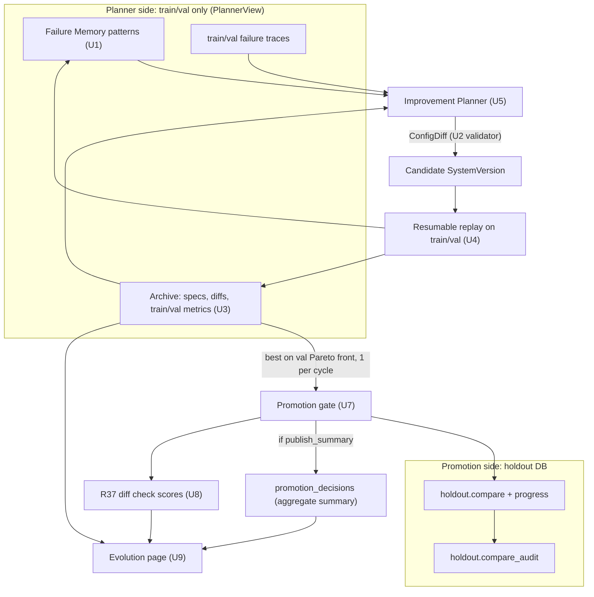

# feat: Self-evolution cycle (Failure Memory, Improvement Planner, archive, holdout promotion)

> **Decision context (2026-10-06).** These decisions were made before this plan and are not reopened here. Where a section below conflicts with this block, this block wins.
>
> - **Base version.** The self-evolution base is `v1.0-unscoped` (plan 002 Revision 2026-10-03). Data scopes stay a side experiment, and the Improvement Planner never edits scopes in v1 (plan 002, Deferred to Follow-Up Work).
> - **Formal comparisons run on the api twins** (`v1.0-*-api`, `system_versions/PROMOTIONS.md`, 2026-10-04 section). `claude_code` runs are development runs, and their verdicts are labelled dev-only.
> - **Prompts before topology.** The first improvement stage is GEPA-style reflection on train/val failure traces (prompt edits). A topology change, a new expert, is proposed only when a failure pattern survives the prompt stage (origin Key Decisions: GEPA first, MASS order).
> - **"A new expert"** means three config entries and nothing else: a new `experts[]` registry entry, its prompt file, and its router entry (the relevance gloss the decider uses). No code changes per expert.
> - **The holdout is never readable by the Improvement Planner.** This is enforced by structure (module boundaries, process environment, a single data-access object) and by tests, not by convention.
> - **Holdout interface.** `womm.eval.holdout.compare` (golden plan, Revision 2026-10-04 and `src/womm/eval/holdout.py`) is the only holdout reader. It returns per-metric mean deltas, paired bootstrap CIs clustered by proposal, pooled noise, a `failure_policy` and an `insufficient_proposals` flag, and writes only aggregates to its audit table. The R27 archive excludes holdout metrics.

## Overview

This plan delivers the v1 self-evolution cycle (origin F3) and the demo it must support (R30):

1. **Failure Memory** (R25): structured train/val failure records, aggregated by pattern.
2. **A config-only Improvement Planner** (R26): it proposes prompt edits by reflecting on failure traces, and proposes a new expert when a pattern persists.
3. **A candidate archive** (R27): every candidate with its parent, config diff and train/val metrics.
4. **Resumable batch replay** (R29): candidates are replayed on train/val as background jobs that survive a restart.
5. **A promotion gate** (R28): built on the sealed holdout compare, with a pre-registered policy, a statistical mode and an honest weak-threshold mode.
6. **A diff regression check** (R37): visible on the evolution page and in promotion records, never gating.
7. **The evolution page** (R36 page 4): lineage tree, config diff, train/val and holdout aggregates, the decision, and a highlight when a new expert is created.

Human feedback (R31) is a scoped follow-on (U11). It is built only if U1–U10 land with time left.

---

## Problem Frame

v0 and plan 002 leave self-evolution as interfaces:

- The `failures` table (`src/womm/api/migrations/001_init.sql`) holds one row per low metric or missed-impact list. It has no category, no attributed agent and no aggregation, so nothing can say "this kind of impact is missed again and again".
- SystemVersions are content-addressed and built from YAML files plus prompt files (`src/womm/models/system_version.py`). There is no way to create, store or compare a candidate without hand-writing files, and no lineage beyond prose in `PROMOTIONS.md`.
- `holdout.compare` exists on `feat/golden-import`, but nothing decides a promotion from its output. It runs every case sequentially in one process, so a restart loses all progress.
- Evaluation runs (`evaluate_cases`) run in one CLI process. `src/womm/api/jobs.py` says outright: "Resuming interrupted runs is v1 work (R29)".
- Run-to-run noise is large: about 0.1 coverage on one case between identical runs (`docs/solutions/evaluation/single-run-scores-are-noise.md`). With 8 holdout cases from at least 5 proposals, a statistical gate may not resolve the improvement one cycle can achieve. The plan must say what happens then, and say it honestly in the demo.

---

## Requirements Trace

- R25. Failure Memory: train/val only, structured (agent, impact type, cases, frequency), aggregated by pattern. → U1
- R26. The Improvement Planner edits config only: prompts, routing table, research policy and agent registry. → U2, U5, U6
- R27. Every candidate is archived with its parent, diff and metrics at each level, not only the best. Holdout metrics are excluded. → U3
- R28. Promotion threshold on the sealed holdout: improvement beyond noise (bootstrap CI), per-metric regression tolerances, a weak-threshold mode stated honestly, and results written only where the Planner cannot read them. → U7
- R29. Batch replay runs as a background task and resumes after a restart. → U4, U7 (holdout progress)
- R30. Demo: a new expert is proposed, the holdout improves, and the candidate is promoted. If that route is not stable, fall back to a prompt-level cycle. → U5, U10
- R36 page 4. Evolution page: lineage tree, config diff, train/val and holdout aggregates, promote/reject, new-expert highlight, plus loading, empty and error states. → U9
- R37. Diff regression check on the demo diff scenario, run for every SystemVersion, visible but not gating. → U8
- R31. Analyst feedback into Failure Memory: only as the scoped follow-on U11.
- R34 dependency. The promotion threshold depends on formal noise data from the api backend. → U7, Dependencies

**Origin actors:** A3 (Improvement Planner, LLM judge), A5 (evaluation and promotion process), A1 (demo audience; analyst for U11)
**Origin flows:** F3, and F2 as its replay step
**Origin acceptance examples:** AE3 (the Planner sees only train/val failure summaries) → U6. AE4 (coverage +8% with a grounding drop is rejected, and the Planner cannot see the result) → U7, U6

---

## Scope Boundaries

- **Config only.** The Improvement Planner never edits code, the judge, the backend or model of any role, the router mode, data scopes, or the golden cases. The origin excludes evaluator self-improvement and code self-modification.
- **No agent merge, deletion or graph reorganisation** (origin Scope Boundaries, Experimental items). A topology change in v1 is one thing only: adding one expert.
- **Promotion optimises whole-proposal evaluation only.** The provision-level diff is monitored by R37 and never gates (origin Scope Boundaries).
- **No new golden cases and no changes to holdout sealing.** The golden plan owns both. This plan adds one holdout migration (compare progress, U7), behind the same module boundary.
- **No automatic deployment.** A promoted version becomes the deployed default only through a human commit to `PROMOTIONS.md` and the API's default version (see Human-in-the-Loop Points).

### Deferred to Follow-Up Work

- R31 analyst feedback beyond U11, and any review UI of our own (the origin says LangSmith annotation queues come first).
- Improvement Planner edits to data scopes (plan 002 deferral stands).
- Using the Pareto archive to recombine candidates (GEPA's merge step). v1 only mutates.
- R36 page 3 (evaluation page). U9 shows the train/val aggregates page 4 needs and links each candidate to its eval reports. The full per-case page 3 is a separate item.
- Re-calibrating the R21 router reliability threshold on evolved versions. Evolved versions keep the router in shadow.

---

## Context & Research

### Relevant Code and Patterns

Code referenced below lives on two unmerged branches: `feat/provision-corpus` (plan 002) and `feat/golden-import` (golden plan). This plan starts after both are merged into `main`, or rebases onto them.

- `src/womm/models/system_version.py`:
  - `build_system_version` hashes `canonical_dump()` plus prompt hashes into `version_id`.
  - `canonical_dump` drops post-v0 fields when None, so old ids stay stable. Any field added here (U2) must follow that rule.
  - `derive_system_version` is the existing pattern for content-addressed overrides (`name: <base>+overrides`).
- `src/womm/graph/build.py` adds one graph node per entry in `sv.spec.experts`, and `src/womm/graph/router.py` dispatches by expert id. A new registry entry therefore becomes a running expert with no code change.
- `src/womm/decisions/jev.py` `relevance_question` reads `DOMAIN_GLOSS` (code) and falls back to `"the {domain} domain"`. This is the one place where a new expert's router entry is code today. U2 moves it to config.
- `web/src/model/pipeline.ts` builds the topology from `trace.experts` (`edges`, `colIds`), and `DESC`/`SUB` fall back to a generic description for unknown ids. A new expert renders without console changes.
- `src/womm/eval/evaluators.py`:
  - `failure_records` gives coarse records (`low_<metric>`, `missed_expected_impacts` with ids, `expert_<kind>`);
  - `ExpectedVerdict` maps each expected impact to `covered` and the dossier `impact_id`;
  - `FAILURE_THRESHOLDS` are loose v0 defaults.
- `src/womm/eval/golden.py` (golden-import): `ExpectedImpact.category` comes from `CATEGORY_GUIDE` in `src/womm/eval/drafting.py` (`compliance_cost`, `public_enforcement_cost`, `social_environmental`, ...). This is R25's "impact type".
- `src/womm/eval/run_eval.py`: `persist_failures` refuses holdout reports. `check_formal` gates the R34 run on the api backend with `FORMAL_MIN_REPETITIONS = 6`.
- `src/womm/eval/holdout.py`: `compare(candidate, baseline, repetitions, store=..., failure_policy=...)`, `HoldoutComparison`, `MIN_PROPOSALS = 5`, and `HoldoutStore.record_audit`. Scoring uses the baseline's judge.
- `src/womm/eval/trajectory.py`: deterministic per-run metrics (`planner_key_recall`, ...), recomputable offline from `runs/`. These feed failure traces.
- `src/womm/tracing.py`: `is_sealed(split)` is the single sealed-split predicate. Every new trace or feedback path must check it.
- `src/womm/api/jobs.py`: `JobRunner` with heartbeats and a reconcile pass that fails orphaned runs. U4 reuses the heartbeat and reconcile pattern and adds resumption.
- `src/womm/api/migrations/`: 001–003 exist on both branches. The next main-database migration is 004.
- `scripts/compare_versions.py`: noise band = the larger arm's pooled spread. Its pooled-SD and "within noise" conventions are reused for train/val candidate summaries.

### Institutional Learnings

- `docs/solutions/evaluation/single-run-scores-are-noise.md`: pool at least 6 runs per case before claiming a difference; omission scores move in steps of 0.25–0.33. This governs replay repetitions and the weak-threshold mode.
- `docs/solutions/llm-backends/claude-cli-subscription-isolation.md`: `claude_code` calls run with no tools, no MCP and no project files. The Improvement Planner's LLM therefore sees only what our code puts in its prompt, which is why the data boundary (U6) sits in code.
- `system_versions/PROMOTIONS.md`, 2026-09-29: v0.3's promotion gain came from one case, and its prompts were tuned on the same cases. This is why promotion must be decided on the holdout, not on train/val.

### External References

- **GEPA** (`gepa-ai/gepa`, docs at gepa-ai.github.io/gepa, PyPI `gepa` 0.1.4, MIT, Python ≥3.10):
  - The loop: sample a train minibatch → run the candidate with traces → build a reflective dataset per text component → propose new component texts → accept if the minibatch improves → evaluate on the val set → keep a per-instance Pareto front of candidates.
  - A candidate is `dict[str, str]` of named text components. Custom systems plug in through a `GEPAAdapter` with `evaluate(batch, candidate, capture_traces)` and `make_reflective_dataset(...)`, plus an optional `propose_new_texts`, which takes over proposal generation from the reflection LM.
  - Options include `candidate_selection_strategy` (`pareto`, `top_k_pareto`, `current_best`), `module_selector` (`round_robin`, `all`), `max_metric_calls` as the budget, and `run_dir` resume through a pickled `gepa_state.bin`.
  - The docs show `reflection_lm` as any `str -> str` callable, including `claude -p`.
  - Core dependencies are `litellm` and `tqdm`.
- **DSPy GEPA** wraps the same engine for DSPy programs. WOMM is not a DSPy program, so the standalone `gepa` package is the relevant entry point.
- ADAS and DGM (origin Key Decisions): keep every candidate in an archive with lineage, not only the best. This is R27.

---

## Key Technical Decisions

- **Adopt the GEPA engine for the prompt stage. Own the proposer, the evaluator and the topology step.**
  - The GEPA loop (minibatch sampling, acceptance, Pareto front over val instances, budget) is what the origin asked to borrow, and the package exposes it through a custom adapter. Porting it would re-implement solved code.
  - WOMM supplies `propose_new_texts` itself. It calls the Improvement Planner role through WOMM's own `LLMBackend` with a structured `PromptEdit` schema. GEPA's built-in reflection LM (and so litellm) is never called at runtime, which keeps both `claude_code` and `api` backends working with no new credentials.
  - The candidate's components are the prompt files of the evolvable roles (Planner, the experts and synthesis), keyed by role. The judge prompt is never a component.
  - `evaluate` goes through the resumable replay store (U4), so a GEPA restart re-reads finished replays instead of re-running them. GEPA's own pickled `run_dir` state is a convenience, never the source of truth.
  - The topology step, a new expert, is outside GEPA, because GEPA's component set is fixed at the seed. When a new-expert candidate passes train/val, a fresh GEPA run can then tune its prompt with the new component in the seed.
  - **Spike gate:** U5 starts with a one-day spike on the fake backend. If GEPA's adapter cannot run WOMM's async replay, or its state cannot be checkpointed with our adapter, port the loop instead (about 250 lines: minibatch → propose → accept → val → Pareto). The rest of the plan does not change.
  - *Why:* the origin's "borrow from GEPA first" decision, plus the user's rule to prefer adopting a proven library when it fits.
- **The editable surface is a typed `ConfigDiff`, validated against an allow-list.** The Planner never writes YAML. It returns operations:
  - `edit_prompt(role, new_text)` for the Planner (preset and explore prompts), expert and synthesis roles;
  - `add_expert(id, domain, prompt_text, router_gloss)`, which copies backend, model and timeouts from the parent's existing experts;
  - `set_router_gloss(expert_id, text)`, the "routing table" (the decider's relevance question per expert);
  - `set_retrieval(max_provisions, max_prompt_chars)` within fixed bounds, the "research policy".

  Anything else is rejected before materialisation: judge edits, backend or model changes, router mode, scopes, removing an expert, or more than one `add_expert` per candidate. *Why:* R26 as a structural guarantee, not a prompt instruction.
- **`ExpertConfig.router_gloss` makes the router entry config.** The field is optional, and `canonical_dump` drops it when None, so every existing version id is unchanged (the plan 002 pattern). `relevance_question` uses it first and `DOMAIN_GLOSS` second.
- **Candidates are stored in the database first and materialised as files second.**
  - `build_system_version_from_texts(spec, prompts)` builds a `SystemVersion` from in-memory prompt texts at virtual paths `prompts/evolved/<parent_id>/<role>-<sha8>.md`. It produces the same `version_id` that loading the materialised files would give.
  - The archive stores the spec and every prompt text, keyed by hash.
  - `womm evolve materialize <version_id>` writes the YAML (`system_versions/candidates/<name>.yaml`) and the prompt files, for promoted versions or for inspection.
  - *Why:* dozens of candidates must not litter the repo, yet any candidate stays reproducible.
- **Failure Memory is a pattern view over richer failure rows.**
  - Each missed expected impact, missed omission, unsupported finding and expert error becomes one row, tagged with: case, proposal (fixture), split, the golden item's `category`, the experts that posted findings on the item's provision keys (`touching_agents`), the run, the repetition and the system version.
  - A **pattern** is `(kind, category, owner)`, where owner is the one touching agent, `multiple`, or `none`.
  - Its frequency is counted over **persistent misses**: a (case, item) pair missed in at least half of its repetitions. Single-run misses are noise (institutional learning).
  - Holdout rows can never be written: the insert path refuses `split = holdout` (as `persist_failures` already does), and a database `CHECK` enforces it.
- **Two-level evaluation, with the holdout as a scarce resource.**
  - All search, selection and Pareto bookkeeping use train/val only.
  - At most **one holdout comparison per cycle**, and a **v1 budget of 6 holdout comparisons in total** (pre-registered in the promotion policy). Each comparison returns an aggregate decision, and adaptive reuse of a small holdout overfits it (the reusable-holdout problem). The Planner never sees the outcome (U6), and the budget bounds the leak through humans choosing what to submit.
- **Promotion policy is a committed, pre-registered file.**
  - `evals/promotion_policy.yaml` holds: the primary metric, the per-metric regression tolerances, repetitions per holdout case, `failure_policy`, the mode, the holdout budget, and the coverage-judge calibration record that the golden plan requires (judge–human agreement ≥85%).
  - The gate refuses to run while the file is missing a field or the calibration is missing or below 85%.
  - Changes to the file after the first holdout comparison are allowed only through a commit whose message the audit row records (git sha), so a moved goalpost is visible.
- **Three gate modes, chosen by the data, never by the result.** See the table under High-Level Technical Design.
  - **Statistical** needs the api backend, a formal R34 noise run, and at least 5 proposals (no `insufficient_proposals` flag).
  - **Weak** is the formal backend without a resolvable CI. This includes the case the golden plan names: the minimum-detectable-delta report shows the gate cannot resolve R30's expected improvement.
  - **Dev** is a `claude_code` run. It can never change the deployed default and is labelled dev-only everywhere.
  - *Why:* origin R28's weak-threshold clause, the golden plan's MDD rule, and R34's "claude_code data is for development reference only".
- **The promotion decision has two records.**
  - The full `HoldoutComparison` stays in `holdout.compare_audit` (golden plan, unchanged).
  - When enabled (`publish_summary`, below), a decision summary goes to a main-database table `promotion_decisions`: candidate, incumbent, decision, mode, reasons, and per-metric mean delta with CI. It has no case or scenario ids and no per-case values, which is the same content class the audit holds.
  - The deployed API reads only this table for page 4, and the Improvement Planner's data access excludes it structurally (U6).
  - *Why:* R36 page 4 must show holdout aggregates and the decision, but the API is never given `HOLDOUT_DATABASE_URL`.
  - **This amends the golden plan** ("results go only to an audit table in the holdout DB") and origin R28 ("written only to an audit record readable only by the promotion process"), for aggregate summaries only. R28's purpose, keeping results from the Improvement Planner, is kept by U6. It is Open Question 3.
  - **Until the user confirms, the golden plan's rule stands.** U7 writes the summary row only when `evals/promotion_policy.yaml` sets `publish_summary: true` (default false). With it false, page 4's holdout panel says "decision recorded in the sealed audit", and a local-only `womm evolve show <candidate>` prints the summary from the audit table.
- **Formal candidates are api twins.** A dev cycle produces candidates on `claude_code`. Before a formal holdout comparison, the chosen candidate and the incumbent are twinned to the api backend with `derive_system_version(backends=...)`. Both twins are archived with a `twin_of` link, so the lineage shows one logical candidate.
- **The R37 diff check runs on `demo_penalties_amended`,** the R2 demo scenario (proposal → final), against reference answers in `evals/diff_regression/demo_penalties_amended.yaml`. Its score is recorded per version in the archive and copied into each promotion record next to the incumbent's score. A worse score is shown and never blocks.

---

## Open Questions

### Resolved During Planning

- **Adopt GEPA or port it?** Adopt the engine, own the proposer and the evaluator, behind a one-day spike gate (Key Technical Decisions).
- **Where does the "routing table" live?** As `ExpertConfig.router_gloss`. Router mode and the decider stay out of the editable surface.
- **What is "research policy" in v1?** The explore-mode `retrieval` bounds (`max_provisions`, `max_prompt_chars`) within fixed limits. Layer 2 tools and Exa (R18) are not in v1's evolvable surface.
- **How is a missed impact attributed to an agent?** Deterministically, through the experts that posted findings on the impact's provision keys. No extra LLM call. `owner = none` is the signal for a new expert.
- **Can the console show a new expert without code?** Yes. `pipeline.ts` builds nodes from `trace.experts` and has generic fallbacks (verified).

### Needs the User

These are listed again in the final report. Each has a proposed default, and the plan proceeds on the default unless told otherwise.

1. **Primary metric.** Default: coverage is the primary metric, and omissions and grounding are regression guards (AE4 shape). The alternative is a weighted composite.
2. **Tolerances and holdout budget.** Default: grounding may drop at most 0.02, omissions at most one pooled noise SD; one holdout comparison per cycle and 6 in total for v1.
3. **Aggregate decision summary in the main database** for page 4 (amends the golden plan and origin R28's wording, see Key Technical Decisions). Default until confirmed: off (`publish_summary: false`), so the golden plan's rule holds, and page 4 shows the holdout panel only through a local command. Turning it on lets the Railway page show the holdout aggregates.
4. **Demo without an API key.** If no key exists by about 2026-11-13, is a dev-mode (`claude_code`) cycle with the weak threshold, labelled dev-only, acceptable for the demo?
5. **R31 in v1 or v1.1.** Default: v1.1, unless U1–U10 finish by about 2026-11-20.

### Deferred to Implementation

- The exact GEPA version pin, and whether its `EvaluationBatch` multi-objective fields are usable. Settle in the U5 spike.
- The scalar GEPA score per instance. Default: coverage, set to zero when the run's grounding falls below the policy's grounding floor.
- Replay repetitions on train/val. Default: 2 for minibatch acceptance and 3 for full val, tuned against cost after the first cycle.
- Retrieval bound limits for `set_retrieval`. Default: `max_provisions` 4–16, and `max_prompt_chars` up to 60k (plan 002's U3 assertion).

---

## High-Level Technical Design

> *This illustrates the intended approach and is directional guidance for review, not implementation specification. The implementing agent should treat it as context, not code to reproduce.*

**Gate modes**

| Mode | When | Promote if | Labelled |
|---|---|---|---|
| Statistical | api backend; formal R34 run on record; no `insufficient_proposals`; MDD report says the gate can resolve the expected gain | primary-metric CI95 lower bound > 0, and each guard metric's mean delta ≥ −tolerance, and not `aborted` | "promoted (holdout, bootstrap CI)" |
| Weak | api backend, but CIs are null or MDD exceeds the expected gain | primary mean delta > 0, and guards within tolerance, and not `aborted` | "promoted (weak threshold: directional)" |
| Dev | any role on `claude_code` | as Weak | "dev-only, not deployable" |

**Cycle, step by step**

1. Run the incumbent on train/val (replay, cached) → Failure Memory patterns.
2. **Prompt stage:** GEPA over the incumbent's prompt components within a budget (`max_metric_calls`).
3. If a `(missed_impact, category, owner = none)` pattern is still persistent on the best prompt-stage candidate, the **topology stage** proposes one `add_expert`, replays it, and optionally runs a short GEPA pass on its prompt.
4. Pick the candidate on the val Pareto front with the best mean val primary metric whose val grounding is within tolerance. Twin it to api if formal.
5. Gate: holdout compare against the incumbent, R37 check, decision records.
6. On promotion, a human commits `PROMOTIONS.md` and the default version (the only manual step in the loop).

---

## Implementation Units

- U1. **Failure Memory**

**Goal:** Structured train/val failure rows and a pattern aggregation the Improvement Planner can read.

**Requirements:** R25, AE3

**Dependencies:** golden plan U1 (case `fixture`, `split`, item `category`), merged

**Files:**
- Create: `src/womm/evolve/__init__.py`, `src/womm/evolve/failure_memory.py`
- Create: `src/womm/api/migrations/004_evolution.sql` (`failure_events`, `failure_patterns` view; U3, U4 and U7 tables in the same file). The golden plan's body once named a main-database "migration 004" for the holdout; its Revision moved the holdout to its own database and migrations, so 004 is free on both branches.
- Modify: `src/womm/eval/evaluators.py` (`failure_records` emits per-item rows with category and `touching_agents`)
- Modify: `src/womm/eval/run_eval.py` (`persist_failures` writes `failure_events` with repetition and split)
- Modify: `src/womm/api/db.py` (insert and pattern queries)
- Test: `tests/evolve/test_failure_memory.py`, `tests/eval/test_failure_records.py`, `tests/api/test_failure_events_db.py`

**Approach:**
- Row kinds: `missed_impact` (judge `covered = false`), `missed_omission`, `unsupported_finding` (from dossier open questions with `evidence_unresolved`, attributed to the finding's agent), `expert_error` (from `ExpertFailure`, excluding `no_data_in_scope`). Infrastructure-errored runs give no rows, as today.
- `touching_agents`: the experts whose board findings cite any of the item's `provision_keys`.
- The pattern view groups by `(system_version, kind, category, owner)` and reports persistent-miss count, cases, proposals and the mean miss rate. Single-repetition data is shown with `persistence: unknown`.
- `failure_events.split` has `CHECK (split IN ('train','val'))`. The existing `failures` table stays for v0 compatibility.

**Test scenarios:**
- Happy path: a scored case with 2 of 5 expected impacts missed gives 2 `missed_impact` rows, each with its category.
- Happy path: an impact missed in 2 of 3 repetitions is persistent. Missed in 1 of 3, it is not.
- Edge case: a missed impact whose keys no expert cited has owner `none`. Cited by Legal only, owner `legal`. Cited by two experts, `multiple`.
- Edge case: a hand-written v0 case without categories groups under `uncategorised`.
- Error path: a report containing a holdout case is refused before any write (existing guard), and a direct insert with `split = 'holdout'` fails on the database constraint.
- Covers AE3 (part): after a holdout compare has run, the pattern query returns no row whose case id is not a train/val case id.
- Integration: `womm eval --split train` on the fake backend persists rows, and the pattern query aggregates them.

**Verification:** `womm evolve failures --sv <id>` prints the patterns table for the base version from saved train/val reports.

---

- U2. **Config edit surface: `ConfigDiff`, validator, router gloss and in-memory candidates**

**Goal:** A typed, allow-listed way to derive a candidate SystemVersion from a parent, without touching code or the repo.

**Requirements:** R26, R27 (diff), R30 (new expert as config)

**Dependencies:** plan 002 merged (`PlannerConfig.explore_prompt`, `RetrievalConfig`)

**Files:**
- Create: `src/womm/evolve/edits.py` (`ConfigDiff` ops, `validate_diff`, `apply_diff`, `render_diff`)
- Modify: `src/womm/models/system_version.py` (`ExpertConfig.router_gloss`, dropped from `canonical_dump` when None; `build_system_version_from_texts`)
- Modify: `src/womm/decisions/jev.py` (`relevance_question` prefers `router_gloss`)
- Modify: `src/womm/cli.py` (`womm evolve materialize <version_id>`)
- Test: `tests/evolve/test_edits.py`, `tests/models/test_system_version_ids.py`, `tests/decisions/test_jev_question.py`

**Approach:**
- Ops are as in Key Technical Decisions. `add_expert` inherits `backend`, `model`, `timeout_s` and `max_retries` from the parent's first expert, and a new id must match `^[a-z][a-z0-9_]{1,30}$` and be unused.
- `apply_diff` returns `(spec, prompts)`. Prompt texts get virtual paths under `prompts/evolved/<parent_id>/`.
- `render_diff` gives a unified diff per prompt plus a structural summary (experts added, gloss changes, retrieval change), for the archive and page 4.
- Validation limits: prompt text from 200 characters up to 3× the parent's prompt length; at most one `add_expert` per candidate, so a candidate has at most the parent's expert count + 1 (bounded parallel cost; this stays valid if R18's Evidence and Workforce experts land in the base).

**Test scenarios:**
- Happy path: `edit_prompt(expert:fiscal)` gives a new id. Materialising and reloading the files gives the same id.
- Happy path: `add_expert(workforce, ...)` on a 3-expert parent gives a spec with 4 experts, and the fake-backend graph runs 4 expert nodes.
- Error path: diffs touching the judge, a model, a backend, the router mode or a scope are each rejected with the op named.
- Error path: two `add_expert` ops, a duplicate id or a malformed id are rejected.
- Edge case: an empty diff is rejected ("no change").
- Integration: every file in `system_versions/` keeps its pinned id after adding `router_gloss`. Pin the ids in the test.
- Happy path: the Jev question for an expert with `router_gloss` contains the gloss, and without it is byte-identical to today.

**Verification:** a hand-written `ConfigDiff` adding an expert runs end to end on the fake backend, with no file written.

---

- U3. **Candidate archive and lineage**

**Goal:** Every candidate archived with its parent, diff, provenance and train/val metrics. No holdout metrics.

**Requirements:** R27

**Dependencies:** U2

**Files:**
- Create: `src/womm/evolve/archive.py`
- Modify: `src/womm/api/migrations/004_evolution.sql` (`sv_archive`, `sv_prompts`, `sv_metrics`)
- Test: `tests/evolve/test_archive.py`

**Approach:**
- `sv_archive`: `version_id` (PK), `parent_id`, `twin_of`, `cycle_id`, `origin` (`seed | gepa | topology | twin | manual`), `diff` (ops JSON plus rendered diff), the spec JSON, `created_at` and `proposer` (model id and prompt hash of the Improvement Planner).
- `sv_prompts`: hash → text, shared across versions.
- `sv_metrics`: `(version_id, split, level, metric, n, mean, sd)`, with `level` one of `case`, `proposal` or `split`. `split` is restricted to `train`, `val` or `diff_check` (R37) by a `CHECK`.
- Seed rows: `v1.0-unscoped` and `v1.0-unscoped-api`, origin `seed`.
- `load_candidate(version_id)` rebuilds a `SystemVersion` from the archive alone.

**Test scenarios:**
- Happy path: archiving a candidate and loading it gives the same `version_id` and prompt texts.
- Happy path: the lineage of a grandchild returns seed → child → grandchild, and an api twin hangs off its dev candidate.
- Error path: inserting a metric with split `holdout` fails on the constraint.
- Edge case: archiving an already archived id is idempotent and keeps the first `created_at`.
- Integration: an archive row can be rebuilt with no prompt files on disk.

**Verification:** the archive reproduces any candidate after a fresh checkout plus a database restore.

---

- U4. **Resumable batch replay**

**Goal:** Replay a candidate on train/val cases × repetitions as background work that resumes after a crash or redeploy, and serves as the cache for GEPA's `evaluate`.

**Requirements:** R29

**Dependencies:** U3, golden plan U1/U7 (`--split`)

**Files:**
- Create: `src/womm/evolve/replay.py`
- Modify: `src/womm/api/migrations/004_evolution.sql` (`replay_batches`, `replay_items`)
- Modify: `src/womm/cli.py` (`womm evolve replay <version_id> --split train|val --repetitions n`, `womm evolve worker`)
- Test: `tests/evolve/test_replay.py`

**Approach:**
- One item per `(version_id, case_id, repetition, judge_version, git_sha)`, with status `pending | running | done | errored` plus owner and heartbeat (the `jobs.py` pattern). Workers claim items with `FOR UPDATE SKIP LOCKED`.
- A finished item stores the `CaseScore`, trajectory metrics and the run id. The `RunResult` is saved under `runs/` as `evaluate_cases` does today.
- Resume: on start, items whose owner stopped heartbeating go back to `pending`, and finished items are never re-run. A batch completes when every item is `done` or `errored`.
- The judge is pinned per batch to the **seed's** judge, so candidates cannot move their own yardstick. Judge edits are forbidden (U2), so the incumbent's judge, which `compare` uses, is the same judge.
- Holdout cases cannot be enqueued: the case loader is `load_all_golden(split=...)`, which refuses holdout.
- Runs are traced with split metadata, as train/val evals are today.

**Execution note:** start with a failing test that kills a worker mid-batch on the fake backend and checks that a second worker finishes only the remaining items.

**Test scenarios:**
- Happy path: a batch of 2 cases × 2 repetitions completes, and per-case means land in `sv_metrics`.
- Integration (R29): a worker is cancelled after 1 of 4 items, a new worker finishes the other 3, and the finished item is not re-run (assert backend call counts).
- Edge case: re-submitting the same batch returns the cached results with no LLM calls.
- Edge case: a rate-limit error marks the item `errored` and stops claiming new items for that batch (mirrors `_hit_rate_limit`).
- Error path: enqueuing a holdout case id is refused.
- Edge case: a changed `git_sha` creates new items rather than reusing old scores.

**Verification:** `womm evolve replay` survives `kill -9` and a restart with no duplicated or lost items.

---

- U5. **Improvement Planner: reflection proposer, GEPA adapter, topology proposer**

**Goal:** Produce candidates from train/val evidence: prompt edits through GEPA, and one new expert when a pattern persists.

**Requirements:** R26, R30

**Dependencies:** U1, U2, U3, U4, U6 (it reads only through `PlannerView`)

**Files:**
- Create: `src/womm/evolve/gepa_adapter.py` (`WommAdapter`: `evaluate` through replay, `make_reflective_dataset` from failure traces, `propose_new_texts` through the proposer)
- Create: `src/womm/evolve/proposers.py` (`PromptEdit` and `ExpertProposal` schemas, calls through `LLMBackend`)
- Create: `src/womm/evolve/cycle.py` (orchestrates the prompt stage, topology stage and candidate choice)
- Create: `prompts/evolution/reflect_prompt.md`, `prompts/evolution/propose_expert.md`
- Create: `evals/evolution.yaml` (Improvement Planner role: backend, model, prompts; budgets: `max_metric_calls`, `max_usd`, minibatch size, repetitions)
- Modify: `pyproject.toml` (`gepa` pinned, if the spike passes)
- Modify: `src/womm/cli.py` (`womm evolve cycle --base <id> [--stage prompt|topology|both]`)
- Test: `tests/evolve/test_gepa_adapter.py`, `tests/evolve/test_proposers.py`, `tests/evolve/test_cycle_fake.py`

**Approach:**
- **Spike first (one day):** run GEPA with `WommAdapter` on the fake backend and two train cases. Go/no-go criteria: async replay works through the adapter, `propose_new_texts` is honoured, and a restart resumes without re-running replays. On no-go, implement the loop in `cycle.py` with the same adapter interface.
- **Reflective dataset per component:** for each failed train case in the minibatch: the expected impacts that were missed (actor, mechanism, impact, category; the train golden case is visible by design), what the component's role produced on those provision keys, unsupported findings with their validation reason, and the Failure Memory pattern rows the case contributes to. Inputs are capped in characters per component.
- **Prompt proposer:** structured `PromptEdit {role, new_text, rationale}`, validated by U2. A proposal that fails validation counts as a rejected proposal and is not retried endlessly.
- **Topology proposer:** it fires only on a persistent `(missed_impact, category, owner = none)` pattern spanning at least 2 proposals, after the prompt stage. It outputs one `ExpertProposal {id, domain, prompt_text, router_gloss, rationale, target_pattern}`, which becomes an `add_expert` diff. Its rationale must name the target pattern, and page 4 shows it.
- **Candidate choice:** from the archive's val metrics, the val Pareto front (GEPA's per-instance front), then the best mean val primary metric with val grounding within tolerance. One candidate goes to the gate per cycle.
- **The Improvement Planner role is not part of any evolved SystemVersion.** Its prompts are fixed config (no evaluator or planner self-improvement in v1).
- **Budget:** a cycle stops at `max_metric_calls` or `max_usd` (from `CallUsage`), whichever comes first.

**Test scenarios:**
- Happy path (fake backend): a scripted proposer edits the Fiscal prompt, the replayed candidate scores higher on the minibatch, and it is archived with origin `gepa` and its parent.
- Happy path: with a seeded persistent `owner = none` pattern for `social_environmental` across 2 proposals, the topology stage yields one `add_expert` candidate whose diff contains a registry entry, a prompt and a router gloss.
- Edge case: a pattern present in 1 proposal only does not trigger the topology stage.
- Error path: a proposer output editing the judge is rejected by U2 and recorded as rejected, and the cycle continues.
- Edge case: the budget is reached mid-stage, and the cycle stops cleanly with every finished candidate archived.
- Integration: the reflective dataset for a minibatch contains no text from any holdout case (canary test with U6's fixture).
- Integration (spike): a GEPA run interrupted and restarted re-uses replay results (zero repeated backend calls for finished items).

**Verification:** `womm evolve cycle --base v1.0-unscoped` on the fake backend produces archived prompt-stage and topology-stage candidates and names one for the gate.

---

- U6. **Planner data boundary (structural holdout isolation)**

**Goal:** Make it impossible, not just unlikely, for holdout cases, holdout results or promotion decisions to reach the Improvement Planner.

**Requirements:** R23, R26, R28 (results not visible to the Planner), AE3, AE4

**Dependencies:** U1, U3

**Files:**
- Create: `src/womm/evolve/planner_view.py` (`PlannerView`: the only data access for U5; read-only queries on `failure_events`, `sv_archive`, `sv_prompts`, `sv_metrics` with split train/val, and train/val `runs/` files)
- Create: `tests/evolve/test_planner_boundary.py`
- Modify: `src/womm/llm/claude_code.py` and `src/womm/llm/api.py` only if needed, so that `HOLDOUT_DATABASE_URL` is scrubbed from any subprocess environment
- Modify: `src/womm/cli.py` (`womm evolve cycle` refuses to start while `HOLDOUT_DATABASE_URL` is set in its environment)

**Approach:**
- **Import boundary:** `womm.evolve.{planner_view, proposers, gepa_adapter, cycle}` must not import `womm.eval.holdout` or `womm.evolve.promotion`, directly or transitively. An AST import-graph test enforces it. Only `womm.evolve.promotion` may import `womm.eval.holdout`.
- **Process boundary:** the cycle command and the promotion command are separate processes. The cycle refuses to run with the holdout URL in its environment, and the promotion command is the only one that needs it.
- **Query boundary:** `PlannerView` has no method that reads `promotion_decisions`, and no free-form SQL. The test checks its query strings against a table allow-list.
- **Content boundary:** archive rows carry no decision fields. The incumbent id is the only promotion-derived fact the Planner sees: it must know its parent.

**Test scenarios:**
- Covers AE3: with holdout audit rows and `promotion_decisions` rows present (canary strings), every `PlannerView` method and a full fake cycle's prompts contain no canary.
- Covers AE4 (Planner side): after a rejected promotion, the next cycle's Planner input is byte-identical to the input it would have had without the promotion attempt, apart from the cycle id.
- Error path: `womm evolve cycle` with `HOLDOUT_DATABASE_URL` set exits with a clear message.
- Error path: an added `import womm.eval.holdout` in `proposers.py` fails the import-graph test (the test runs on a patched module tree).
- Integration: a `claude_code` subprocess environment built by the backend contains no `HOLDOUT_DATABASE_URL`.

**Verification:** the boundary tests run in CI on every PR.

---

- U7. **Promotion gate**

**Goal:** Decide promote or reject from the sealed holdout compare under a pre-registered policy, with resumable holdout runs and honest mode labels.

**Requirements:** R28, R29, AE4

**Dependencies:** U3, U6, golden plan U6/U7 (`holdout.compare`, R34 command), the coverage-judge calibration (golden plan)

**Files:**
- Create: `src/womm/evolve/promotion.py`, `evals/promotion_policy.yaml`
- Create: `src/womm/eval/holdout_migrations/002_compare_progress.sql`
- Modify: `src/womm/eval/holdout.py` (`compare` checkpoints per `(sv, judge, git_sha, internal case key, repetition)` scores in `holdout.compare_progress` and resumes from them; no change to its return type)
- Modify: `src/womm/api/migrations/004_evolution.sql` (`promotion_decisions`)
- Modify: `src/womm/cli.py` (`womm evolve promote <candidate> --incumbent <id>`)
- Test: `tests/evolve/test_promotion.py`, `tests/eval/test_holdout_resume.py`

**Approach:**
- Preconditions, each a refusal with a message:
  - the policy file is complete;
  - the judge calibration is on record and at least 85%;
  - the holdout budget is not exhausted;
  - candidate and incumbent use the same backends;
  - the R34 formal record exists for statistical or weak mode.
- The mode comes from the table in High-Level Technical Design. It is computed **before** calling `compare`, from the backends, the R34 record, the MDD report and `n_proposals`. When `compare` returns `insufficient_proposals`, the statistical mode is downgraded to weak and the downgrade is recorded.
- `failure_policy` comes from the policy file (default `abort`). An `aborted` comparison is a **reject with reason `inconclusive`** and does not consume budget. A repeated abort on the same pair is surfaced to a human.
- **Decision record:** the full comparison goes to the holdout audit (existing). The summary row goes to `promotion_decisions` (only when `publish_summary: true`, see Key Technical Decisions) with: candidate, incumbent, mode, `deployable`, decision, reasons, per-metric `mean_delta`, `ci95_low` and `ci95_high`, `n_proposals`, flags, the policy file sha, and both versions' R37 scores (U8). With `publish_summary: false`, the same fields are added to the audit row's JSON instead.
- **Resumability:** `compare_progress` lives in the holdout database, keyed by internal case keys only. A restarted `promote` re-uses finished repetitions, so a crash costs at most one case run.
- Baseline holdout runs for the same `(incumbent, judge, git_sha)` are reused from `compare_progress` across cycles. This roughly halves holdout cost after the first comparison.

**Test scenarios:**
- Covers AE4: a fake comparison with coverage +0.08 (CI above 0) and grounding −0.05 (tolerance 0.02) is rejected with reason `grounding_regression`. The summary row has no case ids, and `PlannerView` cannot read it.
- Happy path (statistical): CI low > 0 and guards within tolerance gives `promoted`, mode `statistical`.
- Happy path (weak): CIs null with a positive mean delta gives `promoted`, mode `weak`, and the label says "directional".
- Edge case: `insufficient_proposals` with the statistical mode requested downgrades to weak and records the downgrade.
- Edge case: any role on `claude_code` gives mode `dev` and `deployable = false` in the decision record.
- Edge case: with `publish_summary: false`, no `promotion_decisions` row is written and the summary fields sit in the audit row only.
- Error path: the judge calibration is missing or at 80%, and the gate refuses before any holdout run.
- Error path: the budget is exhausted, and the gate refuses.
- Error path: an `aborted` comparison is rejected as `inconclusive`, and the budget is unchanged.
- Integration (R29): `compare` is interrupted after 3 of 8 cases and resumed, the first 3 are not re-run, and the result equals an uninterrupted run with the same seed.
- Integration: a holdout run writes no `runs/` files and posts nothing to LangSmith (extends the golden plan's test to the resume path).

**Verification:** a fake-backend promotion produces one audit row, a `promotion_decisions` row when `publish_summary` is on, and a clear mode label.

---

- U8. **R37 diff regression check**

**Goal:** Score every archived SystemVersion on the provision-level demo diff, and show regressions without gating.

**Requirements:** R37

**Dependencies:** U3, U4

**Files:**
- Create: `evals/diff_regression/demo_penalties_amended.yaml` (reference answers: expected change impacts for the proposal → final penalties diff, in `GoldenCase` shape with split `diff_check`)
- Create: `src/womm/evolve/diff_regression.py`
- Modify: `src/womm/eval/golden.py` (a loader for the `diff_check` set, never returned by `load_all_golden`)
- Test: `tests/evolve/test_diff_regression.py`

**Approach:**
- The reference answers are written by hand, as origin R37 requires: one person decides every item. The golden plan's drafting tool may pre-fill a draft, but no item is auto-accepted (unlike the golden plan's LLM-judged train/val items). The R2 demo scenario has no IA, so anchors are provision quotes, not IA quotes.
- The check runs through the replay store with split `diff_check` and 3 repetitions. Scores go to `sv_metrics` (split `diff_check`).
- `PlannerView` does not read `diff_check` metrics, so the Planner cannot optimise the monitor.

**Test scenarios:**
- Happy path: a fake run scores the diff case and writes `diff_check` metrics.
- Edge case: a candidate scoring below the incumbent by more than one pooled SD gets `diff_regression: true` in its promotion record, and the decision is unchanged.
- Error path: `load_all_golden` never returns the diff case.
- Integration: `PlannerView` queries exclude `diff_check`.

**Verification:** every archived version has a diff-check score, and page 4 shows the flag.

---

- U9. **Evolution API and page 4**

**Goal:** Show the evolution story: lineage, diffs, train/val and holdout aggregates, decisions, the new-expert highlight and the R37 flag.

**Requirements:** R36 page 4, R35, R37 (visibility)

**Dependencies:** U3, U7, U8

**Files:**
- Modify: `src/womm/api/app.py` (`GET /evolution/lineage`, `GET /evolution/candidates/{version_id}`, `GET /evolution/candidates/{version_id}/diff`)
- Modify: `src/womm/api/db.py` (read queries)
- Create: `web/src/screens/Evolution.tsx`, `web/src/model/evolution.ts`, `web/src/model/evolution.test.ts`
- Modify: `web/src/api.ts`, `web/src/types.ts`, `web/src/App.tsx` (route and nav)
- Modify: `scripts/export_ui_contract.py` (new response types)
- Test: `tests/api/test_evolution_api.py`, `web/src/screens/Evolution.test.tsx`

**Approach:**
- **Lineage tree:** archive parent links, api twins collapsed under their dev candidate. Node badges: `seed`, `gepa`, `topology` (new expert), `promoted`, `rejected`, `dev-only`.
- **Candidate panel:**
  - the structural diff summary, then per-prompt unified diffs, collapsed by default;
  - train/val aggregates with noise bands;
  - the holdout panel from `promotion_decisions` only: mean delta, CI, mode label, reasons. With `publish_summary` off, the panel says "decision recorded in the sealed audit";
  - the R37 score next to the incumbent's.
- **New-expert highlight:** a topology candidate shows the added expert's id, gloss, prompt and the Failure Memory pattern it targeted.
- Loading, empty ("no candidates yet: run `womm evolve cycle`") and error states.
- The page carries no business logic. Mode labels and reasons come from the API.

**Test scenarios:**
- Happy path: a lineage of seed → 2 children (one topology) renders the tree with the topology badge.
- Happy path: a promoted weak-mode candidate shows "weak threshold: directional" verbatim.
- Edge case: a candidate with no decision shows train/val only and "not submitted to holdout".
- Edge case: an R37 regression shows a visible warning, and the decision badge is unchanged.
- Error path: an API error shows the error state. An unknown id returns 404.
- Integration: the API responses contain no case ids for holdout fields (schema test).

**Verification:** the demo story can be walked through on page 4 from seed to promoted candidate.

---

- U10. **Demo cycle (R30) and fallback**

**Goal:** One reproducible cycle, from the base version to a promotion decision, with the new-expert route attempted first.

**Requirements:** R30, R28, R37

**Dependencies:** U1–U9, golden cases published and sealed (golden plan U8), the api key for a formal run

**Files:**
- Modify: `system_versions/PROMOTIONS.md` (record the cycle and the decision, human commit)
- Create: `docs/solutions/evaluation/` entry for what the cycle taught (after the run, only with a signal reference)

**Approach:**
- Run the incumbent `v1.0-unscoped-api` (or `v1.0-unscoped` in dev mode) on train/val. Check that Failure Memory has a persistent `owner = none` pattern across 2+ proposals.
- **New-expert route:** cycle with `--stage both`. Promote or reject through U7.
- **Fallback (decided by 2026-11-20):** if no persistent `owner = none` pattern exists, or the topology candidate fails on val, run a prompt-stage-only cycle, and the demo says so.
- **Honesty rules:**
  - The demo states the gate mode.
  - In weak or dev mode, it says the improvement is directional, not statistically shown.
  - It never presents a hand-written expert as Planner-proposed. The Planner's raw proposal is archived.
- Rehearse once on the fake backend end to end, so the demo path is deterministic apart from LLM output.

**Test expectation:** none beyond U1–U9. This unit is an operational run.

**Verification:** the decision row, archive lineage and page 4 agree, and `PROMOTIONS.md` records the result.

---

- U11. **(Follow-on, only if time allows) Analyst feedback into Failure Memory**

**Goal:** R31's minimal path: an analyst's "missing impact" or "weak evidence" mark on a train/val run becomes a Failure Memory row.

**Requirements:** R31 (partial)

**Dependencies:** U1

**Files:**
- Modify: `src/womm/evolve/failure_memory.py` (kind `analyst_missing_impact`, `analyst_weak_evidence`; source `human`)
- Create: `scripts/import_feedback.py` (reads LangSmith annotation-queue feedback for train/val runs only)
- Test: `tests/evolve/test_feedback_import.py`

**Approach:** feedback on a run whose metadata split is `holdout` (or sealed per `is_sealed`) is refused. Feedback never edits golden cases in v1; proposing golden additions from feedback is v1.1.

**Test scenarios:**
- Happy path: a "missing impact" mark on a train run becomes one row with source `human`.
- Error path: feedback on a sealed run is refused.

**Verification:** analyst rows appear in the patterns view, marked as human.

---

## Human-in-the-Loop Points

Kept to the places where a machine decision cannot be trusted, or where a deployment changes:

| # | Point | Who | When | Effort |
|---|---|---|---|---|
| 1 | Sign the promotion policy (primary metric, tolerances, budget) before the first holdout comparison | user | once, before U10 | 15 min |
| 2 | Coverage-judge calibration (≥85% agreement), already required by the golden plan | classmates | once; again if the judge changes | about 1 h (golden plan) |
| 3 | Write the R37 reference answers for `demo_penalties_amended` (by hand, origin R37) | one person | once (U8) | about 1 h |
| 4 | Commit a promoted version as the deployed default (`PROMOTIONS.md`) | user | per promotion | 10 min |
| 5 | Look at an `inconclusive` abort that repeats on the same pair | user | only when it happens | varies |

Not a gate: the golden plan's habit of reading 3 sampled transcripts per eval report. No human approves candidates before the holdout, and no human sees the holdout cases.

---

## System-Wide Impact

- **Interaction graph:** the graph, Planner, experts and router are unchanged. `relevance_question` reads one new optional field. New code sits in `src/womm/evolve/` and in CLI subcommands.
- **Data:**
  - Main database gains `failure_events`, `sv_archive`, `sv_prompts`, `sv_metrics`, `replay_batches`, `replay_items` and `promotion_decisions` (migration 004).
  - The holdout database gains `compare_progress` (holdout migration 002).
  - No holdout content enters the main database. `promotion_decisions` holds aggregates only.
- **Unchanged invariants:** every existing SystemVersion id; v0 and plan 002 prompt bytes; the holdout sealing guarantees and `compare`'s return type; `.dockerignore` keeping `evals/` out of the image.
- **Cost:** see Sizing. Every evolution command reports `CallUsage` totals and stops at the configured `max_usd`.
- **Deployment:** evolution runs locally or as a worker. The `claude_code` backend cannot run on Railway (origin Key Decisions), so dev cycles are local. The API only reads the new tables.

---

## Sizing

Today is 2026-10-06. v1 is due around 2026-11-27: about 7.5 weeks, of which about 6 are usable after reserving demo rehearsal time.

| Unit | Estimate | Can start | Blocked by |
|---|---|---|---|
| U1 Failure Memory | 2–3 d | now (2 AI Act train cases, fake backend) | golden plan U1 merge |
| U2 Edit surface | 2–3 d | now | plan 002 merge |
| U3 Archive | 2 d | after U2 | — |
| U4 Replay | 3 d | after U3 | — |
| U5 Planner + GEPA (incl. 1 d spike) | 4–5 d | after U1–U4 | train cases for realistic runs |
| U6 Boundary | 1–2 d | with U5 | — |
| U7 Gate | 3 d | after U3, U6 | holdout sealed; API key for formal modes |
| U8 R37 | 2 d + 1 h human | after U4 | — |
| U9 Page 4 | 4 d | after U3; finish after U7 | — |
| U10 Demo cycle | 3–5 d wall clock | ~2026-11-16 | all of the above |
| U11 Feedback | 1–2 d | only if ahead | — |

Total: about 26–32 developer-days for U1–U10, which fits the window for one developer with little slack. The critical path is golden cases (holdout sealed from at least 5 proposals) → U7 → U10, not this plan's code.

**Compute, rough, to be measured in the U5 spike:**
- One preset case run costs 3 expert calls plus Planner, synthesis and judge. On `claude_code` this is a few minutes per case at parallelism 3.
- A prompt stage with `max_metric_calls` around 60 case runs takes about 3–4 hours of wall clock on `claude_code`.
- A holdout comparison of 8 cases × 3 repetitions × 2 versions is 48 runs. The baseline cache makes later comparisons 24.

**Cut order if late:**
1. U11.
2. U9's per-prompt diffs (keep the structural summary).
3. The topology stage: fall back to the prompt-level cycle, as R30 allows.

Never cut U6 or U7's preconditions.

---

## Risks & Dependencies

| Risk | Mitigation |
|---|---|
| **No API key (R34 dependency).** Without the api backend there is no formal noise run, so statistical and weak modes are unavailable | The gate runs in dev mode on `claude_code`, labelled "dev-only, not deployable", with the weak rule. The demo states this. Formal modes switch on as soon as a key and the R34 run exist, with no code change. User decision 4 sets the cut-off date |
| The holdout cannot resolve the gain (8 cases, noise about 0.1) | The weak mode is pre-registered, the golden plan's MDD report chooses it before any result is seen, and the label is shown everywhere |
| Adaptive overfitting of the holdout through repeated comparisons | One comparison per cycle, 6 for v1, and the Planner never sees outcomes (U6) |
| No persistent `owner = none` pattern appears, so no new expert is proposed | The R30 fallback to a prompt-level cycle is decided by 2026-11-20. The topology trigger is reported honestly, never forced by hand-seeding failures |
| Train/val is small (about 10 train / 3 val), so the val Pareto front is coarse | Several repetitions on val, choice on mean val primary metric, and the holdout decides anyway |
| GEPA does not fit the async replay, or its pickled state does not round-trip | The one-day spike with go/no-go. The port is about 250 lines, and the replay store is the source of truth in both cases |
| GEPA pulls in `litellm` as a core dependency | Pin and lock it; it is never called at runtime (own proposer). Revisit if the dependency footprint is a problem |
| The Improvement Planner writes prompts that game the judge | The judge is pinned to the seed's (replay) and the baseline's (holdout), judge edits are forbidden, and the calibration requirement stands |
| A new expert's id or gloss confuses the Jev decider | The router stays in shadow, so the decision is recorded but every expert runs. The gloss is config and shown on page 4 |
| Golden cases or the holdout arrive late | U1–U6 and U8–U9 run on the 2 existing train cases and the fake backend. U7 and U10 wait |
| Dependence on unmerged branches (`feat/provision-corpus`, `feat/golden-import`) | Start after both merge. U1 and U2 name the merge as their dependency |

---

## Sources & References

- **Origin document:** [docs/brainstorms/2026-09-28-womm-phased-requirements.md](../brainstorms/2026-09-28-womm-phased-requirements.md) (F3, R25–R31, R34, R36, R37, AE3, AE4)
- Golden-case plan: [docs/plans/2026-10-04-001-feat-golden-case-expansion-plan.md](2026-10-04-001-feat-golden-case-expansion-plan.md) (holdout interface, MDD rule, judge calibration, R27 exclusion)
- Retrieval plan: [docs/plans/2026-10-02-002-feat-scoped-provision-retrieval-plan.md](2026-10-02-002-feat-scoped-provision-retrieval-plan.md) (unscoped base, version-id canonicalisation, scope edits deferred)
- `system_versions/PROMOTIONS.md` (api twins, the v0.3 promotion caveat)
- Code: `src/womm/models/system_version.py`, `src/womm/eval/holdout.py`, `src/womm/eval/evaluators.py`, `src/womm/eval/trajectory.py`, `src/womm/tracing.py`, `src/womm/api/jobs.py`, `src/womm/decisions/jev.py`, `web/src/model/pipeline.ts`
- GEPA: gepa-ai/gepa repository and documentation (adapters guide, `optimize` API, Claude CLI as proposer, FAQ on resume); PyPI `gepa` 0.1.4
