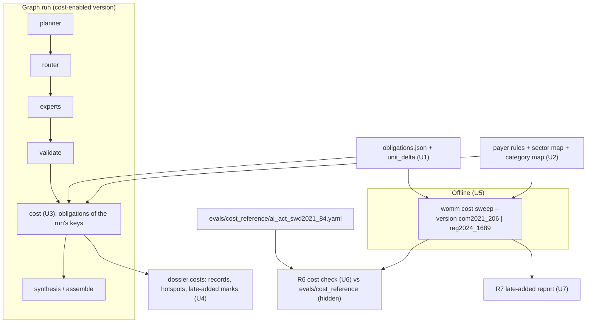

# feat: EU-level cost estimation (cost records, hotspot view, IA cost check, late-added costs)

> **Decision context (2026-10-07).** Stage B (origin R4–R7) moved from "v1 if time allows" into v1 by user decision on 2026-10-07. Stage A (obligation enrichment, the adversarial reviewer) stays in v1.1. The defaults below were set at user level before this plan; the user may revise them, and the plan proceeds on them until told otherwise. Where a section below conflicts with this block, this block wins.
>
> - **Effort types: the colleague's seven, as they are.** `new_process`, `documentation`, `registration`, `notification`, `human_oversight`, `training`, `assessment`. Each record has one primary type and optional secondary types.
> - **Fixed mapping to the IA cost categories,** using the golden `CATEGORY_GUIDE` wording (`src/womm/eval/drafting.py`, from `feat/golden-import`):
>
>   | Effort type | IA category | Why |
>   |---|---|---|
>   | `documentation`, `registration`, `notification` | `administrative_burden` | "costs of information obligations: familiarisation with the new rules, information, reporting and record-keeping duties, documentation" |
>   | `new_process`, `human_oversight`, `training`, `assessment` | `compliance_cost` | "substantive costs of meeting the requirements themselves: technical and organisational measures, equipment, and staff for meeting requirements" |
>   | any type, when the payer is a public body | `public_enforcement_cost` | "costs for public authorities, supervision and enforcement" |
>
>   The mapping applies to the primary type. It agrees with the IA's own labels for all five Table 8 items (data and robustness are compliance costs; documentation and provision of information are administrative burden; human oversight is a compliance cost).
> - **Magnitude: one-off vs recurring × an ordinal band** `negligible | low | medium | high`. A record carries a one-off band, a recurring band (per year), or both. Bands are per affected entity and per regulated item (one AI system), or per authority per year for public bodies.
> - **EUR band edges, anchored on the IA where it gives figures** (checked against SWD(2021) 84 on 2026-10-07, see "IA figure audit"):
>
>   | Band | EUR per entity per item (one-off), or per year (recurring) | Hours at the IA's Standard Cost Model rate (EUR 32/h) | IA anchors (scoring side only, never in a prompt) |
>   |---|---|---|---|
>   | negligible | below 1 000 | below about 30 h | user documentation "negligible", relying on in-built logs (§6.1.3) |
>   | low | 1 000 to below 5 000 | about 30–150 h | data EUR 2 763; provision of information EUR 3 627; documentation and traceability EUR 4 390 (Table 8) |
>   | medium | 5 000 to below 25 000 | about 150–800 h | human oversight EUR 5 000–8 000 a year (Table 8b: EUR 7 764); robustness and accuracy EUR 10 733 (Table 8a); notified-body documentation review EUR 3 000–7 500 (midpoint 5 250); BAU-adjusted total EUR 6 000–7 000 |
>   | high | 25 000 or more | about 800 h or more | national competent authorities 1–25 FTE per Member State (§6.2, Annex 3 Table 5; 1 FTE ≈ EUR 55 000 at the SCM rate, our derivation); the IA's cited benchmarks (CSPN EUR 25 000–35 000, a machinery conformity assessment EUR 275 000) |
>
>   Agents see only the band edges in EUR and hours. They never see an IA item, an IA figure or which provision an anchor belongs to.
> - **Records outside the seven types.** A record the cost step judges to carry no direct compliance effort (for example a prohibition, whose cost is forgone business) gets status `not_costed` with a reason. This is a status, not an eighth effort type (Open Question 2).

## Overview

This plan delivers origin Stage B, EU-level cost estimation:

1. **Cost records** (R4): each relevant obligation becomes a record of who pays, effort type, magnitude and when, citing the obligation and its unit.
2. **A dossier cost-hotspot view** (R5): which obligations, payers and effort types concentrate cost, with obligations added or changed after the proposal marked.
3. **An IA cost check** (R6): cost records scored against the cost sections of SWD(2021) 84, which stays hidden from every agent.
4. **"Costs the ex-ante IA could not see"** (R7): cost records on obligations added after the proposal, reported and never scored.

The work fits into the v1 build without touching the self-evolution base, the holdout or the promotion gate.

---

## Problem Frame

- The Fiscal expert describes cost impacts in prose (`prompts/v0.3/fiscal.md`). It does not classify effort, estimate magnitude or say who pays. Nothing in a dossier answers "who pays, for what kind of effort, how much, and from when" (origin Success Criteria).
- The corpus holds structured obligations (`data/corpus/ai_act/obligations.json`): 975 duties and prohibitions in Regulation (EU) 2024/1689 and 506 in COM(2021) 206. **430 of the 975, and 243 of the 506, have `primary_actor: unspecified`**: the rule pass cannot name a payer for passive sentences ("High-risk AI systems shall be designed…"). Stage A's LLM enrichment, which would fill these, is v1.1. Every one of the 65 proposal duties in Articles 8–15, the requirements the IA costs in detail, is `unspecified`. Without a fallback, R6 has nothing to score.
- **The corpus build drops the unit-level delta.** The colleague's obligation rows carry `delta_status` per unit (`added`, `modified`, `split_merge`, `minor_edit`, `unchanged`), measured on the pinned commit: 387 of the 975 final duties are `added`, as are 22 of the 30 duties whose primary actor is `deployer`. `scripts/build_corpus.py` keeps only `OBLIGATION_FIELDS`, which leave it out, and the index has article-level delta only (`added`, `modified`, `unchanged`, `removed`). R5 and R7 need the unit level.
- The IA is our benchmark and is hidden from every agent (origin R11, origin Scope Boundaries). The origin assumed that SWD(2021) 84 gives enough per-obligation-group cost figures to score Stage B. That assumption is checked below, and it only partly holds.

---

## IA figure audit (SWD(2021) 84, checked 2026-10-07)

Read from the cached IA text (`.cache/ia/ai_act/ia_full.txt`, both parts): Part 1 §6.1.3 (Tables 8, 8a, 8b and 9, verification costs), §6.1.4, §6.2, and Part 2 Annex 3 (Table 5) and Annex 4. All figures are for the preferred option 3/3+, per AI application, for an average application assumed to cost EUR 170 000 to develop.

| # | IA cost item | Figure | Payer | One-off / recurring | Proposal articles |
|---|---|---|---|---|---|
| 1 | Compliance costs regarding data (incl. risk assessment and testing, Annex 4) | EUR 2 763 | provider | one-off | Art 9, 10 |
| 2 | Administrative burden: documentation and traceability | EUR 4 390 | provider | one-off | Art 11, 12, 16 (Annex IV) |
| 3 | Administrative burden: provision of information | EUR 3 627 | provider | one-off | Art 13 |
| 4 | Robustness and accuracy, only for firms below state-of-the-art practice | EUR 10 733 | provider (subset) | one-off | Art 15 |
| 5 | Human oversight, an operating cost of users | EUR 7 764 (text: EUR 5 000–8 000 a year, about 0.1 FTE) | user (deployer) | recurring | Art 14, 29 |
| 6 | User documentation | "negligible" (in-built logs) | user (deployer) | recurring | Art 12, 29 |
| 7 | QMS audit by a notified body (third-party subset) | EUR 1 000–2 000 per day, initial; re-audit EUR 300 per hour (Table 5 only) | provider (subset) | one-off and recurring | Art 17, 43 |
| 8 | Notified-body review of technical documentation (third-party subset) | EUR 3 000–7 500 per product | provider (subset) | one-off | Art 43 (Annex VII) |
| 9 | National competent authorities | 1–25 FTE per Member State | Member States | recurring | Art 59 |
| 10 | EU-level coordination (Board secretariat) | 10 FTE (§6.2) or 5 FTE (Table 5) | Union | recurring | Art 56–58 |
| 11 | Aggregates | EUR 6 000–7 000 per application after the business-as-usual factor; EUR 100–500 million by 2025; verification about EUR 100 million | providers (all) | one-off | Art 8, 16 |

**What the IA does not quantify:** prohibitions (Art 5), transparency obligations for certain AI systems (Art 52), registration in the EU database (Art 51; the database itself, Art 60, is "funded by the EU" with no figure), post-market monitoring and incident reporting (Art 61–62), importer, distributor and authorised-representative duties (Art 25–28), most user duties beyond oversight (Art 29), sandboxes and SME measures (Art 53–55), penalties (Art 71), and codes of conduct (Art 69, "a fraction" of verification). General-purpose AI did not exist in the proposal.

**Verdict on the origin assumption: partly true.**
- **Overlap is supportable.** About 11 items map to about 16 proposal articles, which hold about 130 of the proposal's 506 duties (about a quarter). Recall over the IA's quantified items is a meaningful score.
- **Precision is not.** IA silence does not mean "no cost": registration and post-market monitoring are costly and simply unquantified. Records flagged costly where the IA is silent are reported, never counted as false positives.
- **Rank agreement is weak by construction.** Only five items share a unit (one-off, per application, provider): items 1, 2, 3, 4 and 8. Their figures span EUR 2 763–10 733, under one order of magnitude, so a four-band scale puts them in two bands. A rank statistic over n = 5 with ties cannot reach significance (Spearman needs ρ = 1.0 at one-sided 0.05 for n = 5). R6 reports it as a descriptive statistic with its n, never as evidence.
- **Two internal inconsistencies** are recorded in the reference file rather than resolved: EU-level FTE (10 in §6.2, 5 in Table 5), and human oversight (EUR 7 764 in Table 8b, EUR 5 000–8 000 in the text).
- **The IA scores the proposal, not the final act.** R6 therefore runs on COM(2021) 206 obligation records only. The final act's new obligations are R7's subject.

---

## Requirements Trace

- R4. A cost step turns each relevant obligation into a cost record: who pays (actor category, public or private), effort type, magnitude class (one-off or recurring, ordinal band) and when (`applies_from`). Every record cites the obligation and the unit. → U1, U2, U3, U5
- R5. The dossier gets a cost-hotspot view of which obligations, payers and effort types concentrate cost. Obligations added or modified after the proposal are marked. → U1, U4
- R6. The cost records are scored against SWD(2021) 84's cost sections: overlap of the obligations flagged as costly, plus rank agreement where the IA gives figures. The IA stays hidden from every agent. → U6, U8
- R7. A proposal-to-final run reports "costs the ex-ante IA could not see": cost records on obligations added after the proposal, reported and not scored. → U1, U7
- Origin Success Criteria, "the Fiscal side of a dossier answers who pays, for what kind of effort, how much, and from when". → U4 (the hotspot view joins cost records to Fiscal findings on the same provision)
- Parent R11 (the IA is the benchmark and never an agent input) and R24 (memorandum stripping). → U6, U8

**Origin actors and data:** the colleague's obligation records (schema 04) and unit-level delta; SWD(2021) 84 as the hidden benchmark.

---

## Scope Boundaries

- **AI Act only.** The IA cost check uses SWD(2021) 84. Cost references for the other imported proposals are v1.1 work (see Deferred).
- **No EUR totals.** Bands are ordinal. Nothing in the dossier, the API or a report sums EUR across records or turns bands back into money. Hotspots rank by band counts.
- **No change to findings, synthesis or scoring of existing metrics.** The cost step reads obligation records, writes a separate dossier section, and never feeds the board, synthesis or the coverage judge.
- **No self-evolution change.** The cost role is outside the Improvement Planner's editable surface, and cost scores are not GEPA scores, train/val metrics or promotion metrics in v1 (Key Technical Decisions).
- **Stage A is not pulled in.** The fallback for unspecified payers is a small rule table plus an inferred payer stored as agent output; it never writes back into the corpus, and it is replaced when Stage A lands.
- **No municipal case** (Stage C) and no VNG or standard-cost-model validation.

### Deferred to Follow-Up Work

- Cost references for other proposals whose IAs give cost figures. Once at least three proposals have one, cost can join the train/val/holdout split and become an evolvable, scored target (v1.1).
- Replacing the payer fallback with Stage A enrichment of all 430 unspecified duties (v1.1).
- Showing R6 and R7 reports in the console. In v1 they are CLI reports; the dossier view (R5) and the in-run late-added marking are in the console.
- Cost records for Articles the Digital Omnibus amended, which have no obligation records in the corpus (plan 002, Revision 2026-10-03). They are listed as "not covered" in every cost section.

---

## Context & Research

### Relevant Code and Patterns

Code referenced below is on `feat/v1-integration` (plan 002, the golden plan and the self-evolution plan merged). This plan starts from that branch.

- `data/corpus/ai_act/obligations.json`: `version → provision key → records`. Record fields are `obligation_id`, `unit_id`, `article`, `division`, `statement_type`, `modal`, `primary_actor`, `actors`, `addressee_text`, `condition`, `action`, `timing`, `public_sector`, `span`, `applies_from`, `date_label`, `date_withheld`. Statement types in the final act: 944 `duty`, 31 `prohibition`, 158 `permission`, 48 `applicability`, 21 `deeming`, 10 `power`.
- `scripts/build_corpus.py`: `OBLIGATION_FIELDS`, `build_obligations` (date rules: `date_withheld` is `amended_2026` or `date_moved_2026` for 602 final records; Article 113 records are left out) and `delta_kinds` (article level).
- `src/womm/data/corpus.py`: `Obligation` (a `StrictModel`), `Corpus.obligation_records(version_id, key)`; consolidated runs take the 2024 records for unamended articles only.
- `src/womm/retrieval.py`: `_field_lines` renders an explicit field list, so a new record field does not reach any expert's prompt unless added there. `obligations_source` gives the citable id `<records_version>/obligations/<suffix>`.
- `src/womm/models/system_version.py`: `DataScope` (`text`, `obligations`, `sees_delta`, `sees_memorandum`), `RoleConfig`, `canonical_dump`, which drops post-v0 optional fields when None so old ids stay stable.
- `system_versions/v1.0-unscoped.yaml` (`sv_73c6a3fdd013`) and its api twin: the self-evolution base. In `v1.0-scoped.yaml`, Fiscal already has `text: none, obligations: full` ("cost claims stay traceable to specific obligation records").
- `src/womm/graph/build.py`: `planner → router → experts → validate → synthesis → assemble`; `_after_validate` branches to synthesis or assemble. `src/womm/graph/experts.py` shows the per-role LLM call pattern (`structured(...)` with a pydantic schema, `CallUsage`).
- `src/womm/models/dossier.py`: `ImpactDossier` (impacts, chains, disagreements, open questions, discarded, notes). `src/womm/models/run.py`: `RunResult`.
- `src/womm/eval/evaluators.py` `judge_input` builds the judge prompt from `dossier.impacts` only, so a new dossier section is invisible to the coverage judge by construction.
- `src/womm/eval/golden.py` and `evals/golden/case_01_provider_compliance_costs.yaml`: case 01 scores §6.1.3 on scenario `eval_provider_compliance_costs` (11 high-risk keys). Its expected impacts already map IA figures to provision keys (data EUR 2 763, documentation EUR 4 390, information EUR 3 627, robustness EUR 10 733, oversight EUR 5 000–8 000 a year, QMS audit, NB review EUR 3 000–7 500).
- `src/womm/eval/trajectory.py`: `TRAJECTORY_KEYS` become LangSmith feedback and Failure Memory input. This plan does not add keys (Key Technical Decisions).
- `src/womm/evolve/edits.py` `_prompt_path`: editable roles are `planner`, `planner:explore`, `synthesis` and `expert:<id>`; anything else returns None and is rejected. `src/womm/evolve/planner_view.py` reads `sv_metrics` only for train/val. `src/womm/evolve/diff_regression.py` is the pattern for a monitor that is recorded and never gates.
- `web/src/model/pipeline.ts` has fixed columns (`diff, planner, router, experts, board, citation, synthesis, dossier`). `web/src/screens/Detail.tsx` has the dossier tabs.
- `data/fixtures/ai_act/scenarios.yaml` (generated from `scripts/build_fixture.py` `SCENARIOS`): `eval_provider_compliance_costs`, `eval_sme_impacts`, `demo_penalties_amended` (proposal → final, preset), `eval_whole_proposal`, `consolidated_whole_act`, `omnibus_2026`. No explore scenario compares proposal to final.
- `.dockerignore` keeps `evals/` and `.cache/` out of the image.

### Measured on the data (2026-10-07)

- Upstream final obligations (pinned commit `16b5807`): 975 duties and prohibitions; `delta_status` is `added` 387, `modified` 348, `split_merge` 96, `minor_edit` 73, `unchanged` 71. Of the 387 added: 141 unspecified, 56 Commission, 37 provider, 35 AI Office, 22 deployer.
- Proposal duties on case 01's 11 keys: 103, of which 83 unspecified. Final: 125, of which 92 unspecified.
- Unspecified duties by article (proposal): Articles 8–15 hold 65; annexes 38; Article 17 15. Frequent openings: "High-risk AI systems", "The technical documentation", "The EU declaration", "That system".
- Average span: about 206 characters. A batch of 60 records with fields is about 25k characters.

### Institutional Learnings

- `docs/solutions/evaluation/single-run-scores-are-noise.md`: identical runs differ. Cost bands are LLM output too, so every R6 number comes from at least 3 repetitions with the spread shown.
- `docs/solutions/llm-backends/claude-cli-subscription-isolation.md`: `claude_code` calls see only what our code puts in the prompt. The IA can only leak through our own inputs, which is where the guards sit (U8).

### External References

- European Commission Better Regulation Toolbox, Tool #56 (Standard Cost Model): administrative burden = information obligations; substantive compliance costs are separate. This is the distinction the IA and `CATEGORY_GUIDE` use.
- No library is needed: the cost step is one structured LLM call per batch through the existing `LLMBackend`. Kendall's tau-b with ties is about 20 lines; `scipy` is not a dependency (checked in `pyproject.toml`) and is not added for one statistic.

---

## Key Technical Decisions

- **A separate cost role, not a second job for the Fiscal expert.**
  - The cost step is a new optional SystemVersion role `cost` (a `CostConfig`, a `RoleConfig` subtype with `max_records_per_call`). It runs as a graph node after `validate` and before the synthesis branch, only when the version sets it.
  - Its input is obligation records only, rendered with the `full` view: no provision text, no memorandum, no delta, no findings. The cost role's view is fixed in code rather than declared as a `DataScope`, because it is not an expert and is not routed.
  - *Why:* the Fiscal prompt is an evolvable GEPA component tuned for coverage; a second output there would be changed by search without being measured. A separate role keeps the Fiscal schema and every finding byte-stable, and follows the colleague's design, where cost location works from structured obligation records.
- **Version ids stay stable; cost-enabled versions are new files.**
  - `canonical_dump` drops `cost` when None, as it does for `scope` and `router_gloss`. Every existing version id is unchanged (pinned in a test).
  - New files: `system_versions/v1.0-cost.yaml` (= `v1.0-unscoped` + the cost role, `claude_code`) and `v1.0-cost-api.yaml` (its api twin). `PROMOTIONS.md` lists them as candidates for cost analysis, not as promotions.
- **The self-evolution base does not change, and cost is not evolvable in v1.**
  - The base stays `v1.0-unscoped` (self-evolution plan, Decision context). The R30 demo, the holdout budget and the promotion policy are untouched.
  - `apply_diff` carries `cost` from parent to child unchanged, and `edit_prompt(role="cost")` is rejected by the existing allow-list. A test pins both.
  - Cost scores are not GEPA instance scores, not `sv_metrics` rows, not Failure Memory rows and not promotion metrics.
  - *Why:* only one IA has a cost reference, so there is no train/val/holdout split for cost. Searching on the only scoring set would overfit it with nothing left to detect that. The holdout `METRICS` and the signed policy are pre-registered and must not move. The cost node is downstream-only, so it cannot change the gated metrics anyway. Revisit in v1.1 with several cost references (Deferred).
- **One record per obligation, deterministic fields filled by code.**
  - The LLM returns, per `obligation_id`: primary and secondary effort types, a one-off band and/or a recurring band, an inferred payer only where the payer is unspecified and no rule applies, a short verbatim `payer_quote` from the span for that inference, and a one-sentence rationale. Or status `not_costed` with a reason.
  - Code fills: `provision_key`, `unit_id`, the citable `source_id` of the obligation view, payer and payer basis, sector, IA category (the mapping in the Decision context), `applies_from` with its label (the corpus date rules), and the unit delta.
  - Records are validated: the `obligation_id` must be one of the batch's inputs, enums must hold, and `payer_quote` must be a verbatim substring of the span (the `citations.py` normaliser, minimum 3 words). An invalid record is dropped and counted; a missing one is listed as `not_estimated`.
- **Relevant obligations** are duties and prohibitions (not permissions, powers, applicability or deeming statements) on the run's provisions in the run's after version: the scenario keys (preset) or the Planner's selected keys (explore), restricted to changed keys when the run has a before version. Keys with no records (Omnibus-amended articles) are listed as not covered.
- **Payer fallback for unspecified duties: rules first, then an inferred payer, never a silent guess.**
  - `payer_basis` is one of `rule_field` (the colleague's `primary_actor`), `rule_table` (our table), `inferred` (the cost step, with a verbatim quote, stored as `source = agent:cost` in the colleague's convention) or `unknown`.
  - The rule table is small, code, and every row cites its legal basis. Proposal and final numbering both: Articles 8–15 → provider (Art 16(a)); Article 17 and Annex IV → provider; the EU declaration of conformity article and Annex V → provider. Anything else is left to inference.
  - Rule-table and inferred payers never overwrite the corpus. The cost section reports how many payers came from each basis.
  - *Why:* R6 is impossible without it (all 65 proposal duties in Articles 8–15 are unspecified), and Stage A is v1.1.
- **Payer sector** comes from a fixed map: `provider`, `deployer`, `importer`, `distributor`, `authorised_representative`, `notified_body`, `operator` → private; `commission`, `ai_office`, `board`, `member_state`, `national_competent_authority`, `market_surveillance_authority`, `notifying_authority`, `union_institutions`, `edps` → public. A record whose `public_sector` flag is set (for example public-body deployers) is public. An unknown actor value fails the build check, so a new upstream category cannot slip through.
- **Unit-level delta is kept in the corpus.** `delta_status` from the colleague's rows is stored as a new `Obligation.unit_delta` field (the colleague's `delta_status` values). It is not added to `_field_lines`, so every expert's rendered obligation view stays byte-identical (test). For R5, `added`, `modified` and `split_merge` are "changed after the proposal"; for R7, only `added` counts as "the IA could not see".
- **Hotspots rank by bands, not money.** Per provision, payer and effort type: the count of records at `medium` or `high`, then the count at `low`, with one-off and recurring shown separately. A tie keeps corpus order.
- **Two run modes, one estimator.** `estimate_costs(records, role)` serves the graph node (the run's obligations, R4/R5) and a sweep command over a whole version (`womm cost sweep`, R6/R7), which writes per-batch files under `runs/cost_sweeps/` and resumes by skipping finished batches.
- **R6 metrics are pre-registered before the first scored sweep** (Human-in-the-Loop point 1). The reference is `evals/cost_reference/ai_act_swd2021_84.yaml`: the IA items above, each with proposal article numbers (resolved to keys through the corpus index), payer, recurrence, figure and band. It is a hand-written paraphrase with figures, in the golden-case convention; it lives in `evals/` and never in `data/`.

  | Metric | Definition | Kind |
  |---|---|---|
  | `cost_recall` | Share of IA items with a non-negligible figure for which the system has at least one record on the item's keys with the IA's payer and a band of `low` or higher | scored |
  | `band_exact`, `band_within_one` | Per IA item with a figure: the highest band among matching records vs the IA figure's band | scored |
  | `payer_recurrence_agreement` | Items 5, 6, 9, 10: payer and recurrence match the IA (oversight on deployers and recurring; authorities recurring) | scored |
  | `rank_tau_b` | Kendall's tau-b between band points and IA figures over items 1, 2, 3, 4 and 8, printed with n | descriptive only |
  | `ia_silent_costly` | Provisions with records at `medium` or higher that no IA item covers | reported, not scored |

  Each metric is computed per repetition and reported as mean with min–max. On `claude_code` the report is labelled dev-only, as elsewhere.
- **R6 runs at two levels with the same functions.** The whole-proposal sweep is the main score (all IA items are reachable). A cost-enabled run of `eval_provider_compliance_costs` gets the same metrics restricted to items whose keys are in the scenario, as a cheap in-run check next to case 01's coverage.
- **R7 has an explicit run.** A new explore scenario `final_vs_proposal` (before COM(2021) 206, after Regulation 2024/1689, kind `demo`) shows late-added cost records in its dossier. The whole-act R7 report comes from a sweep of the final act. `demo_penalties_amended` (preset, proposal → final) also gets the marking.

---

## Open Questions

### Resolved During Planning

- **Fiscal expert or a new role?** A new optional `cost` role (Key Technical Decisions).
- **Are cost records evolvable or promotion metrics?** No in v1, with the reasons above; revisited when several proposals have a cost reference.
- **Does the IA support R6?** Partly. Recall, band agreement and payer/recurrence agreement over about 11 items are supportable; rank agreement is descriptive only; precision is not definable (IA figure audit).
- **Proposal or final act for R6?** The proposal, because the IA assessed it.
- **Where does the late-added marking come from?** The colleague's unit-level `delta_status`, kept in the corpus (U1), not recomputed.
- **What about the 430 unspecified duties?** Rule table, then inferred payer with a verbatim quote, then `unknown`; replaced by Stage A in v1.1.
- **Does the cost section change coverage scores?** No. `judge_input` reads `dossier.impacts` only; a test pins it.

### Needs the User

Each has a default, and the plan proceeds on it.

1. **Band edges and the effort-type mapping** (Decision context). Default: as recorded. They must be confirmed before the first scored sweep, because changing them afterwards moves the goalposts (the commit sha of the reference file is printed in every report).
2. **`not_costed` as a status outside the seven effort types.** Default: yes, so prohibitions and pure-definition duties are not forced into a cost type. The alternative is forcing a type with band `negligible`.
3. **R7 scope.** Default: `added` units only are "costs the IA could not see"; `modified` and `split_merge` are marked "changed after the proposal" in R5 but not counted in R7. The alternative counts substantive modifications too (another 444 duties).
4. **Default version for demo explore runs.** Default: `v1.0-cost` for cost demos (`final_vs_proposal`, `consolidated_whole_act`); the console and API default stays as it is, and the evolution base stays `v1.0-unscoped`.

### Deferred to Implementation

- `max_records_per_call`. Default 60; tune against measured output truncation on `claude_code`.
- Whether the cost node should run in parallel with the experts (from `planner`, joined at `assemble`) instead of after `validate`. Measure the added latency on the fake and `claude_code` backends first; move it only if the added time exceeds about 3 minutes per run.
- The exact rule-table rows for the final act's renumbered articles (the declaration of conformity is Art 48 in the proposal and Art 47 in the final act). Settle against `index.json`.

---

## High-Level Technical Design

> *This illustrates the intended approach and is directional guidance for review, not implementation specification. The implementing agent should treat it as context, not code to reproduce.*

**Cost record (directional)**

| Field | Filled by | Notes |
|---|---|---|
| `obligation_id`, `unit_id`, `provision_key`, `source_id` | code | the citation (R4) |
| `payer`, `payer_basis`, `payer_quote`, `sector` | code; `inferred` payer from the LLM | basis is `rule_field`, `rule_table`, `inferred` or `unknown` |
| `effort_type`, `secondary_types` | LLM | the seven types |
| `ia_category` | code | the fixed mapping |
| `one_off`, `recurring` | LLM | band or null; at least one unless `not_costed` |
| `applies_from`, `date_label` | code | corpus date rules; withheld dates stay withheld |
| `unit_delta`, `changed_after_proposal`, `late_added` | code | from U1 |
| `status`, `reason`, `rationale` | LLM / code | `estimated`, `not_costed` |

---

## Implementation Units

- U1. **Keep the unit-level delta in the corpus**

**Goal:** Every obligation record carries the colleague's unit-level `delta_status`, without changing anything an expert sees.

**Requirements:** R5, R7

**Dependencies:** none (on `feat/v1-integration`)

**Files:**
- Modify: `scripts/build_corpus.py` (keep `delta_status` as `unit_delta`; a stats line with counts per value)
- Modify: `src/womm/data/corpus.py` (`Obligation.unit_delta: str | None = None`; `validate_corpus` checks the allowed values)
- Regenerate: `data/corpus/ai_act/obligations.json` (same pinned commit; `downloads.json` unchanged)
- Test: `tests/test_build_corpus_script.py`, `tests/data/test_corpus.py`, `tests/test_retrieval.py`

**Approach:**
- Same pinned URLs, so `downloads.json` and every hash in it stay the same; only the derived file changes.
- The proposal's records keep their own upstream value, but nothing reads it; "late-added" is defined on the final act only.
- Consolidated runs read the 2024 records, so their `unit_delta` still describes proposal → 2024. The dossier labels it so (U4).

**Test scenarios:**
- Happy path: the rebuilt final corpus has 387 `added` among its 975 duties and prohibitions (the measured count).
- Edge case: a row without `delta_status` (older upstream format) gives `unit_delta = None`, and the build reports it.
- Error path: an unknown `delta_status` value fails `validate_corpus`.
- Integration: for every key in the corpus, `render_obligations` output under `actors` and `full` is byte-identical before and after the rebuild (snapshot hashes).
- Integration: every pinned SystemVersion id is unchanged (existing id test).

**Verification:** `scripts/build_corpus.py` regenerates the corpus with only `obligations.json` changed, and the existing test suite passes unchanged.

---

- U2. **Cost record model, payer resolution and the fixed maps**

**Goal:** The deterministic half of a cost record: schema, payer rules, sector map, effort-to-category map and bands.

**Requirements:** R4

**Dependencies:** U1

**Files:**
- Create: `src/womm/models/cost.py` (`EffortType`, `Band`, `CostDraft`, `CostBatch`, `CostRecord`, `CostSection`, `CostHotspot`)
- Create: `src/womm/cost/__init__.py`, `src/womm/cost/payer.py` (rule table, sector map, `resolve_payer`), `src/womm/cost/categories.py` (`IA_CATEGORY`, `BAND_EDGES_EUR`)
- Test: `tests/cost/test_payer.py`, `tests/cost/test_categories.py`, `tests/models/test_cost_models.py`

**Approach:**
- `EffortType` is exactly the seven Decision-context values. `Band` is `negligible | low | medium | high`.
- `IA_CATEGORY` maps the primary effort type; a public payer overrides to `public_enforcement_cost`. Category values are imported from `CATEGORY_GUIDE`'s keys so the two cannot drift.
- `resolve_payer(record)` returns `(payer, basis)`: the record's `primary_actor` when specified (`rule_field`), else the first matching rule-table row (`rule_table`), else `(None, "unknown")` for the LLM to try.
- Rule-table rows name version, article or annex, payer and the legal basis string shown in the dossier.
- The sector map covers every `primary_actor` value present in both corpus versions; a build-time check enumerates them.

**Test scenarios:**
- Happy path: a proposal Article 10 record with `unspecified` resolves to `provider`, basis `rule_table`, legal basis "Art 16(a)".
- Happy path: a final Article 26 record with `primary_actor: deployer` resolves to `deployer`, basis `rule_field`.
- Edge case: a deployer record with `public_sector: true` has sector `public`, and its category is `public_enforcement_cost` whatever its effort type.
- Edge case: an unspecified Article 5 record matches no rule and returns `unknown`.
- Happy path: each of the seven effort types maps to the category in the Decision context table.
- Error path: every `primary_actor` value in `obligations.json` is in the sector map (fails on a new upstream value).
- Integration: the rule table covers all 65 unspecified proposal duties in Articles 8–15 (measured count pinned).

**Verification:** the deterministic fields of a record can be built for every duty in both versions with no LLM call, and the coverage per payer basis is printed.

---

- U3. **The cost step: estimator, graph node and cost-enabled versions**

**Goal:** Turn a run's relevant obligations into validated cost records through one structured LLM call per batch.

**Requirements:** R4

**Dependencies:** U2

**Files:**
- Create: `src/womm/cost/estimate.py` (`relevant_records`, `estimate_costs`, `validate_batch`)
- Create: `src/womm/graph/cost.py` (`cost_node`)
- Create: `prompts/v1/cost.md` (task, the seven effort types with one-line glosses, band edges in EUR and hours, the `not_costed` rule; no IA content)
- Create: `system_versions/v1.0-cost.yaml`, `system_versions/v1.0-cost-api.yaml`
- Modify: `src/womm/models/system_version.py` (`CostConfig`; `SystemVersionSpec.cost: CostConfig | None = None`; `canonical_dump` drops it when None)
- Modify: `src/womm/graph/build.py` (add the node and edge only when `sv.spec.cost` is set), `src/womm/graph/state.py` (a `cost` slot), `src/womm/graph/events.py` (counts only, never texts)
- Modify: `src/womm/llm/fake.py` (a deterministic fake cost batch)
- Modify: `system_versions/PROMOTIONS.md` (list the two files as cost-analysis candidates, human commit)
- Test: `tests/cost/test_estimate.py`, `tests/graph/test_cost_node.py`, `tests/models/test_system_version_ids.py`

**Approach:**
- `relevant_records(run inputs)` follows Key Technical Decisions. It returns records grouped by key plus the not-covered keys.
- Batches of at most `max_records_per_call`, kept whole per provision key where possible, run concurrently under `max_parallel_llm_calls`.
- Input per record: id and the `full`-view fields, plus the resolved payer when known. When the payer is unknown, the prompt asks for an inferred payer and a quote.
- A failed batch (timeout, schema error after retries) marks its records `not_estimated` with the error kind. The run's status is unchanged, and the dossier notes the failure (the `ExpertFailure` degradation pattern, without touching `failed_experts`).
- `CallUsage` is recorded with role `cost`, so run cost and token totals include it.

**Execution note:** start with a failing fake-backend test that runs the graph for `eval_provider_compliance_costs` with and without the cost role and asserts identical board, dossier impacts and judge input.

**Test scenarios:**
- Happy path (fake backend): `eval_provider_compliance_costs` on `v1.0-cost` gives one record per relevant duty (103 on the proposal), each with `source_id` of the form `com2021_206/obligations/...` and the obligation's `unit_id`.
- Happy path: a record with only a one-off band and a record with both bands both validate; a record with neither and status `estimated` is rejected.
- Edge case: a batch answer that omits two ids lists them as `not_estimated`; an answer with an id not in the batch drops that record.
- Edge case: an inferred payer whose quote is not a verbatim substring of the span falls back to `unknown`, and the record is kept.
- Edge case: a consolidated-version run lists Omnibus-amended keys as not covered and estimates the rest.
- Error path: a timed-out batch gives `not_estimated` records, the run status stays `completed`, and a dossier note names the failure.
- Integration: with and without the cost role, the board, the dossier impacts and `judge_input` are identical (fake backend, same seed).
- Integration: every existing version id is unchanged; `v1.0-cost` gets a new id, and `apply_diff` on it carries `cost` into the child unchanged.
- Error path: a `ConfigDiff` with `edit_prompt(role="cost")` is rejected.
- Integration: the run event stream for the cost node carries counts only.

**Verification:** `womm run` of `eval_provider_compliance_costs` with `v1.0-cost` on the fake backend produces a dossier with a cost section, and the same run on `v1.0-unscoped` is unchanged.

---

- U4. **Dossier cost section and hotspot view (API and console)**

**Goal:** Show who pays, for what effort, how much and from when, and which obligations concentrate cost, with changed and late-added obligations marked.

**Requirements:** R5, origin Success Criteria

**Dependencies:** U1, U3

**Files:**
- Create: `src/womm/cost/hotspots.py` (`build_section`: records, hotspots by provision, payer and effort type, coverage stats)
- Modify: `src/womm/models/dossier.py` (`ImpactDossier.costs: CostSection | None = None`), `src/womm/graph/assemble.py`
- Modify: `scripts/export_ui_contract.py`, `web/src/types.ts`
- Create: `web/src/model/costs.ts`, `web/src/model/costs.test.ts`
- Modify: `web/src/screens/Detail.tsx` (a "Costs" tab), `web/src/model/pipeline.ts` (an optional `cost` column between `citation` and `synthesis`, shown only when the trace has a cost step)
- Test: `tests/cost/test_hotspots.py`, `tests/api/test_app.py` (cost section in the run payload); Create: `web/src/screens/Detail.test.tsx`

**Approach:**
- `CostSection`: `records`, `hotspots` (three rankings), `coverage` (relevant, estimated, not costed, not estimated, not covered keys; payers by basis), `late_added` (count and ids), `delta_basis` label ("proposal 2021 → adopted 2024", also on consolidated runs).
- The Costs tab: a hotspot table per dimension, then the record list with filters for payer, effort type, band and "changed after the proposal" / "added after the proposal". Each record links to its obligation source (the existing source viewer) and lists Fiscal findings on the same provision key.
- Inferred and unknown payers are visibly marked ("inferred from the text", "payer not identified"). Bands show as words, never as EUR.
- Loading, empty ("this version has no cost step") and error states, as on the other tabs. The page carries no business logic: rankings come from the API.

**Test scenarios:**
- Happy path: three records on one key at `medium`/`high` rank that key first in the by-provision hotspot.
- Happy path: on a proposal → final run, records with `unit_delta: added` carry `late_added` and `changed_after_proposal`; `modified` and `split_merge` carry only `changed_after_proposal`.
- Edge case: on a proposal-only run (no before version), no record is marked changed or late-added.
- Edge case: a run on a version without the cost role has `costs: null`, and the tab shows the empty state.
- Edge case: one-off and recurring bands are ranked separately; a record with both counts in both.
- Error path: an API error shows the error state.
- Integration: the UI contract export includes the new types, and the existing contract tests pass.
- Integration (Playwright, existing harness): the sample run with a cost section shows the tab and the "added after the proposal" filter.

**Verification:** a `demo_penalties_amended` run on `v1.0-cost` shows the Costs tab with late-added records marked.

---

- U5. **Whole-version cost sweep**

**Goal:** Cost records for every duty and prohibition of one corpus version, resumable, for R6 and R7.

**Requirements:** R4, R6, R7

**Dependencies:** U3

**Files:**
- Create: `src/womm/cost/sweep.py`
- Modify: `src/womm/cli.py` (`womm cost sweep --sv <id> --version <corpus version> --repetitions n`)
- Test: `tests/cost/test_sweep.py`

**Approach:**
- Batches are fixed by version, key and record order, so a batch id is stable across restarts. Each finished batch is written to `runs/cost_sweeps/<sv>/<version>/rep<k>/<batch>.json` with the code identity; a restart skips finished batches.
- A changed SystemVersion or git sha writes to a new directory (no score reuse across code changes).
- The sweep prints `CallUsage` totals and stops at `--max-usd` when set.
- The sweep never reads `evals/`.

**Test scenarios:**
- Happy path (fake backend): a sweep of the proposal produces records for all 506 duties and prohibitions in deterministic batches.
- Integration: a sweep cancelled after 2 of 9 batches and restarted makes no backend calls for the first 2 (assert call counts).
- Edge case: a second repetition writes to `rep2` and does not reuse `rep1`.
- Error path: an unknown corpus version is refused with the list of versions.

**Verification:** `womm cost sweep --sv v1.0-cost --version com2021_206 --repetitions 3` completes on `claude_code` and survives a restart.

---

- U6. **IA cost reference and the R6 cost check**

**Goal:** Score sweep and in-run cost records against SWD(2021) 84 with the pre-registered metrics.

**Requirements:** R6

**Dependencies:** U5; Human-in-the-Loop points 1 and 2

**Files:**
- Create: `evals/cost_reference/ai_act_swd2021_84.yaml` (the IA items: id, `ia_section`, proposal articles, payer, recurrence, figure text, numeric low/high where given, band, `comparable_unit` flag, inconsistency notes)
- Create: `src/womm/eval/cost_check.py` (`load_reference`, `score_records`, `CostCheckReport`)
- Modify: `src/womm/cli.py` (`womm cost check --sweep <dir>` and `--runs <eval report>`)
- Test: `tests/eval/test_cost_check.py`

**Approach:**
- The reference is drafted by the implementer from the IA figure audit and golden case 01, in paraphrase, with figures. One person verifies it (Human-in-the-Loop point 2). The loader refuses a file with unfilled fields or unverified status.
- Proposal article numbers resolve to provision keys through the corpus index (version `com2021_206`), so key typos cannot happen.
- Item bands are computed from the figures by `BAND_EDGES_EUR` (ranges use the midpoint; FTE figures use 1 FTE ≈ EUR 55 000, the SCM rate times 1 720 hours), never typed by hand. An item whose figure has no per-item unit (the QMS audit, priced per day) has no band and counts for recall only.
- Metrics as in Key Technical Decisions, per repetition, then mean and min–max. `rank_tau_b` is printed with its n and the words "descriptive, not significant".
- The report (JSON and Markdown under `runs/cost_check/`) records the reference file's git sha, the SystemVersion, the backend label (dev-only on `claude_code`) and the coverage stats of the scored records (payers by basis), because recall depends on the payer fallback.

**Test scenarios:**
- Happy path: synthetic records matching every IA item's payer and band give recall 1.0 and band agreement 1.0.
- Happy path: records putting human oversight on providers as one-off fail `payer_recurrence_agreement` for item 5 and still count toward recall only if a deployer record exists.
- Edge case: records flagged `high` on Article 51 (no IA figure) appear under `ia_silent_costly` and do not change any scored metric.
- Edge case: tau-b with all five comparable items in one band returns undefined, and the report says so instead of 0.
- Edge case: a scenario-level check on `eval_provider_compliance_costs` scores only items whose keys are in the scenario.
- Error path: a reference item naming a proposal article with no index row fails loading.
- Error path: a reference file marked unverified is refused.

**Verification:** `womm cost check` on three proposal sweep repetitions prints all five metrics with spreads, the payer-basis breakdown and the reference sha.

---

- U7. **R7: costs the ex-ante IA could not see**

**Goal:** Report cost records on obligations added after the proposal, without scoring them.

**Requirements:** R7

**Dependencies:** U1, U4, U5

**Files:**
- Modify: `scripts/build_fixture.py` (`SCENARIOS`: add `final_vs_proposal`, explore, before `com2021_206`, after `reg2024_1689`, kind `demo`), regenerate `data/fixtures/ai_act/scenarios.yaml`
- Create: `src/womm/cost/late_added.py` (`late_added_report`)
- Modify: `src/womm/cli.py` (`womm cost late-added --sweep <dir>`)
- Test: `tests/cost/test_late_added.py`, `tests/test_build_fixture_script.py`

**Approach:**
- Input: a final-act sweep (`reg2024_1689`). Output: the `added` records, grouped by payer, effort type and band, with the dates they apply from (labelled), and the share of all `medium`/`high` records that sit in added text.
- The report states on its first line that these records are not scored, because SWD(2021) 84 assessed the proposal.
- Comparison context, not a score: for each payer category, the count of costly records in added text vs in text the IA could see.
- The new scenario is a demo explore scenario, never an evaluation scenario, so it never enters golden scoring or the self-evolution splits.

**Test scenarios:**
- Happy path: a fake sweep where 3 of 10 records are `added` lists exactly those 3, grouped by payer.
- Edge case: `modified` and `split_merge` records are excluded from R7 and counted in the "changed after the proposal" context line.
- Edge case: a record with a withheld date shows "date withheld (amended 2026)", never a date.
- Integration: `final_vs_proposal` loads as an explore scenario; `load_all_golden` and the evolution case loaders never return it.

**Verification:** `womm cost late-added` on a final-act sweep produces the report, and a `final_vs_proposal` run on `v1.0-cost` shows the same records marked in its Costs tab.

---

- U8. **IA isolation guards for the cost path**

**Goal:** Make it impossible for the IA, the cost reference or cost scores to reach any agent, including the Improvement Planner.

**Requirements:** R6 ("the IA stays hidden"), parent R11, R24

**Dependencies:** U3, U6

**Files:**
- Create: `tests/cost/test_ia_isolation.py`
- Modify: `tests/evolve/test_planner_boundary.py` (add `womm.eval.cost_check` to the forbidden imports)

**Approach:**
- Import boundary: `womm.graph.*`, `womm.cost.*` and the Planner-side `womm.evolve` modules must not import `womm.eval.cost_check`, directly or transitively (the existing AST import-graph test pattern).
- Content canary: `prompts/v1/cost.md` and a rendered fake cost prompt contain none of the IA figures (`2 763`, `4 390`, `3 627`, `10 733`, `7 764`, `170 000`, `1-25 FTE`) in any spacing.
- Data boundary: cost check reports are written under `runs/cost_check/` only, and `PlannerView` has no query that can reach them (it reads database tables only).

**Test scenarios:**
- Error path: an added `import womm.eval.cost_check` in `src/womm/cost/estimate.py` fails the import test (patched module tree).
- Error path: a prompt file containing "EUR 2 763" fails the canary test.
- Integration: a full fake cost-enabled run's LLM inputs (captured by the fake backend) contain no canary figure.

**Verification:** the isolation tests run in CI on every PR.

---

- U9. **Runbook entry and the first real sweeps**

**Goal:** One documented, reproducible pass: proposal and final sweeps, the R6 check and the R7 report.

**Requirements:** R6, R7

**Dependencies:** U1–U8; Human-in-the-Loop points 1 and 2

**Files:**
- Modify: `docs/demo/v1-self-evolution-runbook.md` (a short "cost analysis" section)
- Create: a `docs/solutions/evaluation/` entry after the run, only if a finding has a signal reference

**Approach:**
- Run `womm cost sweep` (3 repetitions) on `com2021_206` and `reg2024_1689` with `v1.0-cost` (dev) or `v1.0-cost-api` (formal, when the API key exists), then `womm cost check` and `womm cost late-added`.
- Record the results, labelled dev-only or formal, in the v1 progress report. State the IA figure audit's limits next to the numbers.

**Test expectation:** none beyond U1–U8. This unit is an operational run.

**Verification:** the R6 and R7 reports exist for the current `v1.0-cost` id, and the progress report cites them.

---

## Human-in-the-Loop Points

| # | Point | Who | When | Effort |
|---|---|---|---|---|
| 1 | Confirm the Decision-context defaults (effort mapping, band edges, `not_costed`, R7 scope) before the first scored sweep, so the metrics are pre-registered | user | once, before U9 | 15 min |
| 2 | Verify `evals/cost_reference/ai_act_swd2021_84.yaml` against SWD(2021) 84 §6.1.3, §6.2, Annex 3 Table 5 and Annex 4 | one person (not necessarily a classmate; the reference is not a holdout) | once (U6) | about 1 h |
| 3 | Commit `v1.0-cost` and its twin to `PROMOTIONS.md` as cost-analysis candidates | user | once (U3) | 5 min |

No human reviews individual cost records. The Costs tab marks inferred payers so a reader can judge them.

---

## System-Wide Impact

- **Graph:** one optional node after `validate`, only in cost-enabled versions. Existing versions build the same graph.
- **Data:** `obligations.json` gains one field per record. No database migration. Cost sections live inside the stored `RunResult` JSON; sweep and check outputs are files under `runs/`.
- **Unchanged invariants:** every existing SystemVersion id; every expert's rendered prompt; the board, synthesis and judge input of every run; the holdout, its compare and its budget; the promotion policy; the evolution base and the Improvement Planner's editable surface.
- **Console:** a new dossier tab and an optional pipeline column. The Evolution page is unchanged.
- **Cost of running:** a cost-enabled run adds one to three LLM calls (case 01: 103 records, two batches). A proposal sweep is about 9 calls per repetition and a final-act sweep about 17; three repetitions of both are about 80 calls, a few hours of wall clock on `claude_code` at parallelism 3.
- **Deployment:** the API serves cost sections from stored runs. Sweeps run locally, like evolution cycles.

---

## Sizing

Today is 2026-10-07. v1 is due around 2026-11-27: about 7 weeks, of which about 6 are usable after demo rehearsal.

| Unit | Estimate | Can start | Blocked by |
|---|---|---|---|
| U1 Unit delta in corpus | 1 d | now | — |
| U2 Record model, payer, maps | 1.5–2 d | after U1 | — |
| U3 Cost step, node, versions | 3 d | after U2 | — |
| U4 Dossier section and console | 3 d | after U3 | — |
| U5 Sweep | 1.5 d | after U3 | — |
| U6 Reference and R6 check | 2.5 d + 1 h human | after U5 | Human point 2 |
| U7 R7 report and scenario | 1.5 d | after U4, U5 | — |
| U8 Isolation guards | 1 d | with U3 and U6 | — |
| U9 First real sweeps | 1–2 d wall clock | after U1–U8 | Human point 1; API key for formal labels |

Total: about 15–17 developer-days.

**Alongside the remaining v1 work** (progress report 2026-10-06): the self-evolution fixes in progress (U5, U7–U9) and the U10 demo cycle (3–5 days of wall clock from about 2026-11-16), plus human-gated steps that do not need developer time (golden reviews, judge calibration, signing the promotion policy, the R37 reference answers, the API key). That is about 8–10 developer-days, so the two together are about 23–27 of about 30 usable days. It fits with little slack.

**Order:** U1–U3 and U8 first (they protect the invariants), then U5–U6 (the R6 question), then U4 and U7. The R30 demo cycle has priority over this plan from about 2026-11-16.

**Cut order if late:**
1. U4's Costs tab (keep the API section and the pipeline column; the CLI prints hotspots).
2. U7's new scenario (keep the sweep-based R7 report and the marking on `demo_penalties_amended`).
3. The in-run R6 check on case 01 (keep the sweep-level check).

Never cut U8, U1's byte-identity tests or U3's no-interaction test.

---

## Risks & Dependencies

| Risk | Mitigation |
|---|---|
| The IA gives figures for only about a quarter of the proposal's duties, all in the high-risk chapter and governance | Stated up front (IA figure audit). R6 scores recall and band agreement over the quantified items only and reports IA-silent costly records separately. No claim beyond what the IA covers |
| Rank agreement over five items in two bands says nothing | Reported as descriptive with n, never in a headline. Band agreement and payer/recurrence agreement carry the score |
| Band edges were chosen with the IA figures in view | Edges are a scale, not an answer key: the agent never sees which provision lies where. They are confirmed and committed before the first scored sweep (Human point 1), and every report carries the reference sha |
| Recall depends on the payer fallback, not only on cost judgment | The report breaks recall down by payer basis. The rule table is small, cited and tested; inferred payers need a verbatim quote |
| LLM bands vary between runs | Three repetitions minimum, mean with min–max, as for the other metrics |
| The cost section quietly changes coverage scores | `judge_input` reads impacts only; the U3 no-interaction test compares board, impacts and judge input with and without the cost role |
| Cost-enabled versions fork from the evolution base, so evolved candidates have no cost role | Accepted for v1: cost is not evolvable. Applying the cost role to a promoted candidate is a one-line YAML derivation, recorded in `PROMOTIONS.md` |
| Omnibus-amended articles have no obligation records | Listed as "not covered" in every cost section; no cost is invented for them |
| Upstream adds an actor category or delta value | The sector map and delta values are checked at build time and fail loudly |
| Output truncation on large batches on `claude_code` | `max_records_per_call` is config; omitted ids become `not_estimated`, never silently lost |
| Time: this plan competes with the R30 demo | R30 has priority from about 2026-11-16; the cut order keeps R6 and R7 reports even if the console tab goes |

---

## Sources & References

- **Origin document:** [docs/brainstorms/2026-10-02-next-stage-cost-and-methodology-requirements.md](../brainstorms/2026-10-02-next-stage-cost-and-methodology-requirements.md) (Stage B, R4–R7; dated note 2026-10-07)
- Parent requirements: [docs/brainstorms/2026-09-28-womm-phased-requirements.md](../brainstorms/2026-09-28-womm-phased-requirements.md) (R11, R24, R39 sequencing)
- Retrieval plan: [docs/plans/2026-10-02-002-feat-scoped-provision-retrieval-plan.md](2026-10-02-002-feat-scoped-provision-retrieval-plan.md) (corpus, obligation views, date rules, version-id canonicalisation, Fiscal scope)
- Golden-case plan: [docs/plans/2026-10-04-001-feat-golden-case-expansion-plan.md](2026-10-04-001-feat-golden-case-expansion-plan.md) (`CATEGORY_GUIDE`, IA handling)
- Self-evolution plan: [docs/plans/2026-10-06-001-feat-self-evolution-cycle-plan.md](2026-10-06-001-feat-self-evolution-cycle-plan.md) (evolution base, editable surface, Planner data boundary, monitor pattern)
- Progress report: `docs/status/2026-10-06-v1-progress.md`
- SWD(2021) 84 final, Part 1 §6.1.3, §6.1.4, §6.2; Part 2 Annex 3 (Table 5) and Annex 4 (cached IA text, read 2026-10-07)
- `evals/golden/case_01_provider_compliance_costs.yaml`
- Code: `scripts/build_corpus.py`, `src/womm/data/corpus.py`, `src/womm/retrieval.py`, `src/womm/models/system_version.py`, `src/womm/models/dossier.py`, `src/womm/graph/build.py`, `src/womm/eval/evaluators.py`, `src/womm/eval/drafting.py`, `src/womm/evolve/edits.py`, `src/womm/evolve/planner_view.py`, `web/src/model/pipeline.ts`, `web/src/screens/Detail.tsx`
- The colleague's data pipeline at the pinned commit (`data/processed/obligations/32024R1689.jsonl`, `delta_status`)
