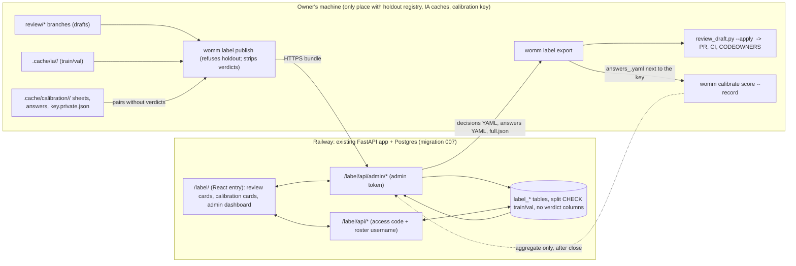

# feat: Labelling web UI (golden-case review and blind coverage-judge calibration on Railway)

> **Decision context (2026-10-08).** These decisions were made by the user before this plan and are not reopened here. Where a section below conflicts with this block, this block wins.
>
> - **A review UI of our own, now.** The origin requirements (R-list "Not in v0" and v1 notes) said v1 human review reuses LangSmith annotation queues first, and the self-evolution plan deferred "any review UI of our own". This plan amends both for exactly two tasks: golden-case review of train/val drafts, and blind coverage-judge calibration. Analyst feedback (U11 of the self-evolution plan) keeps its LangSmith path.
> - **The PR stays the final gate.** The web UI collects decisions; it never writes to the repository. The owner exports a decisions file, applies it with `scripts/review_draft.py --apply` on the review branch, and the PR, CI (`review_gate`) and CODEOWNERS decide. Calibration answers go through `womm calibrate score` locally, as today.
> - **Easy and visual first.** The classmates who label are the scarce resource. One item is one card; the claim and the IA passage sit side by side with the anchor highlighted in context; decisions are one click or one key; progress is always visible.
> - **Deployment is the normal one:** merge to `main`, CI, Railway auto-deploy (CD has worked since 2026-10-02, `docs/status/2026-10-03-v0-status.md`). No separate service, no separate database.
> - **Holdout material never reaches Railway.** Refused at load time, by structure and by tests, not by convention.
> - **Target:** usable by classmates within about 1–2 days of implementation.

> **Revision 2026-10-08 (later): least human work.** The user asked for the least human labour, keeping only the labelling that matters, following Anthropic's eval guidance (automate pipeline steps with LLMs; spend people on checking that the scoring judge agrees with people). This block wins over everything below.
>
> - **Golden cases need no human review.** A tie-break judge (`womm.eval.tiebreak`, PR #5) settles every item the three drafting judges left open and every `possibly_missing` candidate; unsure items are dropped. The audit samples are optional spot checks (`AUDIT_BLOCKS` off), still counted towards the per-proposal error rate when someone decides them.
> - **The one required labelling task is the blind calibration** of the coverage judge (about 30 pairs, two people, about 25 minutes each). U6 is the core of this plan; the calibration screen follows the simplified prototype: one plain question per screen ("Does this report cover this impact?"), the expected impact as one sentence, the dossier passage with the matching text highlighted, three large buttons (Yes / No / Not sure) and an optional one-line note.
> - **Spot checks are optional and secondary.** U5 shrinks to a read-and-answer card for `audit: true` items ("Does the report say this?": Yes / Almost / No / Not sure, one-line note), no edit forms, no diff, no owner queue. It ships after U6, or not at all for v1.
> - **Dropped:** review queues for judge disagreements and candidates, in-form edits, the owner-only queue, per-case assignments to classmates.
> - Unchanged: the PR stays the final gate, holdout material never reaches Railway, deployment is merge to `main`.

## Overview

A labelling area inside the existing WOMM web console, served by the existing FastAPI app on Railway and stored in its Postgres:

1. **Golden-case review.** A reviewer sees only the draft items that need a human decision, one card at a time: the claim (actor, mechanism, impact, provision keys, category), the IA section and part, the IA passage around the anchor with the anchor highlighted, a copyable search phrase, the IA and proposal links on EUR-Lex, and the three LLM judges' verdicts with collapsible reasons. They tick four checks (actor, mechanism, impact, numbers) and decide `verified`, `edited` (with in-form edits and an inline diff), `rejected` or `unclear` (both with a required note).
2. **Blind calibration labelling.** An annotator sees one (expected impact, dossier) pair at a time, in their own shuffled order, and labels it `covered`, `not_covered` or `unsure` with an optional note. The judge's verdict, matched impact and justification never leave the owner's machine.
3. **Admin.** The owner publishes tasks with a local command, watches a dashboard (progress per reviewer and case, decision distribution, disagreement flags, inter-annotator agreement, judge agreement once scored), resolves disagreements, and exports files the existing tools already consume.

---

## Problem Frame

- Golden-case review today runs in a terminal (`scripts/review_draft.py --interactive`) or by editing YAML in a GitHub PR (`docs/eval/reviewer-quickstart.md`). Classmates need Python, `uv`, a checkout of a `review/*` branch, and push access or a PR-comment workaround. Eight review branches are open (`review/case-03` … `review/case-10`), and a case needs 5–8 minutes of judgement but more of setup.
- The IA has to be opened separately and searched by hand for the anchor; the helper prints a search phrase but cannot show the passage.
- Calibration (`womm calibrate sample`) produces a Markdown sheet and a YAML answers file per annotator. Blindness depends on the owner never sending `key.private.json`. Answers come back by hand.
- Disagreement between people is invisible until files are merged, so rubric ambiguity is found late. A prior labelling workflow the user built for a different project showed that a reviewer-spread flag, read before trusting any judge calibration, is the single most useful admin signal: "if humans do not agree, the judge cannot be shown to agree with them".

---

## Requirements Trace

Labelling requirements defined for this plan (L-numbers), traced to the origin plan where one exists:

- L1. Golden review shows exactly the items `review_draft.py` would ask about (judge disagree/uncertain, flagged, audit sample, possibly_missing candidates, human_added, escalated proposals), with claim, IA section/part, search phrase, anchor, judges' verdicts and reasons, IA/proposal links. → U3, U5
- L2. Decisions `verified` / `edited` / `rejected` / `unclear`, notes, in-form edits of the editable fields for `edited`, per-reviewer progress. → U4, U5
- L3. Review rules preserved: the drafter cannot review their case; a `human_added` item is reviewed by someone other than the analyst who raised it and is kept only as `edited` with every required field; notes required for `rejected`/`unclear`; `edited` needs an edit (except `human_added`). Enforced server-side with the same functions CI uses. → U4
- L4. Blind calibration: `covered` / `not_covered` / `unsure` + note; never expose judge verdicts or `key.private.json`; per-annotator shuffled order; annotators independent (no one sees another's labels). → U3, U4, U6
- L5. Admin: publish tasks, progress dashboard, disagreement flags, resolution, exports. → U3, U7, U8
- L6. Exports are consumable unchanged by `scripts/review_draft.py --apply` and `womm calibrate score`. → U8
- L7. Holdout material never reaches Railway: refused at load time, with tests. → U3, U4
- L8. Auth: shared access code + validated per-reviewer GitHub username; separate admin token; every write after auth; rate-limited sign-in; the existing bearer-token console unaffected. → U2
- L9. EUR-Lex links only for train/val. → U3, U4
- L10. Desktop-first, usable on 13-inch laptop screens; keyboard shortcuts for fast labelling. → U5, U6
- L11. Visual: side-by-side claim and highlighted IA passage, check ticks, big decision buttons, collapsible judge reasons, progress bar, per-case overview grid, inline diff for edits, admin charts. → U5, U6, U7
- L12. New main-database migration `007`, earlier migrations frozen. → U1
- Origin golden plan: human check of disagree/uncertain/audit items (classmates), coverage-judge calibration of about 30 pairs at ≥85% agreement, judge–human agreement reported as evidence of golden-set quality. → U7, U8

---

## Scope Boundaries

- **Train/val only.** Holdout drafts stay with `scripts/verify_golden_case.py`, local and encrypted. Nothing in this plan reads `HOLDOUT_DATABASE_URL`, `evals/private/` beyond the holdout registry check, or holdout IA caches.
- **No repository writes from the server.** No GitHub API token on Railway, no commits, no PR comments.
- **No new review rules.** The server reuses `womm.eval.golden_review` (`human_reasons`, `decide_item`, `editable_fields`, `_valid_reviewer`, `_person`) and `womm.eval.judge_calibration` (`LABELS`, file formats). A rule change happens there, once.
- **No change to the existing console screens or to `/runs`, `/system`, `/evolution` auth.**
- **No LangSmith writes.** Labels are not sent anywhere but our Postgres.

### Deferred to Follow-Up Work

- Per-person sign-in links (magic tokens) instead of a shared code plus a username (see Needs the User 2).
- Analyst feedback marking in this UI (stays on LangSmith annotation queues).
- PDF rendering of the IA. v1 shows the cached IA text excerpt plus the EUR-Lex link.
- Free-text highlights and passage comments (the prior workflow had them; the four checks and a note cover what the review rules need).
- Multi-replica rate limiting (one Railway replica today).

---

## Context & Research

### Relevant Code and Patterns

The review tooling is complete on `feat/v1-integration` (it merges `feat/golden-import` and `feat/eu-cost`); `feat/eu-cost` alone lacks `scripts/review_draft.py` and `src/womm/eval/draft_edits.py`. `main` has migrations 001–003 only. This plan builds on `feat/v1-integration` and lands on `main` after it (Dependencies).

- `scripts/review_draft.py`:
  - `needs(draft, drafts_dir)` gives item id → reasons, including escalation from `escalated_fixtures` over every draft in the folder plus `evals/golden/audit_tally.yaml`. The publish command must reproduce this, so it materialises all published drafts into one temporary drafts directory before calling it.
  - `describe` is the reference for what a card shows: claim fields, `provision_keys`, category, derivability, IA section with `review_links.anchor_parts[item_id]`, `search_phrase(anchor)`, anchor source (`ia` or `rsb`), flags, the three judge dimensions and `overall`.
  - `read_decisions(path)` reads `reviewer:` plus `decisions: {item_id: {decision, note, edit}}`; empty decisions are skipped. This is the export target.
  - `SHORTCUTS` (`v/e/r/u`) and the `human_added` rules in `interactive` are the behaviour the web form mirrors.
- `src/womm/eval/golden_review.py`: `HUMAN_DECISIONS`, `NOTE_REQUIRED`, `EDITABLE`, `editable_fields`, `decide_item(item, entry, reviewer)` (raises `ReviewError` with an item-specific, plain message), `GITHUB_USERNAME`, `USERNAME_HINT`, `refuse_holdout_fixture`, `holdout_fixtures` (reads the gitignored `evals/private/holdout_scenarios.yaml`).
- `src/womm/eval/draft_edits.py`: `apply_decisions_in_place(path, decisions, reviewer)` applies one reviewer's decisions per call, with a sha check and atomic replace. Several reviewers on one case therefore means one decisions file per (case, reviewer), applied one after another.
- `src/womm/eval/drafting.py`: `GoldenDraft`, `_DraftItem` subclasses, `ReviewLinks` (`ia`, `proposal`, `ia_parts`, `anchor_parts`), `eurlex_url`, `check_anchor`.
- `src/womm/citations.py`: `normalize` and `match_quote` (ellipsis-split segments found in order). The IA excerpt highlight uses the same segmentation, so what is highlighted is what CI verified.
- `src/womm/eval/ia_sources.py`: IA text lives only in `.cache/ia/<fixture>/` (`ia_full.txt`, parts), gitignored and excluded from the image by `.dockerignore`.
- `src/womm/eval/judge_calibration.py`: `write_sample` writes `sheet_<name>.md`, `answers_<name>.yaml` and `key.private.json` (pairs with `judge_covered`, seed, population); `read_answers` requires one row per pair id, labels in `LABELS`, and names from the file; `score` computes per-annotator agreement, majority, raw/natural agreement, kappa, inter-annotator agreement and kappa. Annotator names allow letters, digits, `-`, `_`, so GitHub usernames fit.
- `src/womm/api/app.py`: `require_token` (bearer `WOMM_API_TOKEN`, `hmac.compare_digest`) guards every console route; the console is a single-page app mounted last at `/` with `StaticFiles(html=True)`. New routes must be registered before that mount.
- `src/womm/api/db.py`: `Database.migrate()` applies `migrations/*.sql` in order and records them; `tests/api/test_db.py` pins the applied list and `FROZEN_MIGRATIONS` digests (001–006).
- `src/womm/api/migrations/006_analyst_feedback.sql`: the pattern for "train/val only by constraint" (`CHECK (split IN ('train','val'))`).
- `web/`: React 19 + TypeScript + Vite, no router (screen state in `App.tsx`), design tokens in `web/src/design.ts`, shared widgets in `web/src/components/ui.tsx`, vitest unit tests, Playwright e2e against a real API on a fresh Postgres and a scripted fake LLM (`web/playwright.config.ts`, `src/womm/api/e2e.py`), axe checks in `e2e/a11y.spec.ts`, a mobile spec. No chart library.
- `Dockerfile` builds `web/dist` in a Node stage; `railway.json` health check `/livez`; `.dockerignore` excludes `evals/`, `.cache/`, `runs/`, `docs/`, `tests/`.
- `.github/CODEOWNERS` requires owner review for `evals/golden/drafts/` and published cases.

### Patterns adopted from the user's earlier labelling tools (outside this repo)

The user built the same workflow twice before (a reviewer web app on Railway, and command-line labelling plus merge scripts). Adopted:

- Shared access code on a styled sign-in page, signed `HttpOnly; SameSite=Strict; Secure` session cookie (12 h), constant-time comparison, session secret derived so that rotating the code or admin token signs everyone out.
- The reviewer names themselves once; work is saved straight to the backend as they go (no files, no email), with a local retry queue so a refresh or a lost connection loses nothing.
- A first-visit guided tour, and `Esc` closing any overlay.
- A separate admin token for the dashboard and exports, never in a URL (the earlier app put it in `?token=`; this plan uses an admin session cookie instead, so tokens never reach logs or browser history).
- Aggregation per item: the median or majority, the inter-rater spread, and a disagreement flag shown at the top of the admin view, to be resolved before trusting calibration.
- Resumable labelling (stop halfway, lose nothing), a `skip` that is not a judgement, and "rate what is on the page": the annotator sees exactly what the judge saw.
- Neutral, checkable review aids only. A source passage and term overlap are fine; an AI confidence flag is not, because it anchors the human whose independent judgement is being measured. For calibration this is strict (nothing judge-derived at all); for golden review the judges' verdicts are part of the task (L1), so their reasons start collapsed.
- Known-bad material is offered, flagged, not skipped (here: flagged items and `possibly_missing` candidates are shown with their flag).

### Institutional Learnings

- `docs/solutions/evaluation/single-run-scores-are-noise.md`: agreement on a few dozen pairs is noisy; the dashboard shows counts next to every rate and never a rate alone.
- The golden plan: an item two careful readers disagree on is not an unambiguous task and is dropped (`unclear`). Disagreement flags feed that rule rather than being averaged away.

---

## Key Technical Decisions

- **One app, one database, one deploy.** New routes under `/label/api/*` in the existing FastAPI app, new tables in migration 007, a second Vite entry (`web/label/index.html`) served at `/label/`. Classmates never load the console bundle or its token modal; the console never sees labelling routes. Shared design tokens and widgets keep the look consistent.
- **Labelling is off unless configured.** Without `WOMM_LABEL_ACCESS_CODE` and `WOMM_LABEL_ADMIN_TOKEN` (each ≥ 16 chars, admin ≥ 32), every `/label/api/*` route answers 404 and the app starts normally. Unlike the earlier tool, an unset code never means "open".
- **Auth model.**
  - Reviewer sign-in: `POST /label/api/session` with `{access_code, github_username}`. The code is compared in constant time; the username must match `GITHUB_USERNAME` and be on the roster (`label_reviewers`, filled by the owner). The session cookie carries the casefolded username and role `reviewer`.
  - Admin sign-in: `POST /label/api/admin/session` with the admin token → cookie with role `admin`. The publish and export commands use `Authorization: Bearer <admin token>` on `/label/api/admin/*` instead of the cookie.
  - The labelling dependencies never accept `WOMM_API_TOKEN`, and `require_token` never accepts a labelling cookie or the admin token: separate secrets, separate code paths, tests both ways.
  - Writes need the session plus `Content-Type: application/json` plus a custom `X-WOMM-Label: 1` header (CSRF defence on top of `SameSite=Strict`).
  - Order in every write handler: authenticate → rate/size limits → validate → write. Enforced by FastAPI dependencies on the router, not per handler.
- **Rate limiting** in process (one replica): sign-in at most 5 failures per 10 minutes per client address and 10 per hour per username, then `429` with `Retry-After`; a global cap of 60 sign-in attempts per minute; writes at most 120 per minute per session. Client address: the right-most `X-Forwarded-For` entry added by Railway's edge (uvicorn's `--forwarded-allow-ips` set accordingly); per-username and global caps hold even if that address is wrong.
- **Publishing goes over HTTPS, not by opening the production database.** `womm label publish …` runs on the owner's machine (where drafts, IA caches and the calibration key live), builds a bundle, validates it, and `POST`s it to `/label/api/admin/tasks` with the admin token. `--dry-run` writes the bundle JSON for inspection. Railway's Postgres stays private.
- **Holdout refusal in depth (L7).**
  1. Local, before anything is read: refuse a draft whose `split` is `holdout`, a fixture in the local holdout registry (`refuse_holdout_fixture`), any path under `evals/private/`, a calibration directory whose key lists a pair from a non-public case (the key's pairs must all be public golden cases with split train/val), and any IA cache for a refused fixture.
  2. Bundle schema: strict Pydantic models (`extra="forbid"`) with `split: Literal["train","val"]`; calibration pair models have no verdict field, so a `judge_covered`, `report`, `matched_impact` or `justification` key fails validation, locally and on the server.
  3. Server: the same models, `review_links` must be `https://eur-lex.europa.eu/` URLs, and every content table has `CHECK (split IN ('train','val'))`.
  4. Tests for each layer, plus a test that the bundle and every calibration API response contain none of the forbidden keys.
- **The server validates decisions with CI's own functions.** Each stored golden item keeps its full draft item JSON. `PUT …/decision` rebuilds the `_DraftItem`, calls `decide_item(item, entry, reviewer)` and refuses with its message (`422`) on any `ReviewError`. A decision the server accepts is therefore one `--apply` accepts. The drafter rule uses the case's `drafted_by` and `_person`; claims by the drafter are refused at claim time.
- **Who reviews what.** Each case is claimed by one reviewer (first come, from the case grid), so a case is decided in one sitting by one person. An optional **warm-up case**, set at publish (`--warm-up case_id`), is open to every reviewer, giving an early disagreement measure on a shared case before the rest is split up. The admin can also open any case to a second reviewer. Items decided by more than one reviewer are compared; a mismatch is a disagreement flag until the admin picks the decision to export.
- **Calibration order and independence.** Pair ids come from the sample (already shuffled, so ids say nothing about strata). Each annotator's order is a deterministic shuffle seeded by `sha256(task_set_id:username)`. An annotator's API only ever returns their own labels; agreement figures are admin-only. Only annotators listed at publish (normally the `--annotator` names given to `womm calibrate sample`) can open the task.
- **Judge agreement for calibration stays local.** The verdicts never go to the server. After the owner runs `womm calibrate score`, `womm label publish-score` may upload the aggregate result only (per-annotator agreement, raw/natural agreement, kappa, confusion counts; no per-pair data), and only once the task set is closed. The dashboard shows it from then on.
- **Visual card design (L11).**
  - Two columns at ≥ 1100 px: left the claim, right the IA passage; stacked below that width. Card body fits a 1280×720 viewport without page scroll for a typical item; long passages scroll inside their panel.
  - Right panel: an excerpt of the cached IA text (the anchor plus about 700 characters either side, from the anchor's IA part), computed at publish. Anchor segments are highlighted with `match_quote`'s segmentation; the item's IA section heading is shown above. Without a cached IA, the panel shows the anchor alone, the search phrase with a copy button, and the EUR-Lex link.
  - Term cues on the claim side: words and numbers of the claim that also occur in the anchor get a subtle underline; a number in the claim that does not occur in the anchor gets an amber outline (the numbers check). Purely lexical, computed client-side, labelled "matching words", toggle with `h`.
  - Four check ticks (actor, mechanism, impact, numbers) above the decision bar. Ticking all four makes `verified` the highlighted suggestion; an unticked check makes `edited` the suggestion and opens the field it maps to. Ticks are stored for analytics and the full archive, not exported to the decisions file (its format has no field for them).
  - Decision bar: four large buttons with their keys (1 verified, 2 edited, 3 rejected, 4 unclear). A required note opens inline and focuses; the decision saves on `Enter`.
  - `edited`: the editable fields (`editable_fields(item)`) become inputs in place; a word-level inline diff (removed struck through in red, added in green) shows under each changed field and in the case summary.
  - Judges: three verdict chips (agree / disagree / uncertain per dimension) always visible; reasons collapsed by default, `j` toggles.
  - Top bar: case progress bar, `n of m decided`, and an overview grid of item tiles coloured decided / pending / flagged-by-checks / disagreement / skipped; click or `g` opens it.
- **Keyboard (L10).** Golden review: `1`–`4` decide, `a`/`m`/`i`/`x` toggle the four checks, `n` focuses the note, `e` starts editing, `Enter` saves and moves on, `←`/`→` previous/next item, `s` skips, `j` judge reasons, `h` term highlights, `c` copies the search phrase, `o` opens the IA, `g` the overview grid, `?` the shortcut sheet, `Esc` closes overlays. Calibration: `1` covered, `2` not_covered, `3` unsure, `n` note, `Enter`, `←`/`→`, `?`. Shortcuts are inactive while a text field has focus (except `Esc` and `Ctrl/Cmd+Enter`).
- **Charts without a dependency.** Small inline-SVG React components (stacked bar, horizontal bar, agreement matrix), with text tables beside them for screen readers and for exact numbers. Keeps the bundle small and the style consistent with the console.
- **Exports reuse the existing formats exactly.**
  - Golden: one file per (case, reviewer), `reviewer:` + `decisions:` mapping, with a header comment naming the draft, its published sha256 and the apply command. Unresolved disagreements are left out and listed in the export summary.
  - Calibration: `answers_<annotator>.yaml` per annotator, every pair id present (blank label when not answered), as `render_answers` writes and `read_answers` reads.
  - Full archive: `full.json` with everything, including check ticks, timings and skips.
  - `womm label export` writes golden files to `.cache/labelling/<task_set>/` and calibration answers into the sample directory next to `key.private.json`, refusing to overwrite a non-blank answers file without `--force`.

---

## Open Questions

### Resolved During Planning

- **Which branch has everything?** `feat/v1-integration` (review helper, draft edits, calibration, migrations 004–006). `feat/eu-cost` lacks the review helper.
- **Can the server reuse the review rules?** Yes. `golden_review` and `judge_calibration` are in `src/womm/`, which the image installs; they read files only when asked (`holdout_fixtures`, `load_audit_tally`), and the server never asks.
- **How do several reviewers fit `--apply`, which takes one reviewer per call?** One decisions file per (case, reviewer), applied in turn; `apply_decisions_in_place` re-reads the file and checks its sha each time.
- **Do calibration sheets need to match the web order?** No. Order only has to differ per annotator and be stable; `score` is order-free.

### Needs the User

Each has a proposed default; the plan proceeds on it unless told otherwise.

1. **Who may sign in.** Default: a roster of GitHub usernames the owner adds (`womm label roster add …`); a username not on it cannot sign in even with the code. Alternative: any well-formed username (faster, weaker).
2. **Identity strength.** Default: shared code plus roster username, as asked. Anyone holding the code could sign in as another rostered classmate; the exported decisions name the classmate as `review.reviewer` in a commit the owner makes. Accept this for a class project, or move to per-person sign-in links (Deferred)?
3. **Warm-up case.** Default: one shared warm-up case that every reviewer decides first (about 5–8 extra minutes each), giving an early disagreement measure. Alternative: none.
4. **Judge reasons visibility in golden review.** Default: verdict chips visible, reasons collapsed (to limit anchoring). Alternative: reasons expanded, as `review_draft.py` prints them.
5. **Term-overlap highlights in calibration.** Default: off for calibration (keeps the human judgement unaided, like the judge's), on for golden review. Alternative: on for both.
6. **Merge order.** Default: `feat/v1-integration` merges to `main` first (it carries migrations 004–006 and the review tooling); this feature branches from it and merges after. If that merge is not wanted yet, this feature cannot reach Railway, because migration 007 depends on 004–006 being applied.

### Deferred to Implementation

- The exact IA excerpt width and how a multi-part IA's part is chosen when `anchor_parts` is empty (default: search `ia_full.txt`, then label the part from the heading index).
- Whether Railway's edge sets a usable `X-Forwarded-For`; verified on the first deploy (U9), and the per-username and global caps hold either way.
- The roster command's shape (`womm label roster add/list/remove` vs a flag on publish).

---

## High-Level Technical Design

> *This illustrates the intended approach and is directional guidance for review, not implementation specification. The implementing agent should treat it as context, not code to reproduce.*



**Golden review card (≥ 1100 px)**

```
+------------------------------------------------------------------------------------------+
| case_03 Data Act cloud switching   [=========-----] 7/11   grid(g)   ?   alice  sign out  |
+-------------------------------------------+----------------------------------------------+
| c03_e01  impact  needs you: judge disagree | IA 6.2.3 Intervention on cloud... (part 1)   |
| Actor      Business customers of cloud ... | ... the intervention under policy option 2   |
| Mechanism  Providers must remove ...       | [will benefit users of cloud and edge        |
| Impact     ... up to (125%) of annual ...  |  services by reducing the cost of switching  |
| Keys  art/23 art/24 art/25  Category ...   |  providers, which currently goes up to 125%  |
| Judges: anchor ok  derivability ok         |  of annual subscription costs.] ...          |
|         category DISAGREE  [reasons (j)]   | search: "Furthermore, the intervention..." c |
|                                            | IA on EUR-Lex (o)   proposal on EUR-Lex      |
+-------------------------------------------+----------------------------------------------+
| checks: [x] actor (a) [x] mechanism (m) [x] impact (i) [ ] numbers (x)                   |
| [1 Verified] [2 Edited] [3 Rejected] [4 Unclear]   note (n) ______________   <- ->       |
+------------------------------------------------------------------------------------------+
```

**Data model (migration 007, sketch)**

| Table | Holds | Guards |
|---|---|---|
| `label_task_sets` | id, kind (`golden_review`/`calibration`), name, status (`open`/`closed`), source (branch, commit, draft sha256 or sample name), warm-up case, created_at | kind and status CHECKs |
| `label_reviewers` | roster: username (casefolded PK), active, added_at | username format CHECK |
| `label_cases` | task set, case_id, fixture, split, drafted_by, review_links, claimed_by, second_reviewer | `split IN ('train','val')` |
| `label_golden_items` | task set, case_id, item_id, kind, position, reasons, item JSON (the draft item), IA excerpt + highlight spans, search phrase | split via case FK |
| `label_golden_decisions` | (task set, case, item, reviewer) → decision, note, edit, checks, skipped, version, timings | decision CHECK; note required for rejected/unclear; edit only with edited |
| `label_golden_resolutions` | chosen reviewer per disagreeing item, by admin, at | — |
| `label_calib_pairs` | task set, pair_id, case_id, split, expected impact, dossier impacts | `split IN ('train','val')`; no verdict column (test) |
| `label_calib_annotators` | task set, username | — |
| `label_calib_labels` | (task set, pair, annotator) → label, note, version, updated_at | label CHECK in `LABELS` |
| `label_calib_scores` | task set, aggregate result JSON, recorded_at | only when task set closed (app check) |
| `label_events` | append-only audit: who, action, target, at (sign-ins, publishes, writes, exports, resolutions) | — |

---

## Implementation Units

- U1. **Migration 007 and the labelling store**

**Goal:** Tables for task sets, roster, golden items and decisions, calibration pairs and labels, scores and the audit log, with train/val constraints.

**Requirements:** L7, L12

**Dependencies:** `feat/v1-integration` merged (migrations 004–006)

**Files:**
- Create: `src/womm/api/migrations/007_labelling.sql`
- Create: `src/womm/api/labelling_db.py` (queries; the `Database` pool is shared)
- Modify: `tests/api/test_db.py` (applied list gains `007_labelling`; `FROZEN_MIGRATIONS` gains its digest once merged)
- Test: `tests/api/test_labelling_db.py`

**Approach:**
- Tables as in the data-model sketch. Upserts with a `version` column for optimistic concurrency (`409` on a stale write). Progress and agreement queries in SQL views or functions in `labelling_db.py`.
- Republishing a task set with the same source is idempotent; a changed draft sha creates a new task set and marks the old one superseded (decisions on unchanged items can be carried over by item digest, see U3).

**Test scenarios:**
- Happy path: migrate on a fresh database applies 001–007; a second migrate applies nothing.
- Error path: inserting a case or pair with split `holdout` fails on the CHECK.
- Error path: a `rejected` decision without a note, or an `edit` with decision `verified`, fails on the CHECK.
- Edge case: `label_calib_pairs` has no column whose name contains `judge`, `verdict`, `covered` or `matched` (schema introspection test).
- Edge case: two writes with the same `version` → the second gets a conflict.
- Integration: the existing frozen-migration test still passes for 001–006.

**Verification:** `uv run pytest tests/api/test_db.py tests/api/test_labelling_db.py` green against the test Postgres.

---

- U2. **Labelling auth: access code, roster identity, admin token, rate limits**

**Goal:** Sessions for reviewers and the admin, separate from the console's bearer token, with rate-limited sign-in and CSRF-safe writes.

**Requirements:** L8

**Dependencies:** U1

**Files:**
- Create: `src/womm/api/labelling_auth.py` (cookie signing with `hmac`/`hashlib`, dependencies `reviewer_session`, `admin_session_or_bearer`, `write_guard`, in-memory `RateLimiter`)
- Modify: `src/womm/config.py` (`label_access_code`, `label_admin_token`, `label_session_secret`, all optional)
- Modify: `.env.example` (the three variables, empty)
- Test: `tests/api/test_labelling_auth.py`

**Approach:**
- Session secret: `WOMM_LABEL_SESSION_SECRET` if set, else derived from the access code and admin token (rotation signs everyone out). Cookie `womm_label`, `HttpOnly; Secure; SameSite=Strict; Path=/label; Max-Age=43200`.
- Sign-in validates code (constant time), username (`_valid_reviewer`, strips `@`), roster membership; logs to `label_events` without the code.
- Sign-out clears the cookie. `GET /label/api/me` returns username, role, tasks.
- Labelling routes return 404 when unconfigured; a configured but too-short code or token refuses startup of the labelling router only (logged), never the whole app.

**Test scenarios:**
- Happy path: right code + rostered username → cookie; `/label/api/me` returns the casefolded username.
- Error path: wrong code → 401 with a generic message; the response time path uses `compare_digest`.
- Error path: `Alice Smith` (display name) → 422 with `USERNAME_HINT`; a well-formed but unrostered username → 403 "ask the course owner to add you".
- Error path: the 6th failed sign-in from one address within 10 minutes → 429 with `Retry-After`; the 11th for one username within an hour from rotating addresses → 429.
- Error path: a write without `X-WOMM-Label` or with a form content type → 403.
- Security: `WOMM_API_TOKEN` as bearer on `/label/api/admin/*` → 401; the admin token as bearer on `/runs` → 401; a reviewer cookie on `/label/api/admin/*` → 403.
- Security: a tampered or expired cookie → 401; rotating the access code invalidates existing cookies.
- Edge case: labelling env unset → `/label/api/session` is 404 and `/runs` works with the bearer token as before.

**Verification:** auth tests green; the existing `tests/api/` suite unchanged and green.

---

- U3. **`womm label publish` and the admin task ingest**

**Goal:** The owner publishes golden-review drafts (from `review/*` refs or files) and calibration pairs (without verdicts) into the database, refusing holdout material.

**Requirements:** L1, L4, L5, L7, L9

**Dependencies:** U1, U2

**Files:**
- Create: `src/womm/labelling/__init__.py`, `src/womm/labelling/bundle.py` (strict Pydantic bundle models shared by CLI and server), `src/womm/labelling/publish.py` (build bundles), `src/womm/labelling/excerpt.py` (IA excerpt + highlight spans)
- Modify: `src/womm/cli.py` (`womm label publish golden|calibration`, `womm label roster add|list|remove`, `womm label publish-score`)
- Create: `src/womm/api/labelling.py` (FastAPI `APIRouter` for `/label/api`, mounted in `create_app` before the static mount), admin route `POST /label/api/admin/tasks`
- Modify: `src/womm/api/app.py` (include the router)
- Test: `tests/labelling/test_publish.py`, `tests/labelling/test_excerpt.py`, `tests/api/test_labelling_ingest.py`

**Approach:**
- Golden: `--ref review/case-03-data-act` (repeatable, or `--all-review-branches`) reads the draft with `git show <ref>:evals/golden/drafts/*.yaml`; `--file` takes a local draft. All selected drafts are written to a temporary drafts directory; each is loaded with `load_draft_for_review`, refused when `split == "holdout"` or `refuse_holdout_fixture` raises; `needs()` gives the items and reasons (escalation sees all drafts plus `audit_tally.yaml`). Per item: full item JSON, kind, reasons, search phrase, anchor part, and the IA excerpt from `.cache/ia/<fixture>/` when present. Case: `drafted_by`, `review_links` (taken from the draft, where `build_review_links` writes them for train/val only; a draft without them publishes with the search phrase only, and any non-EUR-Lex link is refused), ref name, commit sha, draft sha256.
- Calibration: `--dir .cache/calibration/<name>`; reads `key.private.json` locally for pair → (case, expected id, run) and the annotator list; refuses unless every case is a public golden case with split train/val; loads expected impacts from `evals/golden/` and dossier impacts from `runs/<run_id>.json`; the bundle model has no verdict field, and the builder never copies one.
- `--dry-run` writes the bundle to `.cache/labelling/bundles/` and prints counts; otherwise `POST` with `WOMM_LABEL_ADMIN_TOKEN` and `--url` (default from `WOMM_LABEL_URL`).
- Server: re-validates the bundle with the same models, checks EUR-Lex URLs and splits, writes in one transaction, logs to `label_events`. `--warm-up <case_id>` marks a shared case.
- Republish of a changed draft: items whose tool digest is unchanged keep their decisions; changed items return to pending, and the dashboard says so.

**Test scenarios:**
- Happy path: a train fixture draft with 11 items needing decisions publishes 11 items with reasons matching `review_draft.needs()`.
- Happy path: escalation: with an audit tally over 10% for the fixture, every item of the draft is published.
- Error path (holdout): a draft with `split: holdout` → refused before any network call, message names the draft only.
- Error path (holdout): a train draft whose fixture is in a temporary holdout registry → refused (`refuse_holdout_fixture`).
- Error path (holdout): a calibration key with a pair from a case not among public golden cases → refused.
- Error path (server): a bundle with `split: "holdout"` posted directly → 422, nothing written; a pair with an extra `judge_covered` key → 422.
- Security: the dry-run bundle of a calibration sample does not contain `judge_covered`, `matched`, `justification` or `key.private` anywhere (string scan).
- Error path: `review_links.ia` pointing outside `https://eur-lex.europa.eu/` → 422.
- Edge case: no IA cache → items publish with `excerpt: null`, and the card falls back (U5).
- Edge case: an ellipsis anchor gives two highlight spans in order; a `not_found` anchor gives an excerpt-less item flagged "anchor not found in cached IA".
- Integration: republishing the same ref is idempotent; publishing a newer commit keeps decisions on unchanged items.

**Verification:** publish and ingest tests green; `womm label publish golden --ref review/case-03-data-act --dry-run` produces a bundle a person can read.

---

- U4. **Reviewer and annotator API**

**Goal:** Endpoints to list tasks, claim cases, read cards, save decisions and labels, with the review rules enforced.

**Requirements:** L2, L3, L4, L7, L9

**Dependencies:** U1–U3

**Files:**
- Modify: `src/womm/api/labelling.py`
- Test: `tests/api/test_labelling_review.py`, `tests/api/test_labelling_calibration.py`

**Approach:**
- `GET /label/api/tasks`: the reviewer's open task sets with progress. `GET …/golden/{set}/cases`: case grid (claimed by, decided/pending counts). `POST …/cases/{case}/claim`: refused for the drafter and for a case claimed by someone else (unless warm-up or opened to a second reviewer).
- `GET …/cases/{case}/items`: cards for the claimed case, including the reviewer's own decisions only.
- `PUT …/items/{item}/decision` `{decision, note, edit, checks, version}`: rebuilds the item, calls `decide_item(item, entry, reviewer)`; `ReviewError` → 422 with its message (e.g. "a human_added item is kept only as 'edited'"). Checks and skip are stored alongside. `DELETE` clears a decision.
- Calibration: `GET …/calibration/{set}/pairs` returns only pair ids, expected impact, dossier impacts, the annotator's own label, in that annotator's order; refused for non-listed annotators. `PUT …/pairs/{pair}/label` `{label, note, version}`, label in `LABELS`. Refused after the set is closed.
- No endpoint returns another reviewer's decisions or another annotator's labels to a non-admin.

**Test scenarios:**
- Happy path: verify an item → stored; progress 1/11.
- Happy path: `edited` with `{edit: {impact: "Recurring costs of EUR 6 000-7 000 per year"}}` → stored; the re-read card shows the edit.
- Error path: `rejected` without a note → 422 "needs a note saying why".
- Error path: `edited` with no edit on a normal item → 422; with a non-editable field (`expected_id`) → 422 naming the editable fields.
- Error path: `human_added` item `verified` → 422; reviewed by the analyst who raised it → 422; `edited` with an empty `ia_anchor` → 422.
- Error path: the case's `drafted_by` claims the case → 403 "the drafter cannot be the reviewer".
- Error path: a reviewer reads a case claimed by someone else → 403.
- Error path: stale `version` → 409, the body carries the current decision.
- Security (blind): calibration responses for every endpoint contain no `judge`, `verdict`, `covered_by_judge` or `matched` keys (recursive key scan); annotator B never receives annotator A's labels.
- Edge case: two annotators get different orders over the same pair ids; the same annotator always gets the same order.
- Edge case: label write after `close` → 409 "this task is closed".

**Verification:** API tests green; a decisions file built from stored decisions passes `read_decisions` and `apply_decisions_in_place` on the fixture draft (shared with U8).

---

- U5. **Golden review UI**

**Goal:** The visual, keyboard-first card flow for golden review.

**Requirements:** L1, L2, L10, L11

**Dependencies:** U4

**Files:**
- Create: `web/label/index.html`, `web/src/label/main.tsx`, `web/src/label/LabelApp.tsx`, `web/src/label/api.ts`, `web/src/label/SignIn.tsx`, `web/src/label/TaskList.tsx`, `web/src/label/ReviewCard.tsx`, `web/src/label/CaseGrid.tsx`, `web/src/label/Shortcuts.tsx`, `web/src/label/Tour.tsx`
- Create: `web/src/label/model/highlight.ts` (anchor spans, term overlap, unmatched numbers), `web/src/label/model/wordDiff.ts`, `web/src/label/model/keys.ts`, `web/src/label/model/queue.ts` (local retry queue)
- Modify: `web/vite.config.ts` (second entry), `web/src/design.ts` (shared tokens only if needed)
- Test: `web/src/label/model/*.test.ts`, `web/src/label/ReviewCard.test.tsx`, `web/e2e/label-review.spec.ts`

**Approach:**
- Sign-in page in the console's style: access code, GitHub username (with the `USERNAME_HINT` as help text), one button. Then a task list, then the case grid, then cards.
- Card layout, check ticks, decision bar, inline edit and diff, judge chips and collapsible reasons, progress bar and overview grid as in Key Technical Decisions. All UI text in English.
- Saves are immediate and optimistic; failures go to a `localStorage` queue retried with backoff, and a banner says "3 decisions not saved yet, retrying". A 409 shows both versions and asks which to keep.
- A first-visit tour of five steps (the passage, the checks, the decision keys, the grid, the shortcut sheet); `?` reopens the sheet.
- Case done: a summary of the reviewer's decisions with diffs of edits, and "Next case".
- Desktop-first: two columns at ≥ 1100 px, stacked under; minimum supported 1024×640; no horizontal page scroll.

**Test scenarios:**
- Unit (vitest): `highlight` finds both segments of an ellipsis anchor in order; marks claim numbers absent from the anchor (`125%` present, `150%` absent); ignores stop words.
- Unit: `wordDiff("EUR 7 000", "EUR 6 000-7 000")` gives one insertion; identical strings give no change.
- Unit: `keys` maps `1`–`4`, `a/m/i/x`, `n`, `j`, `←/→`, and ignores keys while an input has focus.
- Unit: `queue` keeps unsaved writes across reload and drops them after a successful save.
- Component: all four checks ticked highlights `Verified`; `Rejected` opens a required note and `Enter` without text does not save.
- Component: `edited` on a `human_added` item shows `ia_anchor` among the editable fields; `Verified` is disabled with an explanation.
- E2E (Playwright, fresh database, published fixture task): sign in → claim case → decide 3 items by keyboard only (`a m i x 1 Enter`, `3 n "contradicts the IA" Enter`, `2` edit impact `Enter`) → progress shows 3/n → reload → decisions persist → grid shows 3 decided tiles.
- E2E: wrong access code shows "Wrong access code" and no session; display name rejected with the hint.
- E2E: viewport 1280×720 and 1440×900 show both columns with no horizontal scroll; 1024×640 stacks; axe has no serious violations on sign-in, card and grid.
- E2E: the server rejecting a decision (e.g. the drafter) shows the server's message on the card.

**Verification:** `npm test`, `npm run typecheck`, `npm run e2e -- label-review` green.

---

- U6. **Calibration labelling UI**

**Goal:** Blind, fast pair labelling.

**Requirements:** L4, L10, L11

**Dependencies:** U4, U5 (shared shell)

**Files:**
- Create: `web/src/label/CalibrationCard.tsx`, `web/src/label/Rubric.tsx`
- Test: `web/src/label/CalibrationCard.test.tsx`, `web/e2e/label-calibration.spec.ts`

**Approach:**
- Left: the expected impact (actor, mechanism, impact). Right: the dossier's impacts and findings as a scannable list. The rubric (`RUBRIC` text from `judge_calibration`, served by the API) is pinned above and collapsible.
- Three large buttons (`1` covered, `2` not_covered, `3` unsure), optional note (`n`, suggested for unsure), progress bar, grid of pair tiles. Term highlights off by default (Needs the User 5).
- A notice on first open: "Work alone. Do not discuss pairs until everyone has finished."

**Test scenarios:**
- Component: `3` then `Enter` saves `unsure` with a prompt for a note that is not required.
- E2E: two annotators see the same pairs in different orders; the network log of the whole session contains no `judge`/`verdict` keys (response scan in the spec).
- E2E: after the admin closes the set, buttons are disabled and a banner says the task is closed.
- E2E: a non-listed reviewer gets "You are not an annotator for this task".

**Verification:** vitest and the calibration e2e spec green.

---

- U7. **Admin dashboard**

**Goal:** Progress, distributions, disagreement, agreement, resolution, close, and export buttons, in one admin page.

**Requirements:** L5, L11

**Dependencies:** U4

**Files:**
- Create: `web/src/label/admin/AdminApp.tsx`, `web/src/label/admin/charts.tsx` (stacked bar, bar, agreement matrix), `web/src/label/admin/Disagreements.tsx`
- Create: `web/src/label/model/agreement.ts` (percent agreement, Cohen's kappa for two raters, Fleiss' kappa for more; mirrors `judge_calibration._kappa`)
- Modify: `src/womm/api/labelling.py` (admin read endpoints, `POST …/resolve`, `POST …/close`, `POST …/score` for the aggregate)
- Test: `web/src/label/model/agreement.test.ts`, `tests/api/test_labelling_admin.py`, `web/e2e/label-admin.spec.ts`

**Approach:**
- Golden panel: progress per reviewer and per case (stacked decided/pending/skipped), decision distribution overall and per case, human vs judge (`judge.overall` agree/disagree/uncertain against human verified/edited/rejected/unclear), check-tick failure counts per check, and a disagreement list (items decided differently by two reviewers, showing both decisions, notes and edit diffs side by side, with "use this one" buttons).
- Calibration panel: labelled/blank per annotator, label distribution, pairwise inter-annotator agreement and kappa (matrix), pairs with no majority (flagged), and judge agreement once an aggregate is uploaded (raw, natural, per stratum, kappa, confusion counts, with `n` beside each rate and the 85% line).
- A banner when inter-annotator agreement is low ("resolve rubric ambiguity before trusting the judge calibration"), adopted from the earlier workflow.
- Every chart has a table view; counts beside rates.

**Test scenarios:**
- Unit: kappa on perfect agreement is 1, on chance-level agreement about 0, undefined (shown as "n/a") when one rater uses a single label.
- API: progress numbers match a seeded set; a resolution selects one reviewer's decision and clears the flag; close refuses further writes; the score upload is refused while the set is open and refused when it carries per-pair data.
- API: every admin endpoint refuses a reviewer cookie.
- E2E: the admin signs in with the token, sees two reviewers' progress bars, resolves a seeded disagreement, and the export count changes accordingly.

**Verification:** tests green; the dashboard renders a seeded set of 3 reviewers × 2 cases and 2 annotators × 30 pairs readably at 1280×720.

---

- U8. **Exports and round-trip guarantees**

**Goal:** Files the existing tools consume unchanged, from the dashboard and from the CLI.

**Requirements:** L6

**Dependencies:** U4, U7

**Files:**
- Create: `src/womm/labelling/export.py` (pure functions: rows → decisions YAML, rows → answers YAML, full archive)
- Modify: `src/womm/api/labelling.py` (`GET /label/api/admin/export/{set}/golden.zip|answers.zip|full.json`)
- Modify: `src/womm/cli.py` (`womm label export --set … --out …`, `--calibration-dir`)
- Test: `tests/labelling/test_export_roundtrip.py`

**Approach:**
- Golden files named `<case_id>.<reviewer>.decisions.yaml`, written with `yaml.safe_dump` for values, and a header comment: draft path, published commit and sha256, and `uv run python scripts/review_draft.py evals/golden/drafts/<case>.yaml --apply <file>`. Unresolved disagreements are excluded and listed; skipped items are absent (left for later, as `read_decisions` skips empty decisions).
- The CLI warns when the review branch's current draft sha differs from the published one.
- Calibration answers: one file per listed annotator, all pair ids, blank labels as empty; written into the sample directory; refuses to overwrite a non-blank file without `--force`.

**Test scenarios:**
- Round trip (golden): seed decisions for a fixture draft (verified, edited with an edit, rejected with a note, a human_added item edited with its anchor) → export → `review_draft.read_decisions` → `apply_decisions_in_place` on a copy of the draft → `review_gate(..., allow_pending=False)` reports no problems for the decided items.
- Round trip (two reviewers): two files for one case apply one after the other without a sha conflict.
- Round trip (calibration): export for two annotators → `judge_calibration.read_answers(dir, pair_ids)` accepts them → `score(test_key, answers)` gives the expected agreement.
- Edge case: a reviewer with an unresolved disagreement → that item absent from both files, listed in the summary.
- Edge case: an answers file with blanks is accepted by `read_answers` (blank → `None`).

**Verification:** round-trip tests green; this is the unit that keeps the PR and `womm calibrate score` as the final gate.

---

- U9. **Deployment, owner runbook and documentation**

**Goal:** The feature reaches Railway through the normal CD, and the owner and classmates know exactly what to do.

**Requirements:** L8, deployment

**Dependencies:** U1–U8

**Files:**
- Modify: `Dockerfile` (uvicorn `--forwarded-allow-ips` for the Railway edge, if needed)
- Modify: `README.md` (labelling section: env vars, routes, auth model)
- Create: `docs/eval/labelling-runbook.md` (owner workflow), and a short "Labelling in the browser" section in `docs/eval/reviewer-quickstart.md`
- Test: `web/e2e/label-review.spec.ts` covers the deployed shape locally; a post-deploy smoke checklist in the runbook

**Approach:**
- Environment on Railway: `WOMM_LABEL_ACCESS_CODE` (random, ≥ 16 chars, shared with classmates out of band), `WOMM_LABEL_ADMIN_TOKEN` (random, ≥ 32 chars, owner only), optional `WOMM_LABEL_SESSION_SECRET`. Locally: `WOMM_LABEL_URL`, `WOMM_LABEL_ADMIN_TOKEN` for the CLI. None are committed; `.env.example` lists them empty.
- Deploy: merge to `main` → CI → Railway auto-deploy → migration 007 at startup. Smoke: `/livez` 200; `/label/` loads; wrong code → 401; admin sign-in works; console with `WOMM_API_TOKEN` still works.
- Runbook (owner workflow): roster → publish golden (refs) → `calibrate sample` → publish calibration → share URL and code → watch dashboard, resolve flags → close → export → per case: `git switch review/<case>`, `--apply` each reviewer's file, `--check`, commit, push, mark the PR ready → CI and CODEOWNERS → merge; calibration: export answers into the sample dir → `womm calibrate score --dir … --record` → commit `evals/promotion_records.yaml` → optionally `womm label publish-score`.

**Test scenarios:**
- Test expectation: none beyond the e2e and smoke checklist — this unit is configuration and documentation.

**Verification:** the first deploy passes the smoke checklist; a classmate signs in and decides one item on the deployed URL.

---

## Human-in-the-Loop Points

| # | Point | Who | When | Effort |
|---|---|---|---|---|
| 1 | Set `WOMM_LABEL_ACCESS_CODE` and `WOMM_LABEL_ADMIN_TOKEN` on the Railway service | user | once, before the merge that ships U2 | 5 min |
| 2 | Answer Needs the User 1–6 (defaults stand otherwise) | user | before U2/U5 | 10 min |
| 3 | Add classmates' GitHub usernames to the roster; share the URL and access code privately | user | once per cohort | 5 min |
| 4 | Publish golden tasks from the open `review/*` branches; run `calibrate sample` and publish the pairs | user | per round | 10 min |
| 5 | Label: golden review (about 5–8 min per case) and calibration (about 1 h for 30 pairs per annotator) | classmates | per round | as in the golden plan |
| 6 | Read the disagreement list; resolve or mark items `unclear`; fix the rubric or guide if a pattern shows | user | after the warm-up case and at the end | 15–30 min |
| 7 | Export, apply on each review branch, `--check`, commit, push, mark PRs ready; approve as CODEOWNER | user | per round | about 5 min per case |
| 8 | Close calibration, export answers, `womm calibrate score --record`, commit the record | user | per calibration round | 10 min |
| 9 | Post-deploy smoke checklist | user | after the first deploy | 5 min |

---

## System-Wide Impact

- **Interaction graph:** the graph, evaluators and review rules are unchanged; the API gains one router and the CLI one command group. The server imports `golden_review` and `judge_calibration` for validation only.
- **Data:** migration 007 adds `label_*` tables to the main database. No holdout content, no calibration verdicts, no IA text beyond train/val excerpts. IA excerpts of train/val proposals are public EUR-Lex text, as are the drafts (they are on public `review/*` branches already).
- **Unchanged invariants:** `require_token` and every console route; migrations 001–006 bytes; the holdout database and its migrations; `.dockerignore` keeping `evals/` and `.cache/` out of the image; the PR, CI and CODEOWNERS as the gate for golden cases; `womm calibrate score` as the calibration scorer.
- **Security surface:** two new secrets, a cookie session, an in-process rate limiter, an admin ingest endpoint. Covered by U2 tests and a security review before merge.
- **Cost:** no LLM calls. A few hundred rows per round.

---

## Sizing

Target: classmates can label within about 1–2 days of implementation.

| Unit | Estimate | Day |
|---|---|---|
| U1 Migration + store | 2–3 h | 1 |
| U2 Auth + rate limits | 2–3 h | 1 |
| U3 Publish + ingest (holdout refusal, excerpts) | 3–4 h | 1 |
| U4 Reviewer/annotator API | 2–3 h | 1 |
| U5 Golden review UI | 5–6 h | 1–2 |
| U8 Exports + round trips | 2 h | 2 |
| U6 Calibration UI | 2 h | 2 |
| U7 Admin dashboard + charts | 3–4 h | 2 |
| U9 Deploy + runbook + smoke | 1–2 h | 2 |

Total about 22–29 hours of focused work. **Usable checkpoint at the end of day 1 (or early day 2):** U1–U5 plus U8's golden export, with a minimal admin page (progress table and export buttons), deployed. Golden review can start while U6–U7 are finished.

**Cut order if late:** U7's charts (keep the tables), the tour, term-overlap highlights, the warm-up case, `publish-score`. Never cut: the holdout refusals and their tests, server-side `decide_item` validation, blind calibration responses, the round-trip export tests.

---

## Risks & Dependencies

| Risk | Mitigation |
|---|---|
| `feat/v1-integration` is not on `main`, so migration 007 cannot deploy | Merge it first (Needs the User 6); this branch starts from it |
| Identity: anyone with the code can sign in as a rostered classmate | Roster, audit log of sign-ins and writes, the owner knows the cohort; per-person links as a follow-up (Needs the User 2) |
| A holdout draft or verdict slips into a bundle | Four layers (local refusal, strict models, server checks, DB CHECKs), each tested; calibration models have no verdict field to fill |
| The draft changes on its branch after publish, so an export no longer fits | Published sha stored; export warns on mismatch; `--apply` and CI re-validate anyway; republish carries decisions on unchanged items |
| Judge reasons anchor reviewers | Reasons collapsed by default; the four checks come before the decision; the human vs judge chart shows whether humans only agree with judges |
| IA cache missing for a fixture, so no passage | Fallback card with anchor, search phrase and EUR-Lex link; the dashboard lists items without excerpts so the owner can fetch the IA and republish |
| Rate limiter behind Railway's proxy keys on the proxy address | Per-username and global caps; forwarded-header handling verified on first deploy |
| Single replica: limiter and sessions are in memory or stateless | Sessions are signed cookies (no server state); the limiter resets on restart, which is acceptable at this scale |
| Low inter-annotator agreement makes the calibration meaningless | Warm-up case, the agreement banner, and resolving rubric ambiguity before `calibrate score` is trusted (golden plan rule) |
| Public repository | No secrets, names of classmates, or holdout identifiers in committed files; secrets only in Railway and local env |

---

## Sources & References

- **Origin:** [docs/plans/2026-10-04-001-feat-golden-case-expansion-plan.md](2026-10-04-001-feat-golden-case-expansion-plan.md) (human review rules, calibration of about 30 pairs at ≥85%, judge–human agreement as evidence)
- Self-evolution plan: [docs/plans/2026-10-06-001-feat-self-evolution-cycle-plan.md](2026-10-06-001-feat-self-evolution-cycle-plan.md) (deferral of a review UI, amended here; migration numbering)
- Reviewer docs: `docs/eval/reviewer-quickstart.md`, `docs/eval/golden-review-guide.md`
- Code (on `feat/v1-integration`): `scripts/review_draft.py`, `src/womm/eval/golden_review.py`, `src/womm/eval/draft_edits.py`, `src/womm/eval/drafting.py`, `src/womm/eval/judge_calibration.py`, `src/womm/eval/ia_sources.py`, `src/womm/citations.py`, `src/womm/api/app.py`, `src/womm/api/db.py`, `src/womm/api/migrations/006_analyst_feedback.sql`, `tests/api/test_db.py`, `web/src/App.tsx`, `web/src/api.ts`, `web/playwright.config.ts`, `Dockerfile`, `railway.json`, `.dockerignore`
- Deployment state: `docs/status/2026-10-03-v0-status.md` (CD from `main` to Railway)
- Interaction patterns: the user's earlier reviewer web app and labelling scripts (outside this repository; not named here)
